# Module 01: Introduction to Version Control & Git

> **Level**: 🟢 Beginner | **Estimated Time**: 3 hours | **Prerequisites**: None

---

## 📋 Learning Objectives

- Understand what version control is and why it's essential
- Differentiate between centralized and distributed VCS
- Understand Git's internal philosophy and data model
- Master the three core areas of Git

---

## 1. What is Version Control?

**Version Control** (also called **Source Control** or **Revision Control**) is a system that records changes to files over time so you can recall specific versions later.

### Why Do We Need It?

Without version control, teams resort to:

```
project/
├── report_final.docx
├── report_final_v2.docx
├── report_final_v2_FIXED.docx
├── report_final_v2_FIXED_REAL.docx       ← Chaos!
└── report_final_v2_FIXED_REAL_USE_THIS.docx
```

**Version Control solves this by:**

| Problem | Solution |
|---------|----------|
| Losing previous versions | Every change is recorded & retrievable |
| Not knowing who changed what | Every change has an author & timestamp |
| Team members overwriting each other | Concurrent work with merge capabilities |
| No audit trail | Complete history of every modification |
| Difficulty rolling back errors | Revert to any previous state instantly |

---

## 2. Types of Version Control Systems

### 2.1 Local Version Control

The simplest form — a local database tracking file changes.

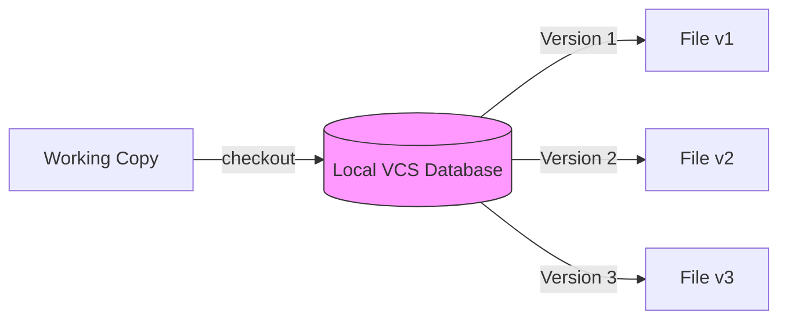

**Example**: RCS (Revision Control System) — stores patch sets on disk.

**Limitation**: No collaboration — single machine only.

### 2.2 Centralized Version Control (CVCS)

A single central server holds all versioned files. Clients check out files from that central place.

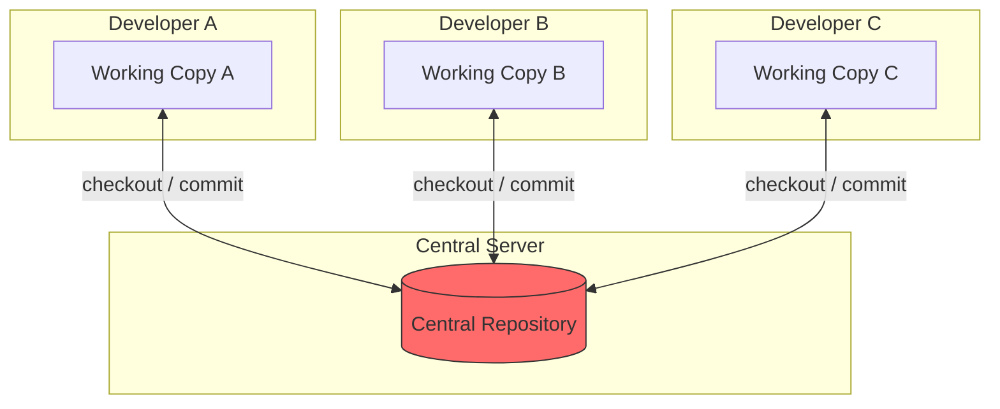

**Examples**: SVN (Subversion), CVS, Perforce

**Advantages**:
- Everyone knows what everyone else is doing
- Admins have fine-grained control over permissions

**Disadvantages**:
- **Single point of failure** — if server goes down, nobody can collaborate
- If server disk is corrupted without backup, entire history is lost
- Requires network connection for most operations

### 2.3 Distributed Version Control (DVCS)

Every developer has a **full copy** of the repository including its complete history.

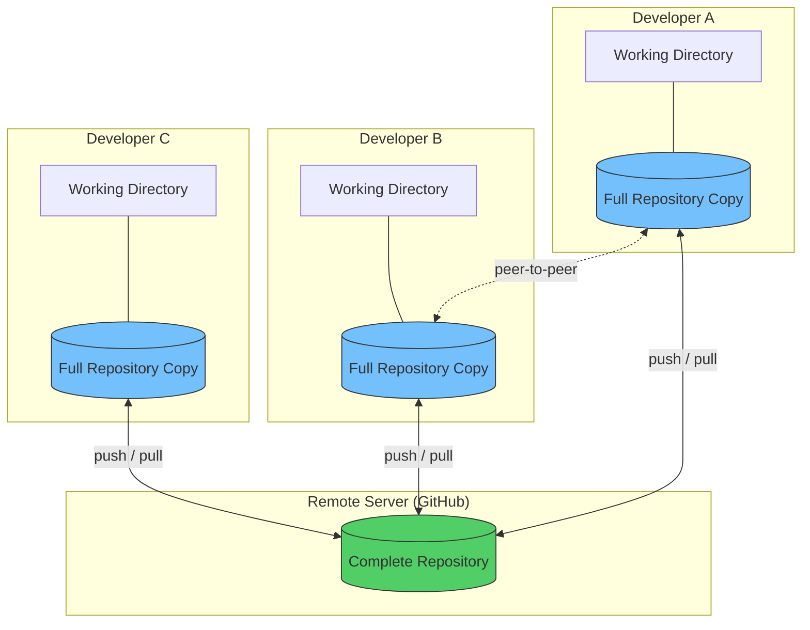

**Examples**: Git, Mercurial, Bazaar

**Advantages**:
- **No single point of failure** — every clone is a full backup
- Work offline — commit, branch, view history without a network
- Faster operations — most happen locally
- Flexible workflows — peer-to-peer, centralized, or hybrid

---

## 3. CVCS vs DVCS — Deep Comparison

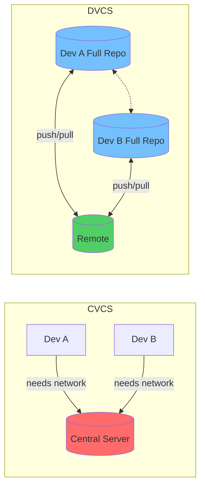

| Feature | CVCS (SVN) | DVCS (Git) |
|---------|-----------|-----------|
| Full history locally | ❌ | ✅ |
| Work offline | ❌ | ✅ |
| Speed | Slow (network) | Fast (local) |
| Branching | Expensive | Cheap & fast |
| Single point of failure | ✅ Central server | ❌ Distributed |
| Disk space per developer | Low | Higher (full repo) |

---

## 4. Git — History and Philosophy

### Brief History

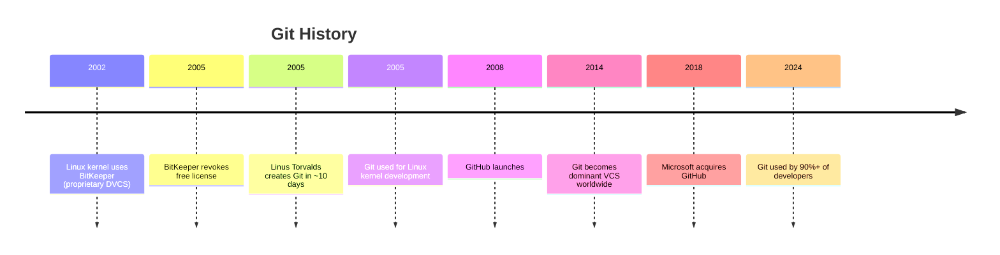

### Git's Design Goals

Linus Torvalds designed Git with these priorities:

1. **Speed** — Most operations are local (milliseconds, not seconds)
2. **Data Integrity** — Every object is checksummed with SHA-1
3. **Support for Non-Linear Workflows** — Thousands of parallel branches
4. **Fully Distributed** — Every clone is a complete repository
5. **Efficiency** — Handles large projects (Linux kernel: 15M+ lines)

---

## 5. How Git Thinks — Snapshots, Not Diffs

### Other VCS: Delta-Based (Diffs)

Most VCS store data as a **list of changes** (deltas) to each file:

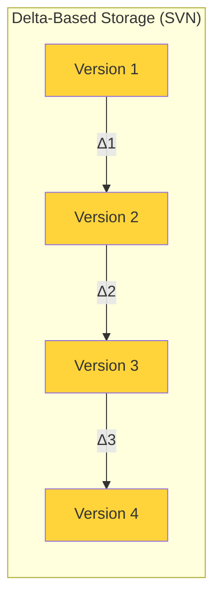

```
File A:  [v1] → [Δ1] → [Δ2] → [Δ3]    ← Store changes
File B:  [v1] → [Δ1] →        → [Δ2]    ← Only changed versions
File C:  [v1] →        → [Δ1] →          ← Sparse changes
```

To get the current version, apply all deltas from the beginning. **Slow for large histories.**

### Git: Snapshot-Based

Git stores a **complete snapshot** of all files at each commit:

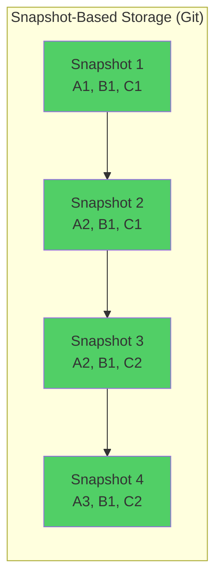

```
                  Commit 1    Commit 2    Commit 3    Commit 4
                  ────────    ────────    ────────    ────────
File A:           [A1]        [A2]        [A2]  ←link [A3]
File B:           [B1]        [B1] ←link  [B1] ←link  [B1] ←link
File C:           [C1]        [C1] ←link  [C2]        [C2] ←link

                                    ↑ Unchanged files are just links
                                      to previous snapshot (no duplication!)
```

**Key Insight**: If a file hasn't changed, Git stores a **link** (pointer) to the previous version, not a copy. This makes Git extremely space-efficient.

### Why Snapshots Are Better

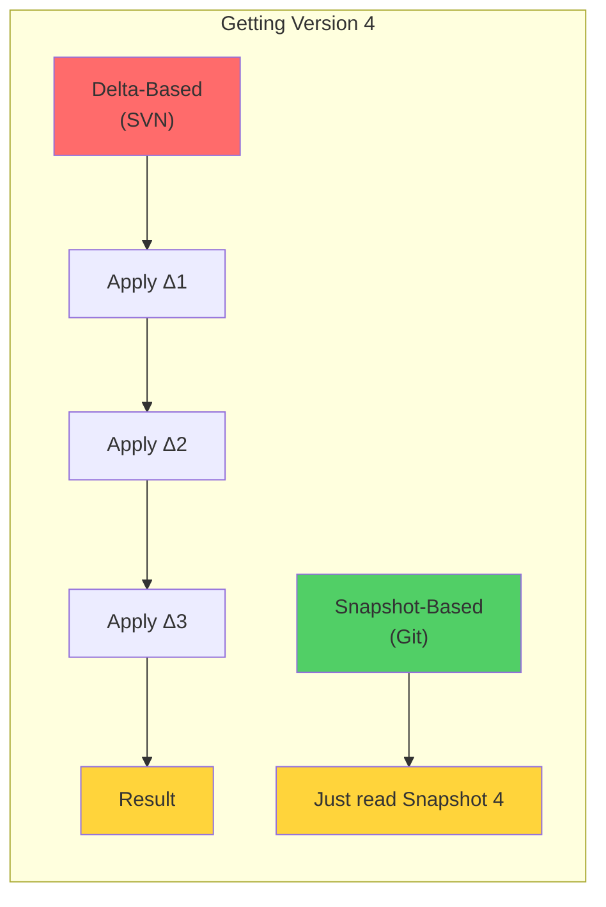

| Aspect | Delta (SVN) | Snapshot (Git) |
|--------|-------------|---------------|
| Checkout speed | Slow (apply all deltas) | Fast (read snapshot) |
| Storage | Smaller initially | Efficient with links + compression |
| Branch creation | Copy files (slow) | New pointer (instant) |
| Comparing versions | Reconstruct then diff | Direct comparison |

---

## 6. The Three Areas of Git

This is the **most fundamental concept** in Git. Everything revolves around these three areas.

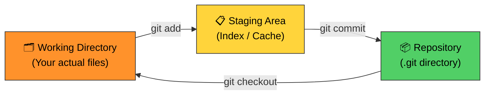

### How It Works — Step by Step

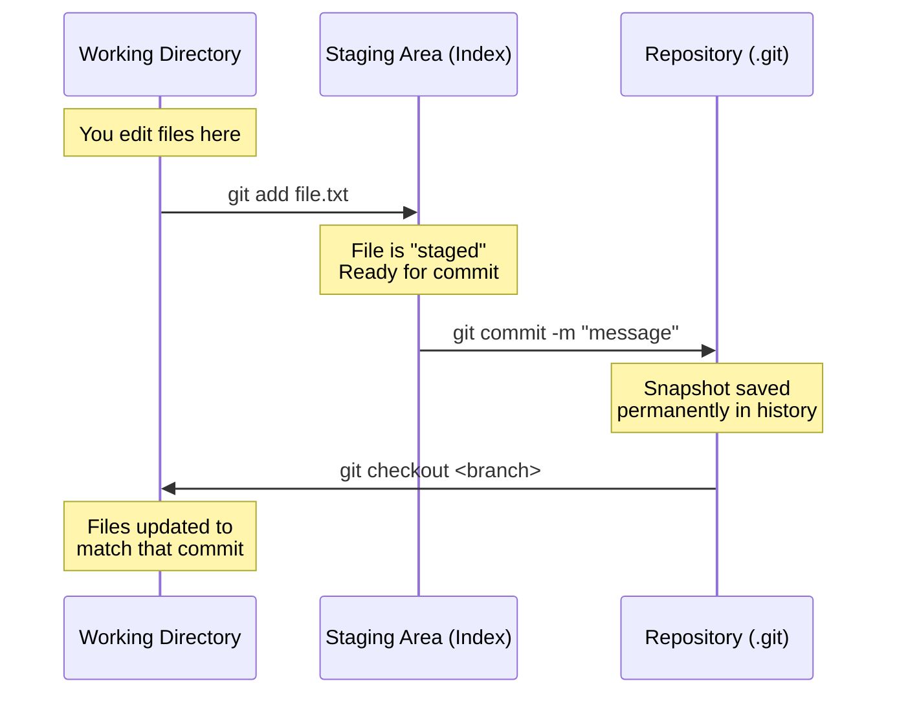

### Detailed Explanation

#### Working Directory (Working Tree)
- The **actual files** on your filesystem that you see and edit
- This is where you do your development work
- Files here can be in any state: modified, new, deleted
- Git **doesn't track changes here automatically** — you must explicitly stage them

#### Staging Area (Index / Cache)
- A **file** (`.git/index`) that stores information about what will go into the next commit
- Acts as a **preview** of your next commit
- You choose exactly what changes go into each commit
- This is what makes Git so powerful — you can commit **part** of your changes

#### Repository (.git directory)
- Where Git stores all the metadata and object database
- Contains the **complete history** of your project
- Located in the `.git/` directory at the root of your project
- When you `commit`, a permanent snapshot is saved here

### The Complete File Lifecycle

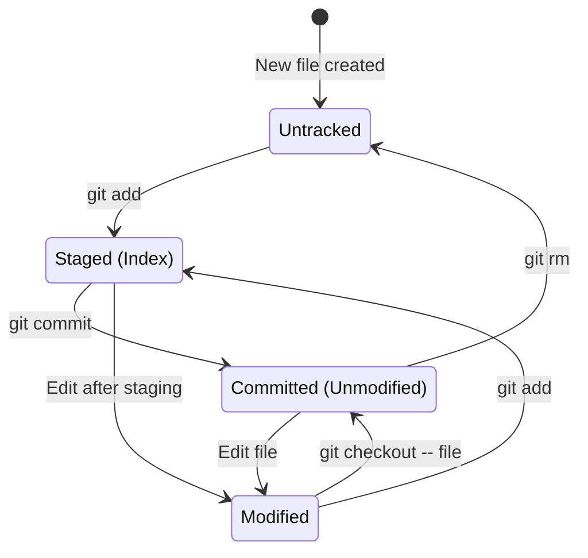

---

## 7. Git vs GitHub

A critical distinction that many beginners confuse:

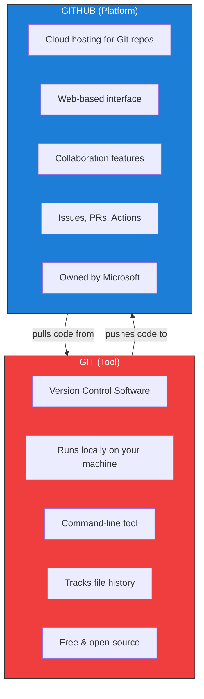

| Aspect | Git | GitHub |
|--------|-----|--------|
| What | Software tool | Cloud platform |
| Where | Your computer | github.com |
| Created by | Linus Torvalds (2005) | Tom Preston-Werner (2008) |
| Purpose | Track code history | Host & collaborate on repos |
| Alternatives | — | GitLab, Bitbucket, Azure DevOps |
| Cost | Free, open-source | Free tier + paid plans |

---

## 8. How Git Ensures Data Integrity

Every piece of data in Git is checksummed with **SHA-1** before it's stored:

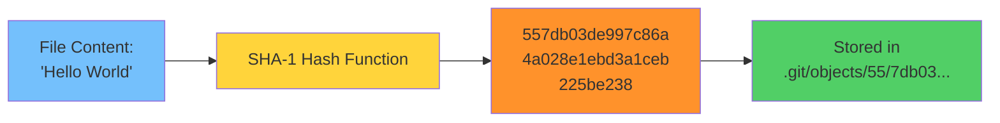

- The hash is a **40-character hexadecimal** string
- **Same content always produces the same hash**
- Any corruption is immediately detectable — the hash won't match
- Git references everything by its hash, not by filename

---

## 🏋️ Exercises

1. **Research**: Install Git and run `git --version` on your machine
2. **Compare**: List 3 advantages of DVCS over CVCS with examples
3. **Draw**: Sketch the three areas of Git from memory with the commands between them
4. **Explain**: In your own words, explain why snapshots are better than deltas
5. **Discuss**: Why is Git free and open-source? Research its license (GPLv2)

---

## 🔑 Key Takeaways

1. **Version Control** tracks every change to your files over time
2. **DVCS (Git)** gives every developer a complete copy — no single point of failure
3. Git stores **snapshots**, not diffs — making it fast and efficient
4. The **three areas** (Working Directory → Staging → Repository) are fundamental
5. Git ≠ GitHub: Git is the tool, GitHub is the hosting platform
6. SHA-1 hashing ensures **data integrity** — corruption is always detected

---

**[Module 02 →](../02-Git-Installation-and-Configuration/README.md)**
