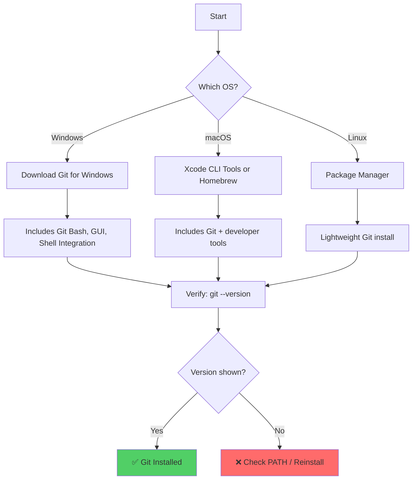
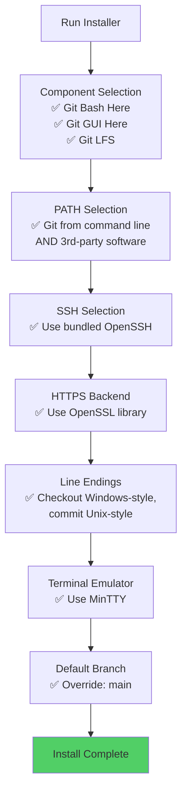
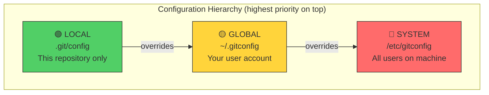
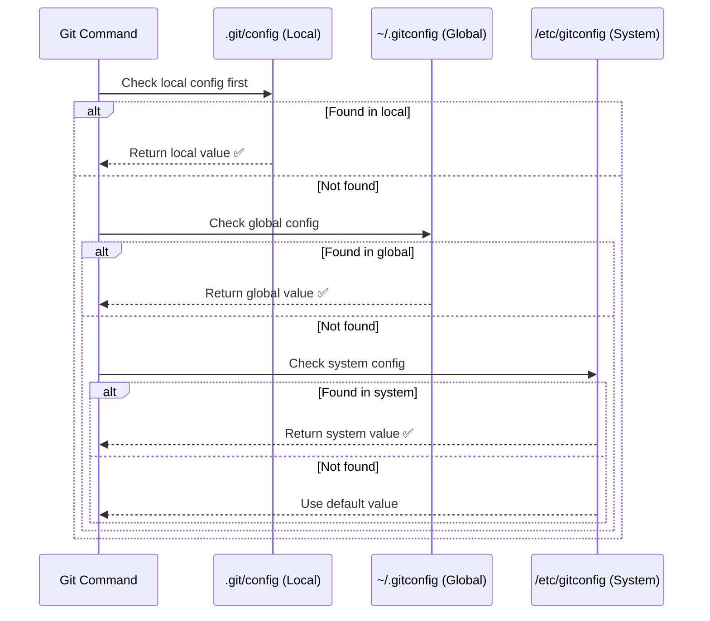
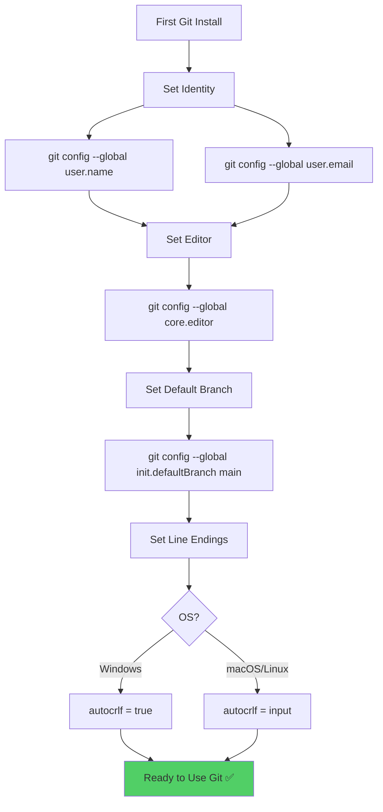
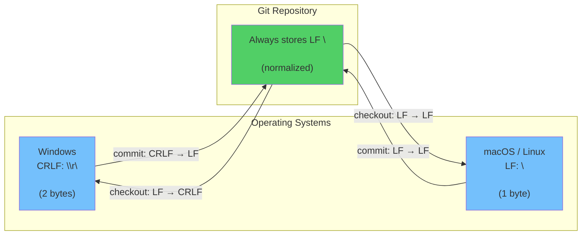
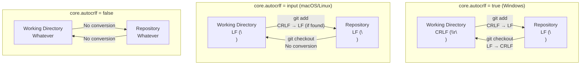
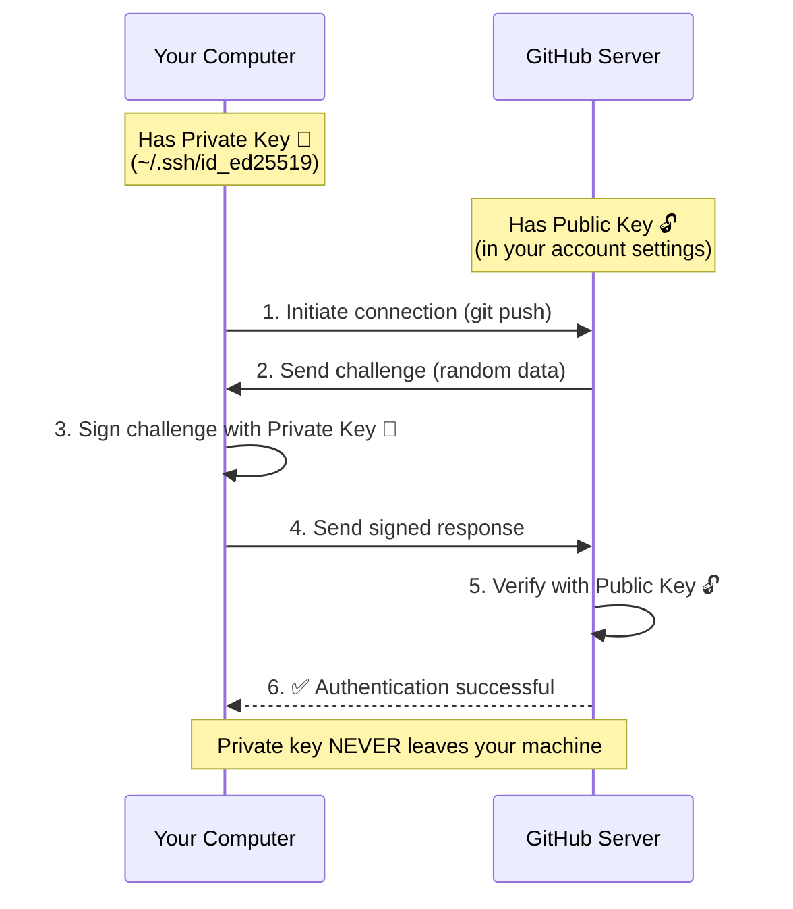
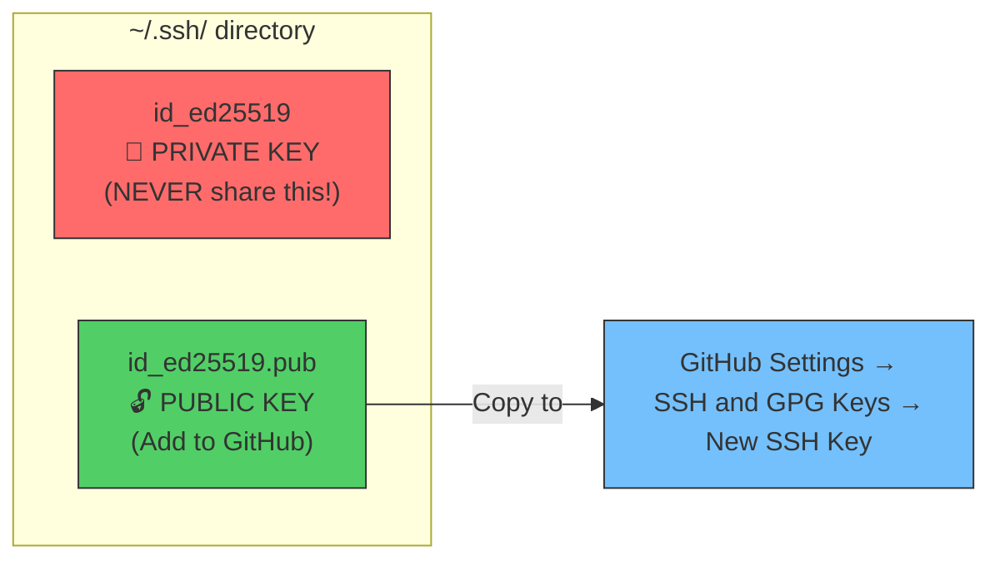
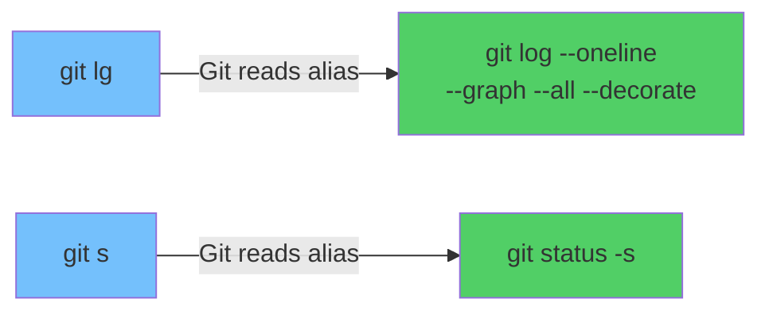

# Module 02: Git Installation & Configuration

> **Level**: 🟢 Beginner | **Time**: 2 hours | **Prerequisites**: [Module 01](../01-Introduction-to-Version-Control/README.md)

---

## 📋 Learning Objectives

- Install Git on Windows, macOS, and Linux
- Understand the Git configuration hierarchy
- Set up essential configuration for development
- Configure SSH keys for GitHub authentication
- Set up GPG signing for verified commits

---

## 1. Installing Git

### How the Installation Process Works



### Windows

**Option A: Git for Windows (Recommended)**

1. Download from [https://git-scm.com/download/win](https://git-scm.com/download/win)
2. Run the installer with these recommended settings:



3. Verify:
```bash
git --version
# Output: git version 2.x.x.windows.x
```

**Option B: winget (Windows 11)**

```bash
winget install --id Git.Git -e --source winget
```

### macOS

**Option A: Xcode Command Line Tools**

```bash
xcode-select --install
git --version
```

**Option B: Homebrew**

```bash
brew install git
git --version
```

### Linux

**Ubuntu / Debian:**
```bash
sudo apt update && sudo apt install git
```

**Fedora:**
```bash
sudo dnf install git
```

**Arch Linux:**
```bash
sudo pacman -S git
```

---

## 2. Git Configuration System — How It Works Internally

Git stores configuration at **three levels**, each overriding the previous:



### How Git Resolves Configuration



### Viewing Configuration

```bash
# View all config with source locations
git config --list --show-origin

# View specific level
git config --local --list
git config --global --list
git config --system --list

# View a specific key
git config user.name
git config user.email
```

### How Config Files Look Internally

```ini
# ~/.gitconfig (Global)
[user]
    name = Parth
    email = parth@example.com
[core]
    editor = code --wait
    autocrlf = true
[init]
    defaultBranch = main
[alias]
    lg = log --oneline --graph --all
```

---

## 3. Essential Configuration — First-Time Setup



### Identity (Required)

```bash
# Your name (shown in commits)
git config --global user.name "Your Full Name"

# Your email (must match GitHub account for linking)
git config --global user.email "your.email@example.com"
```

### Default Editor

```bash
# VS Code
git config --global core.editor "code --wait"

# Vim
git config --global core.editor "vim"

# Nano
git config --global core.editor "nano"

# Notepad++ (Windows)
git config --global core.editor "'C:/Program Files/Notepad++/notepad++.exe' -multiInst -notabbar -nosession"
```

### Default Branch Name

```bash
git config --global init.defaultBranch main
```

### Color Output

```bash
git config --global color.ui auto
```

---

## 4. Line Endings — How They Work

Different OS use different characters for line breaks. This causes problems in cross-platform teams.



### Configuration

```bash
# Windows: Convert CRLF→LF on commit, LF→CRLF on checkout
git config --global core.autocrlf true

# macOS/Linux: Convert CRLF→LF on commit, no conversion on checkout
git config --global core.autocrlf input
```

### How `core.autocrlf` Works Internally



---

## 5. SSH Key Setup for GitHub

SSH keys provide **secure, password-less authentication** with GitHub.

### How SSH Authentication Works



### Generate SSH Key

```bash
# Generate Ed25519 key (recommended)
ssh-keygen -t ed25519 -C "your.email@example.com"

# When prompted:
#   File: Press Enter (default location ~/.ssh/id_ed25519)
#   Passphrase: Enter a strong passphrase (recommended)
```

### Key Files Explained



### Add Key to SSH Agent

```bash
# Start ssh-agent
eval "$(ssh-agent -s)"

# Add your key
ssh-add ~/.ssh/id_ed25519
```

### Add Public Key to GitHub

```bash
# Copy public key to clipboard
# Windows:
clip < ~/.ssh/id_ed25519.pub

# macOS:
pbcopy < ~/.ssh/id_ed25519.pub

# Linux:
cat ~/.ssh/id_ed25519.pub
# Then copy the output manually
```

Then: **GitHub → Settings → SSH and GPG Keys → New SSH Key → Paste**

### Test Connection

```bash
ssh -T git@github.com
# Output: Hi username! You've successfully authenticated
```

---

## 6. Credential Helper

For HTTPS connections (alternative to SSH):

```bash
# Cache credentials in memory (15 min default)
git config --global credential.helper cache

# Cache for 1 hour
git config --global credential.helper 'cache --timeout=3600'

# Windows: Use Windows Credential Manager
git config --global credential.helper wincred

# macOS: Use Keychain
git config --global credential.helper osxkeychain
```

---

## 7. GPG Commit Signing

Prove that commits are genuinely from you (shows "Verified" badge on GitHub):


```bash
# Generate GPG key
gpg --full-generate-key
# Choose: RSA and RSA, 4096 bits, your GitHub email

# List keys
gpg --list-secret-keys --keyid-format=long

# Configure Git to use GPG key
git config --global user.signingkey YOUR_KEY_ID
git config --global commit.gpgsign true

# Export public key (add to GitHub)
gpg --armor --export YOUR_KEY_ID
```

---

## 8. Recommended Aliases

```bash
git config --global alias.s "status -s"
git config --global alias.lg "log --oneline --graph --all --decorate"
git config --global alias.co "checkout"
git config --global alias.br "branch"
git config --global alias.cm "commit -m"
git config --global alias.last "log -1 HEAD --stat"
git config --global alias.unstage "restore --staged"
git config --global alias.amend "commit --amend --no-edit"
```

### How Aliases Work



---

## 9. Complete First-Time Setup Script

```bash
#!/bin/bash
# first-time-git-setup.sh

# Identity
git config --global user.name "Your Name"
git config --global user.email "your.email@example.com"

# Editor
git config --global core.editor "code --wait"

# Default branch
git config --global init.defaultBranch main

# Line endings (change based on OS)
git config --global core.autocrlf true    # Windows
# git config --global core.autocrlf input  # macOS/Linux

# Colors
git config --global color.ui auto

# Merge conflict style
git config --global merge.conflictstyle diff3

# Pull strategy
git config --global pull.rebase true

# Aliases
git config --global alias.s "status -s"
git config --global alias.lg "log --oneline --graph --all --decorate"
git config --global alias.co "checkout"
git config --global alias.br "branch"
git config --global alias.cm "commit -m"
git config --global alias.last "log -1 HEAD --stat"
git config --global alias.unstage "restore --staged"

echo "✅ Git configured successfully!"
git config --list
```

---

## 🏋️ Exercises

1. Install Git and verify with `git --version`
2. Run the first-time setup: name, email, editor, default branch
3. Generate an SSH key and add it to your GitHub account
4. Test SSH connection: `ssh -T git@github.com`
5. Create 3 custom aliases and test them
6. Run `git config --list --show-origin` to see all your settings

---

## 🔑 Key Takeaways

1. Git config has 3 levels: **system → global → local** (local wins)
2. Always set `user.name` and `user.email` before your first commit
3. SSH keys are more secure and convenient than HTTPS passwords
4. `core.autocrlf` prevents line ending issues in cross-platform teams
5. Aliases save time — `git lg` is better than typing the full log command
6. GPG signing adds a "Verified" badge to your commits on GitHub

---

**[← Module 01](../01-Introduction-to-Version-Control/README.md)** | **[Module 03 →](../03-Your-First-Repository/README.md)**
