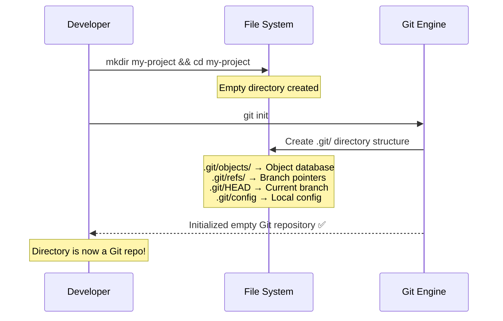
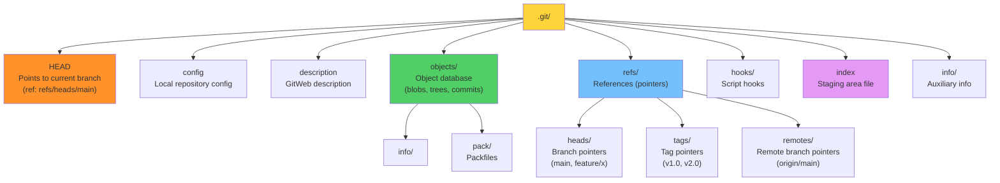
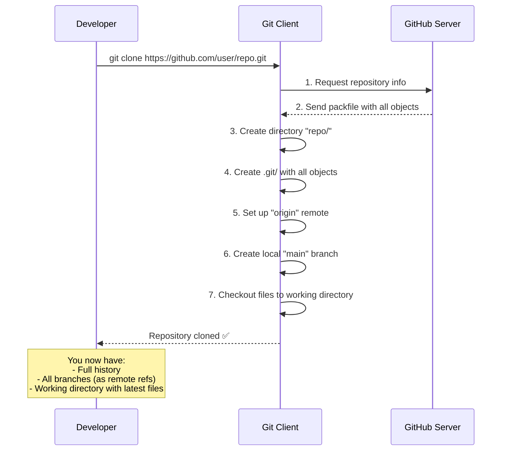
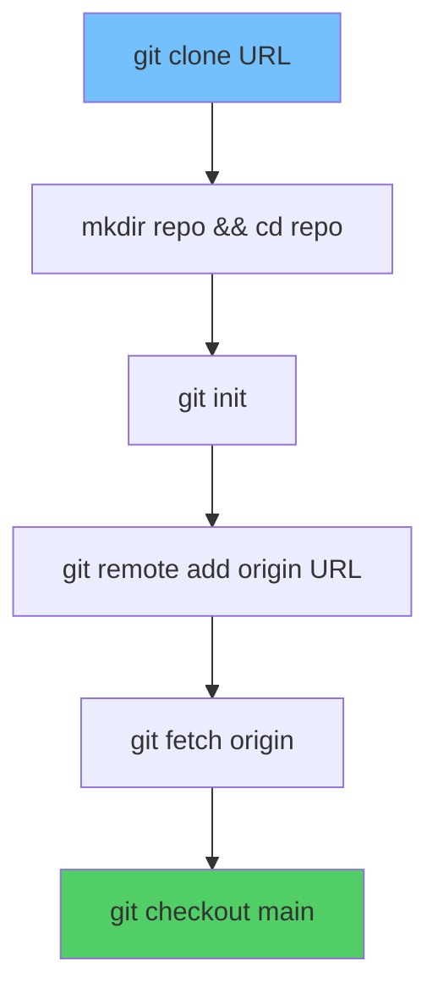
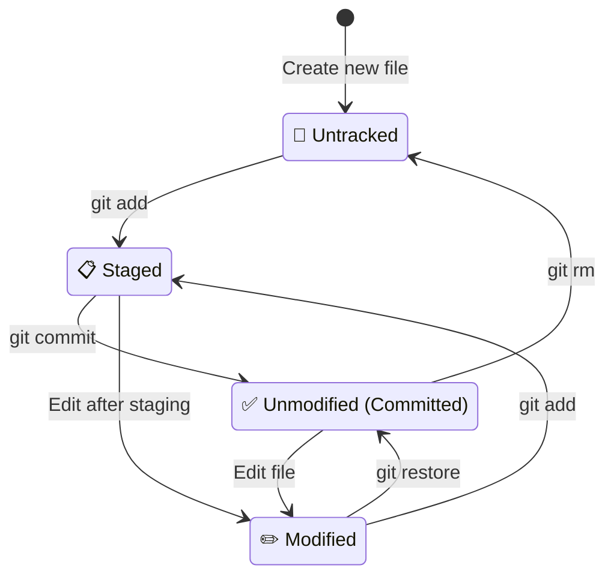
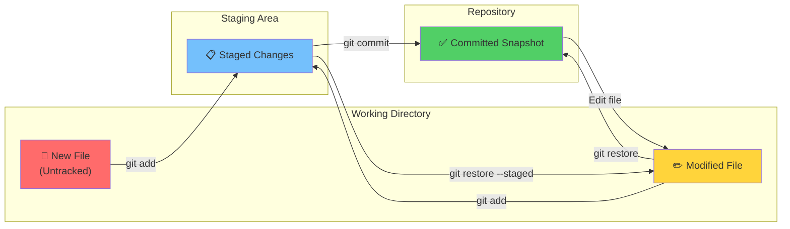
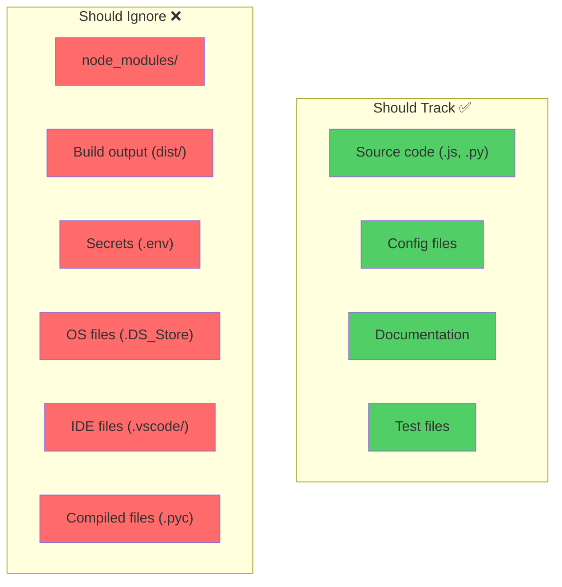
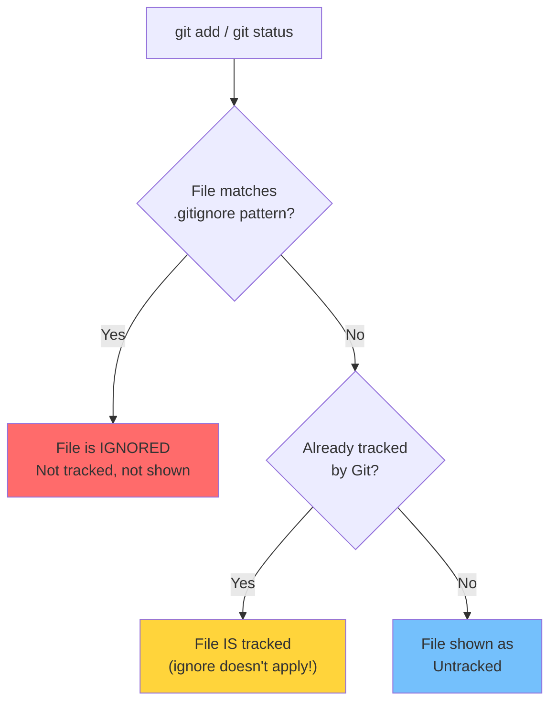
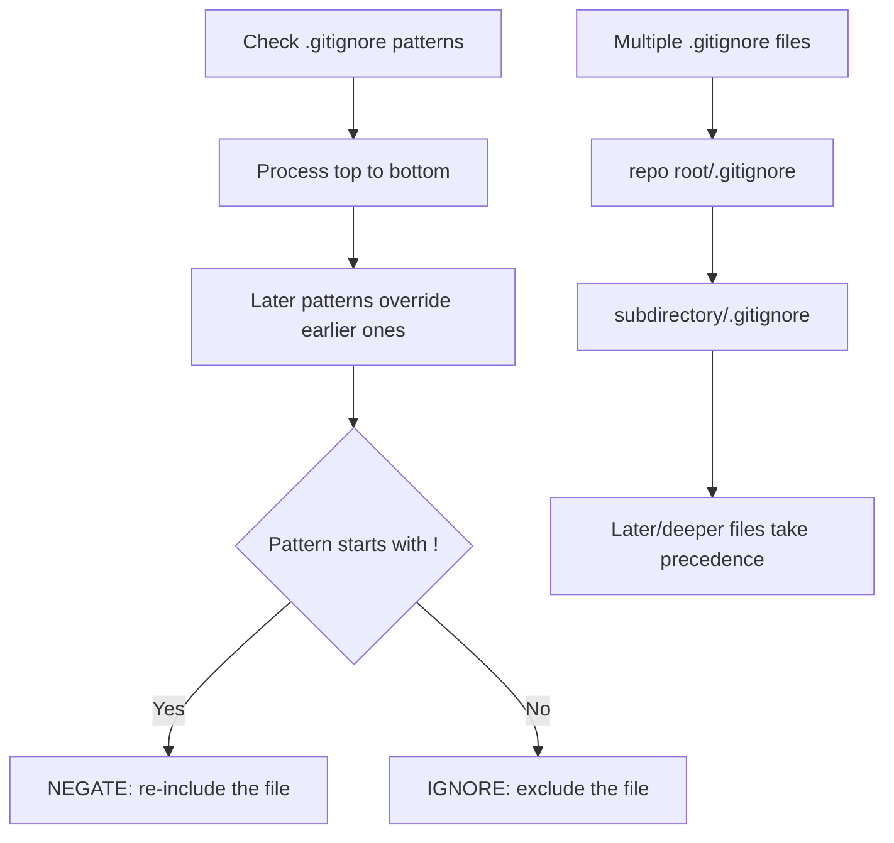
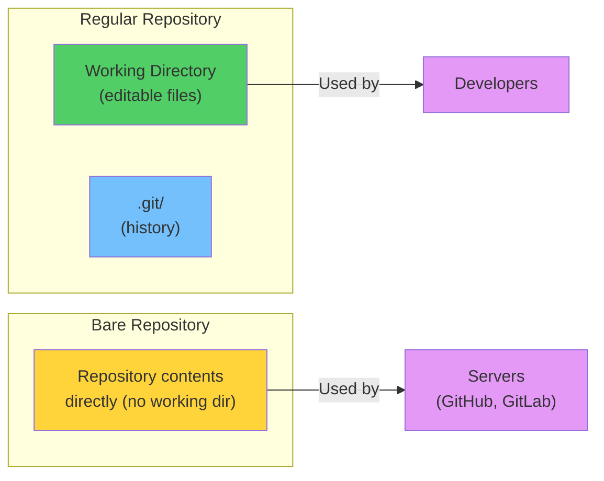

# Module 03: Your First Repository

> **Level**: 🟢 Beginner | **Time**: 2.5 hours | **Prerequisites**: [Module 02](../02-Git-Installation-and-Configuration/README.md)

---

## 📋 Learning Objectives

- Create and clone repositories
- Understand the `.git` directory internals
- Master file states in Git
- Configure `.gitignore` for clean repositories

---

## 1. Creating a Repository — `git init`

### What Happens Internally



```bash
# Create a new project
mkdir my-project
cd my-project

# Initialize Git
git init
# Output: Initialized empty Git repository in /path/.git/
```

---

## 2. Anatomy of the `.git` Directory

When you run `git init`, Git creates this structure:



### What Each Component Does

| File/Directory | Purpose | Importance |
|---------------|---------|------------|
| `HEAD` | Points to current branch | Essential — tells Git where you are |
| `objects/` | Stores all data (blobs, trees, commits) | Essential — the actual database |
| `refs/` | Stores branch and tag pointers | Essential — how Git finds commits |
| `index` | The staging area | Essential — tracks what's staged |
| `config` | Local configuration | Important — repo-specific settings |
| `hooks/` | Event scripts | Optional — automation |
| `info/` | Auxiliary information | Rarely used |
| `description` | Used by GitWeb | Rarely used |

---

## 3. Cloning a Repository — `git clone`

### How Clone Works Internally



```bash
# Clone via HTTPS
git clone https://github.com/user/repo.git

# Clone via SSH (recommended)
git clone git@github.com:user/repo.git

# Clone to a specific directory
git clone git@github.com:user/repo.git my-folder

# Shallow clone (only latest commit)
git clone --depth 1 git@github.com:user/repo.git
```

### What `git clone` Actually Does (Equivalent Commands)



---

## 4. File States in Git

Every file in a Git repository is in one of these states:



### Detailed State Definitions

| State | Description | `git status` shows |
|-------|------------|-------------------|
| **Untracked** | New file, Git doesn't know about it | `Untracked files:` (red) |
| **Staged** | Marked to go in next commit | `Changes to be committed:` (green) |
| **Unmodified** | Committed, no changes since | Not shown (clean) |
| **Modified** | Changed since last commit, not staged | `Changes not staged:` (red) |

### How File State Transitions Work



---

## 5. `.gitignore` — Excluding Files

### Why Ignore Files?



### How `.gitignore` Works Internally



> **Important**: `.gitignore` only works for **untracked** files. If a file is already tracked, you must `git rm --cached file` first.

### Pattern Syntax

```bash
# .gitignore

# Ignore specific files
secrets.env
passwords.txt

# Ignore by extension
*.log
*.pyc
*.class
*.o

# Ignore directories
node_modules/
dist/
build/
__pycache__/
.venv/

# Ignore pattern in any directory
**/temp/

# Negate (DO track this even though *.log is ignored)
!important.log

# Ignore files in root only
/TODO.md

# Wildcard: any single character
file?.txt    # file1.txt, fileA.txt

# Wildcard: directory depth
docs/**/*.pdf
```

### Gitignore Processing Order



### Common `.gitignore` Templates

```bash
# Node.js
node_modules/
dist/
.env
*.log
.DS_Store

# Python
__pycache__/
*.pyc
.venv/
.env
*.egg-info/
dist/
build/

# Java
*.class
*.jar
target/
.idea/
```

### Global `.gitignore` (System-wide)

```bash
# Create global ignore
git config --global core.excludesfile ~/.gitignore_global

# Add common OS/editor files
echo ".DS_Store" >> ~/.gitignore_global
echo "Thumbs.db" >> ~/.gitignore_global
echo ".vscode/" >> ~/.gitignore_global
echo "*.swp" >> ~/.gitignore_global
```

---

## 6. Bare Repositories



```bash
# Create bare repo (server-side)
git init --bare project.git

# Clone from bare
git clone /path/to/project.git
```

---

## 🏋️ Exercises

1. Create a new repo with `git init` and explore the `.git/` directory
2. Clone a public GitHub repo and compare its `.git/` structure
3. Create files, modify them, and observe state changes with `git status`
4. Write a `.gitignore` for a Node.js project
5. Try to ignore an already-tracked file — see what happens, then use `git rm --cached`

---

## 🔑 Key Takeaways

1. `git init` creates the `.git/` directory — the heart of your repository
2. `git clone` gives you a **full copy** including all history
3. Files move through states: Untracked → Staged → Committed → Modified
4. `.gitignore` prevents unnecessary files from being tracked
5. `.gitignore` only affects **untracked** files — already tracked files need `git rm --cached`
6. Bare repositories are for servers — no working directory

---

**[← Module 02](../02-Git-Installation-and-Configuration/README.md)** | **[Module 04 →](../04-Staging-Committing-and-History/README.md)**
