# Module 04: Staging, Committing & History

> **Level**: 🟢 Beginner | **Time**: 3 hours | **Prerequisites**: [Module 03](../03-Your-First-Repository/README.md)

---

## 📋 Learning Objectives

- Master `git add` with all its modes
- Write effective commit messages
- Navigate history with `git log`
- Compare changes with `git diff`

---

## 1. `git add` — How Staging Works Internally

### What `git add` Actually Does

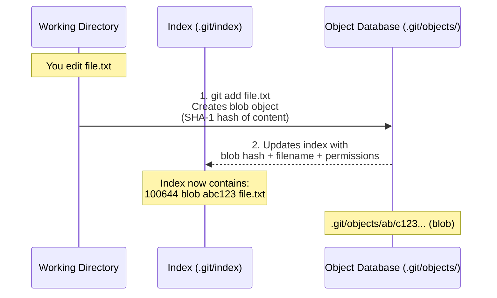

### The Staging Area Is a File

The staging area (index) is literally a binary file at `.git/index`:

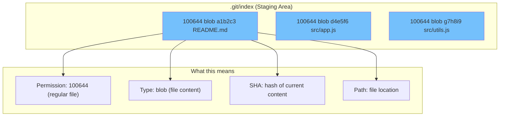

### `git add` Variations

```bash
git add file.txt             # Stage specific file
git add src/ tests/          # Stage specific directories
git add .                    # Stage ALL changes in current dir
git add -A                   # Stage ALL changes in entire repo
git add *.js                 # Stage by pattern
git add -u                   # Stage modified/deleted (not new) files
```

### Interactive Staging (`git add -p`)

Stage individual **hunks** (chunks) of changes within a file:

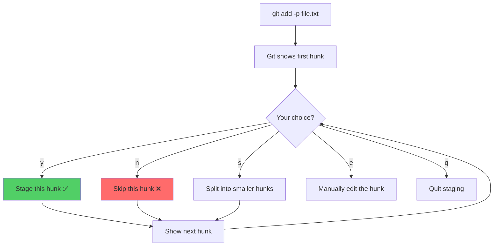

```bash
git add -p
# Stage this hunk [y,n,q,a,d,s,e,?]?
# y = yes (stage)     n = no (skip)
# s = split           e = edit manually
# q = quit            a = stage all remaining
```

**Why use this?** Create focused, clean commits — commit the login fix separately from the UI change, even if both are in the same file.

---

## 2. `git commit` — How Commits Are Created

### What Happens When You Commit

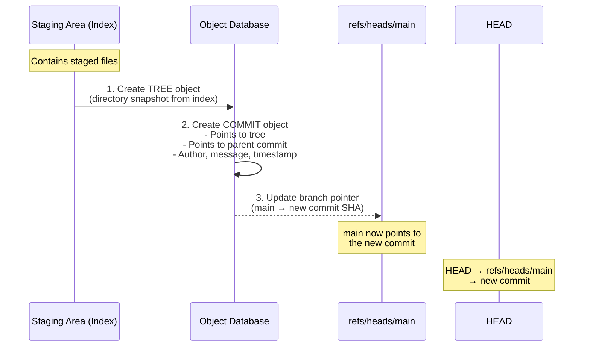

### Commit Object Structure

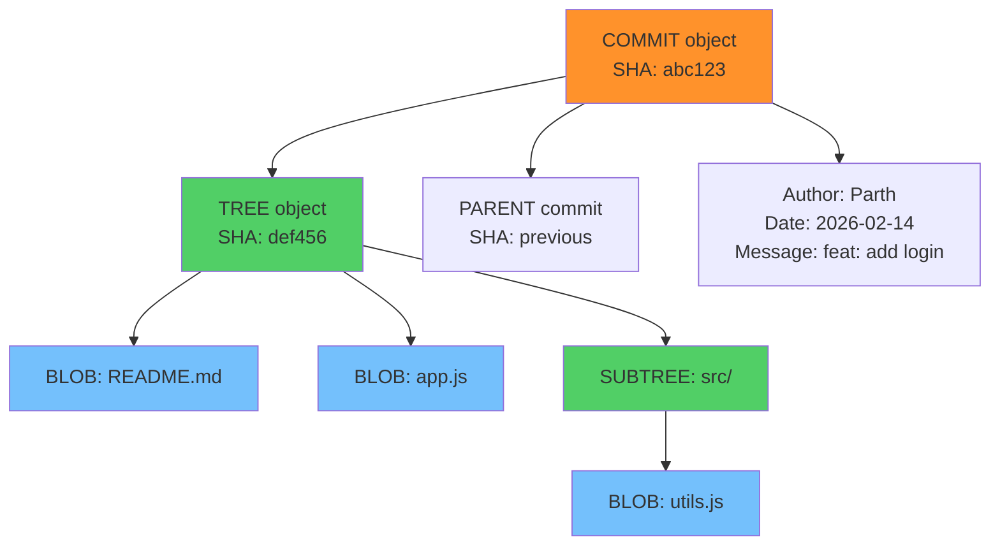

### Commit Command Variations

```bash
# Basic commit
git commit -m "feat: add user login"

# Multi-line message
git commit -m "feat: add user login" -m "Implements JWT-based auth with refresh tokens"

# Stage tracked + commit (skip git add for modified files)
git commit -am "fix: handle null input"

# Open editor for detailed message
git commit

# Amend last commit
git commit --amend -m "fix: corrected commit message"
git commit --amend --no-edit    # Keep message, add staged changes
```

### Conventional Commit Message Format

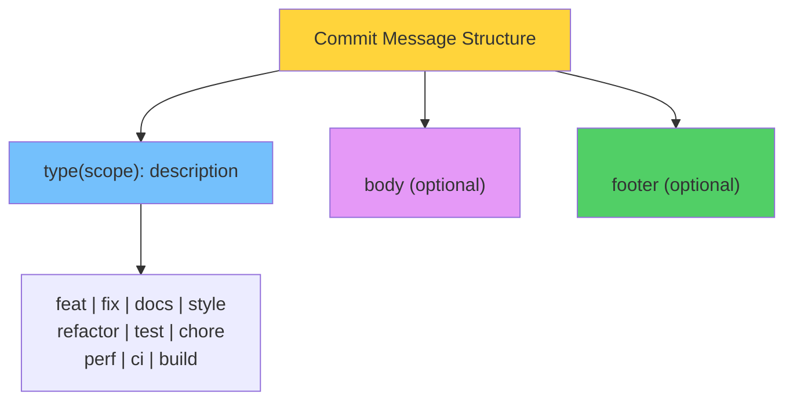

```
feat(auth): add JWT-based login

Implements login endpoint with JWT tokens.
Tokens expire after 24 hours with refresh support.

Closes #42
```

### Good vs Bad Commit Messages

| ❌ Bad | ✅ Good |
|--------|---------|
| `fix bug` | `fix(auth): handle expired JWT tokens` |
| `update` | `feat(search): add fuzzy matching` |
| `changes` | `refactor(api): extract validation middleware` |
| `wip` | `docs: add API endpoint documentation` |
| `asdfgh` | `fix(ui): correct button alignment on mobile` |

### The 7 Rules of Great Commits

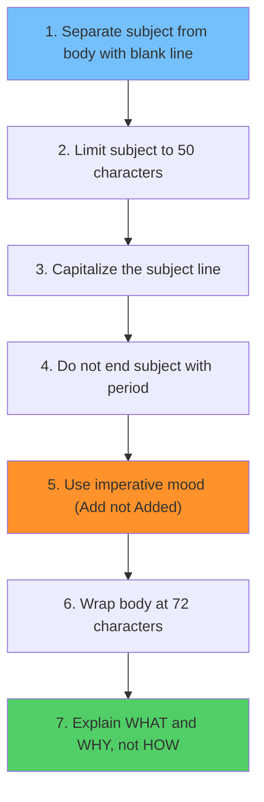

---

## 3. `git status` — Understanding the Output

### How `git status` Works Internally

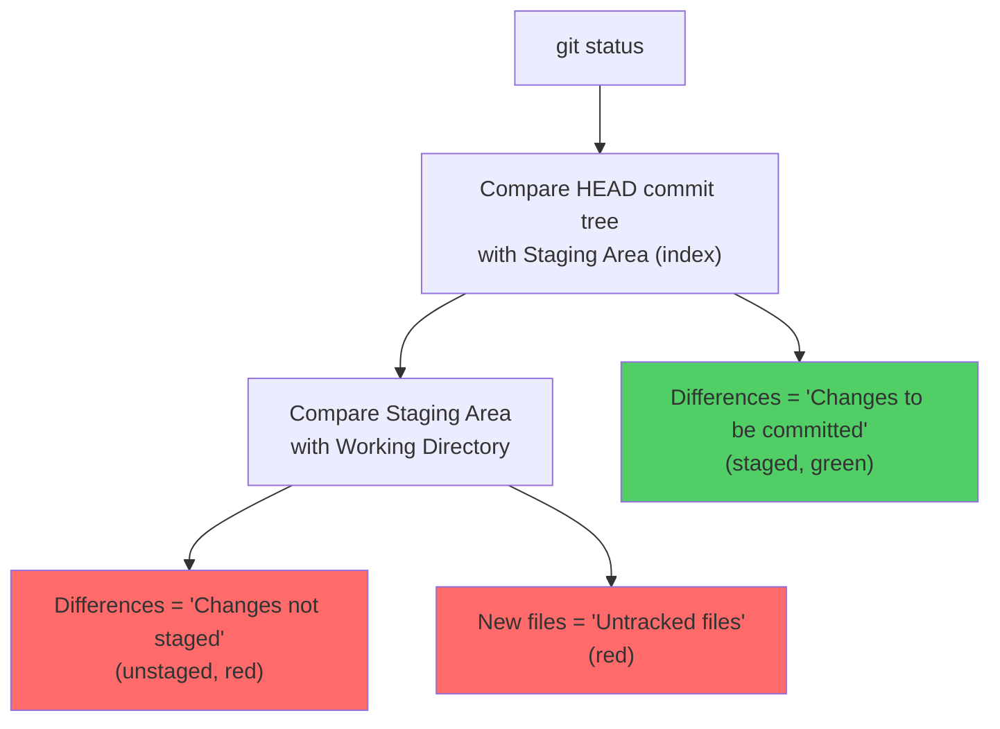

```bash
$ git status
On branch main

Changes to be committed:          # GREEN — Staged (in index, not in last commit)
  new file:   utils.js
  modified:   app.js

Changes not staged for commit:     # RED — Modified but not staged
  modified:   README.md

Untracked files:                   # RED — New files Git doesn't track
  temp.log
```

### Short Format

```bash
$ git status -s
A  utils.js       # A = Added (staged new file)
M  app.js         # M = Modified (staged)
 M README.md      # _M = Modified (unstaged)
?? temp.log       # ?? = Untracked

# Two columns: [staged][unstaged]
# M_ = staged only
# _M = unstaged only
# MM = both staged AND unstaged changes
```

---

## 4. `git log` — Navigating History

### How `git log` Traverses the DAG

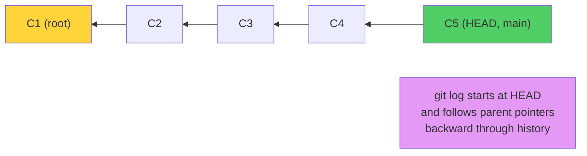

### Common Log Formats

```bash
# Default (verbose)
git log

# One-line summary
git log --oneline

# Visual branch graph
git log --oneline --graph --all --decorate

# With file changes
git log --stat

# With actual diff
git log -p

# Last N commits
git log -n 5

# By author
git log --author="Parth"

# By date range
git log --since="2024-01-01" --until="2024-12-31"

# By message content
git log --grep="fix"

# Commits that changed a specific file
git log -- path/to/file.js

# Commits where a string was added/removed
git log -S "functionName"
```

### Log Output Components

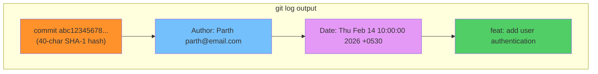

---

## 5. `git diff` — Understanding Changes

### What `git diff` Compares

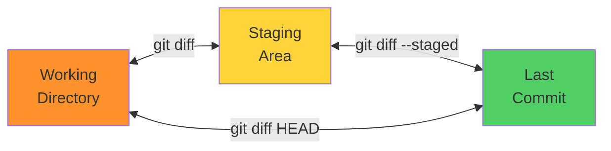

### Reading Diff Output

```diff
diff --git a/app.js b/app.js
index abc1234..def5678 100644
--- a/app.js              ← Old version (a/)
+++ b/app.js              ← New version (b/)
@@ -10,7 +10,9 @@ function login(user) {  ← Hunk header
   const token = generateToken(user);     ← Context (unchanged)
-  return { success: true };              ← Removed (red)
+  return {                               ← Added (green)
+    success: true,                       ← Added
+    token: token                         ← Added
+  };                                     ← Added
 }                                        ← Context
```

### Hunk Header Explained

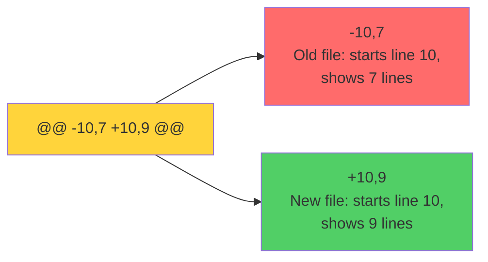

### Diff Variations

```bash
# Unstaged changes
git diff

# Staged changes (about to commit)
git diff --staged

# All changes vs last commit
git diff HEAD

# Between two commits
git diff abc123 def456

# Between branches
git diff main..feature

# Summary only (no actual diff)
git diff --stat
git diff --name-only
git diff --name-status

# Word-level diff
git diff --word-diff

# Ignore whitespace
git diff -w
```

---

## 6. File Management Commands

### `git rm` — Removing Files

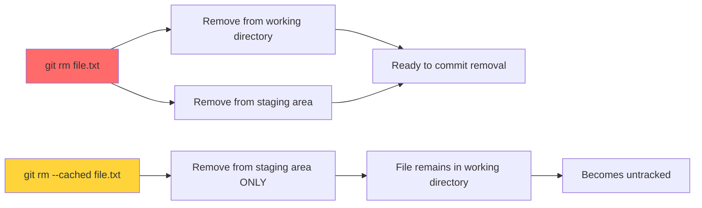

```bash
# Remove file from Git AND filesystem
git rm file.txt

# Remove from Git tracking only (keep file on disk)
git rm --cached file.txt
# Useful when you accidentally committed a file that should be ignored
```

### `git mv` — Moving/Renaming Files

```bash
# Rename a file
git mv old-name.js new-name.js
# Equivalent to: mv old.js new.js && git rm old.js && git add new.js

# Move to a different directory
git mv file.js src/file.js
```

---

## 7. The Complete Workflow

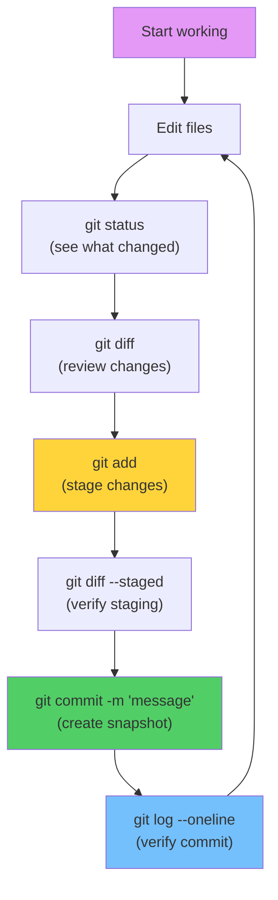

---

## 🏋️ Exercises

1. Create 3 files, stage them in two separate commits using `git add -p`
2. Write 5 commits following Conventional Commit format
3. Use `git log --oneline --graph` to visualize your history
4. Use `git diff` before and after staging to understand the difference
5. Practice `git rm --cached` to untrack a file without deleting it

---

## 🔑 Key Takeaways

1. `git add` creates blob objects and updates the index (staging area)
2. `git commit` creates tree + commit objects and moves the branch pointer
3. `git add -p` enables **partial staging** for clean, focused commits
4. `git diff` compares different areas; `--staged` compares index to last commit
5. Commit messages should be imperative, descriptive, and explain **why**
6. `git status` shows differences between all three areas simultaneously

---

**[← Module 03](../03-Your-First-Repository/README.md)** | **[Module 05 →](../05-Branching-Basics/README.md)**
