# Module 05: Branching Basics

> **Level**: 🟢 Beginner | **Time**: 3 hours | **Prerequisites**: [Module 04](../04-Staging-Committing-and-History/README.md)

---

## 📋 Learning Objectives

- Understand what branches really are internally
- Create, switch, list, rename, and delete branches
- Understand HEAD and detached HEAD state
- Follow branching best practices

---

## 1. What Is a Branch? — The Internal Model

A branch in Git is just a **lightweight pointer** (a 41-byte file) that points to a commit.

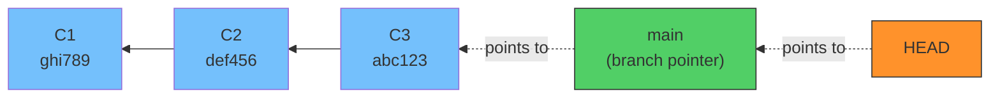

### How Branches Are Stored

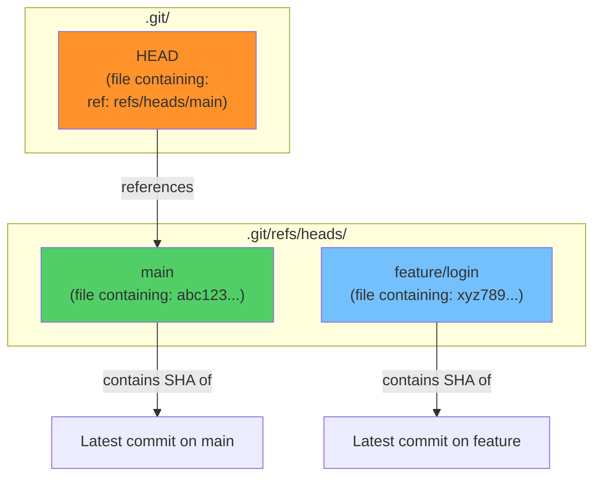

```bash
# Proof: a branch is just a file with a SHA
cat .git/refs/heads/main
# Output: abc123456789... (the commit SHA)

cat .git/HEAD
# Output: ref: refs/heads/main
```

> **Key Insight**: Creating a branch is just creating a 41-byte file. That's why Git branches are practically instant — no copying files!

---

## 2. Creating Branches

### What Happens When You Create a Branch

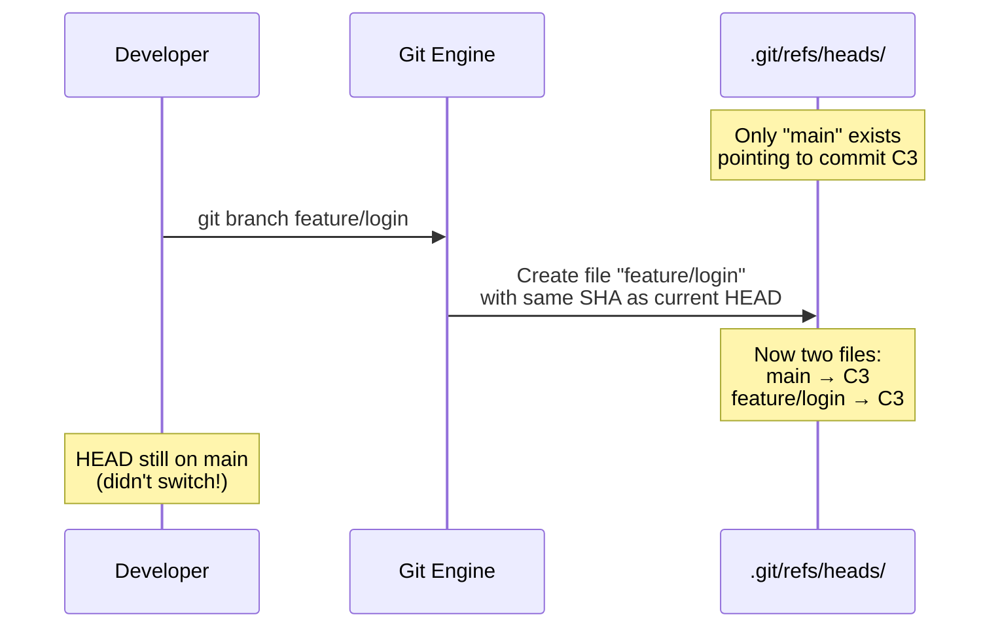

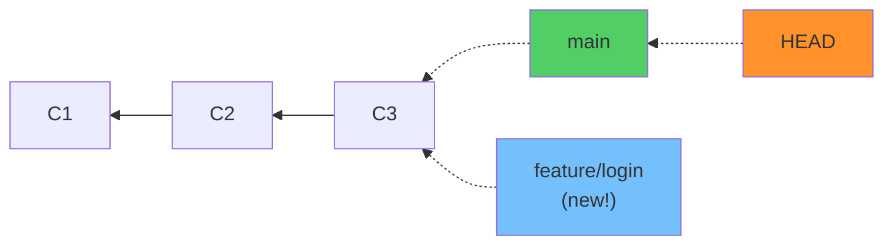

```bash
# Create a branch (doesn't switch to it)
git branch feature/login

# Create AND switch to it
git switch -c feature/login
git checkout -b feature/login    # Legacy equivalent
```

---

## 3. Switching Branches

### What Happens When You Switch

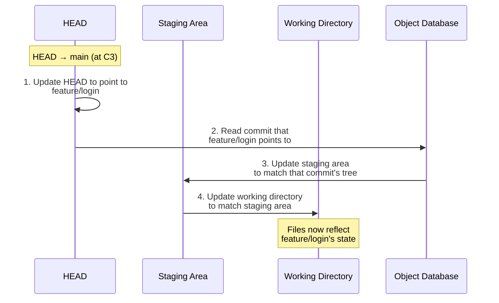

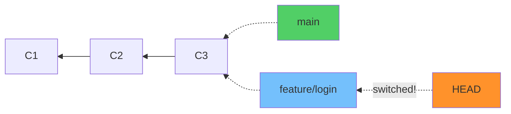

```bash
# Switch to existing branch
git switch feature/login
git checkout feature/login    # Legacy

# Switch back to main
git switch main
```

### After Making a Commit on the Feature Branch

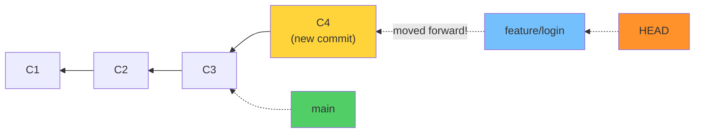

> When you commit on a branch, **only that branch pointer moves forward**. Other branches stay where they are.

---

## 4. Branch Operations

### Listing Branches

```bash
git branch              # Local branches (* = current)
git branch -r           # Remote branches
git branch -a           # All branches (local + remote)
git branch -v           # With last commit info
git branch --merged     # Branches merged into current
git branch --no-merged  # Branches NOT merged into current
```

### Renaming Branches

```bash
# Rename current branch
git branch -m new-name

# Rename a specific branch
git branch -m old-name new-name
```

### Deleting Branches

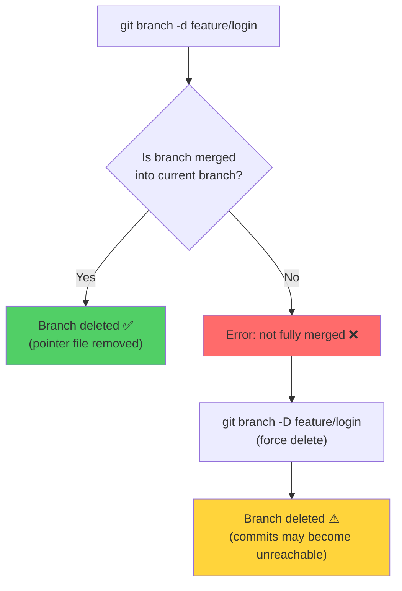

```bash
# Safe delete (only if merged)
git branch -d feature/login

# Force delete (even if not merged)
git branch -D feature/login

# Delete remote branch
git push origin --delete feature/login
```

---

## 5. HEAD — Where Are You?

HEAD is a special pointer that tells Git which branch (or commit) you're currently on.

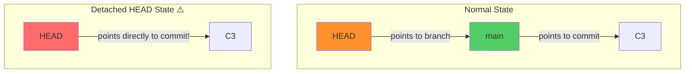

### Detached HEAD

Happens when you checkout a specific commit (not a branch):

```bash
git checkout abc1234     # Detached HEAD!
git checkout v1.0.0      # Detached HEAD (checking out a tag)
```

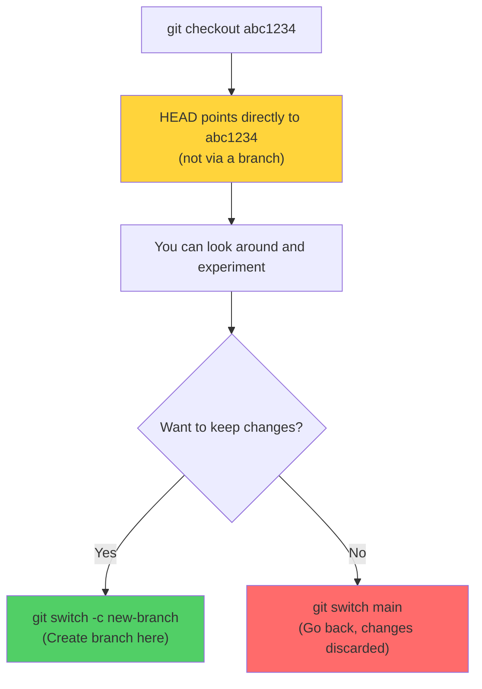

---

## 6. Branch Lifecycle — Complete Flow

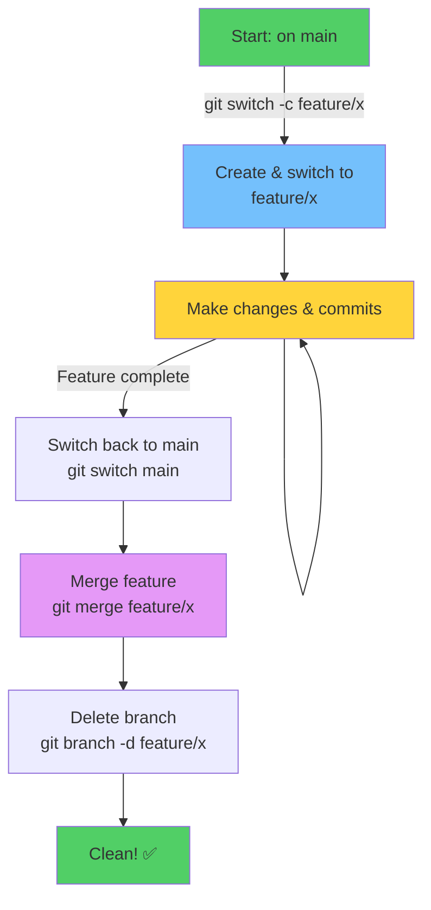

---

## 7. Branching Best Practices

### Naming Conventions

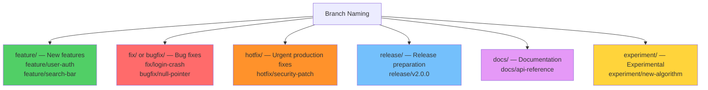

### Rules

```
✅ Use lowercase with hyphens: feature/user-login
✅ Be descriptive: fix/header-overflow-on-mobile
✅ Use prefixes: feature/, fix/, hotfix/
✅ Delete after merging

❌ Don't use spaces: feature/my feature
❌ Don't use vague names: fix/stuff
❌ Don't leave stale branches
```

---

## 🏋️ Exercises

1. Create 3 branches, switch between them, and observe what `git log --graph` shows
2. Explore `.git/refs/heads/` and `.git/HEAD` to see how branches are stored
3. Practice creating a branch from a specific commit: `git branch test abc1234`
4. Enter detached HEAD state by checking out a commit, create a branch to save work
5. Try deleting a branch with `-d` vs `-D` and observe the difference

---

## 🔑 Key Takeaways

1. A branch is just a **41-byte file** pointing to a commit SHA — incredibly lightweight
2. HEAD tells Git which branch you're on (or which commit in detached mode)
3. Creating a branch is instant — Git just creates a pointer file
4. Switching branches updates HEAD, index, and working directory
5. Only the **current branch** pointer moves when you make a new commit
6. Always delete branches after merging to keep the repo clean

---

**[← Module 04](../04-Staging-Committing-and-History/README.md)** | **[Module 06 →](../06-Merging-and-Conflict-Resolution/README.md)**
