# Module 06: Merging & Conflict Resolution

> **Level**: 🟢 Beginner | **Time**: 3 hours | **Prerequisites**: [Module 05](../05-Branching-Basics/README.md)

---

## 📋 Learning Objectives

- Understand how Git merges work at a deep level
- Differentiate fast-forward from three-way merges
- Resolve merge conflicts manually and with tools
- Use merge-related commands effectively

---

## 1. What Is a Merge?

A merge combines the work from two branches into one.

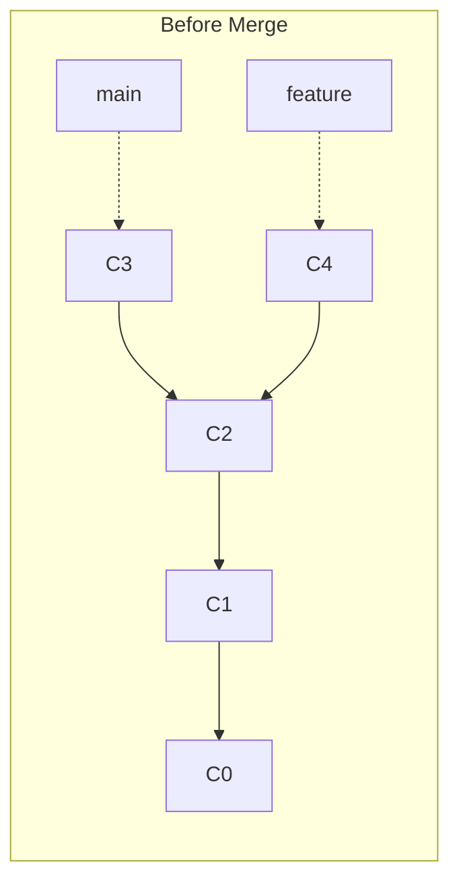
```mermaid
graph RL
    subgraph "Before Merge"
        C1["C1"] --> C0["C0"]
        C2["C2"] --> C1
        C3["C3"] --> C2
        C4["C4"] --> C2
        MAIN["main"] -.-> C3
        FEAT["feature"] -.-> C4
    end
```

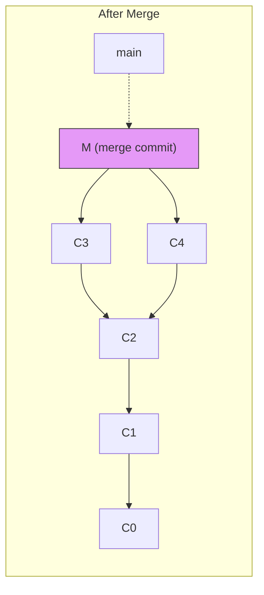
```mermaid
graph RL
    subgraph "After Merge"
        C1B["C1"] --> C0B["C0"]
        C2B["C2"] --> C1B
        C3B["C3"] --> C2B
        C4B["C4"] --> C2B
        M["M (merge commit)"] --> C3B
        M --> C4B
        MAINB["main"] -.-> M
    end
    
    style M fill:#e599f7,stroke:#333
```

---

## 2. Fast-Forward Merge

When the target branch has no new commits since the source branched off, Git simply moves the pointer forward.

### How Git Decides: Fast-Forward Possible?

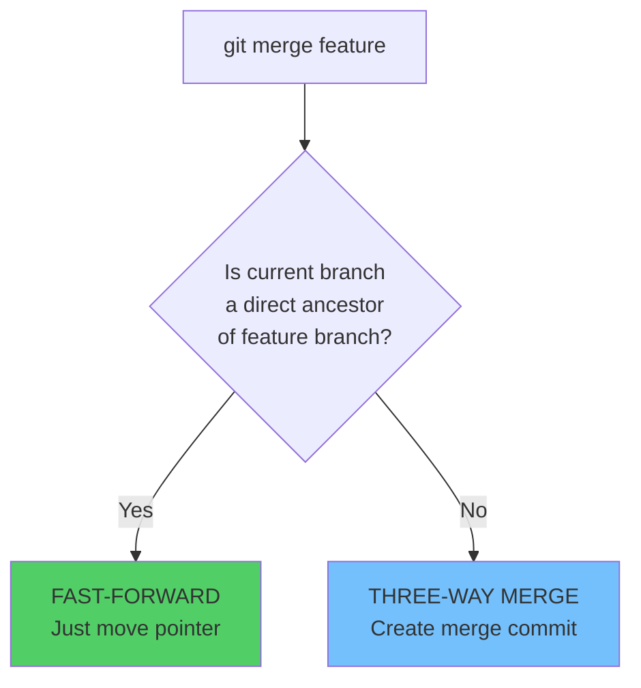
```mermaid
flowchart TD
    A["git merge feature"] --> B{"Is current branch<br/>a direct ancestor<br/>of feature branch?"}
    B -->|"Yes"| C["FAST-FORWARD<br/>Just move pointer"]
    B -->|"No"| D["THREE-WAY MERGE<br/>Create merge commit"]
    
    style C fill:#51cf66
    style D fill:#74c0fc
```

### Fast-Forward in Action

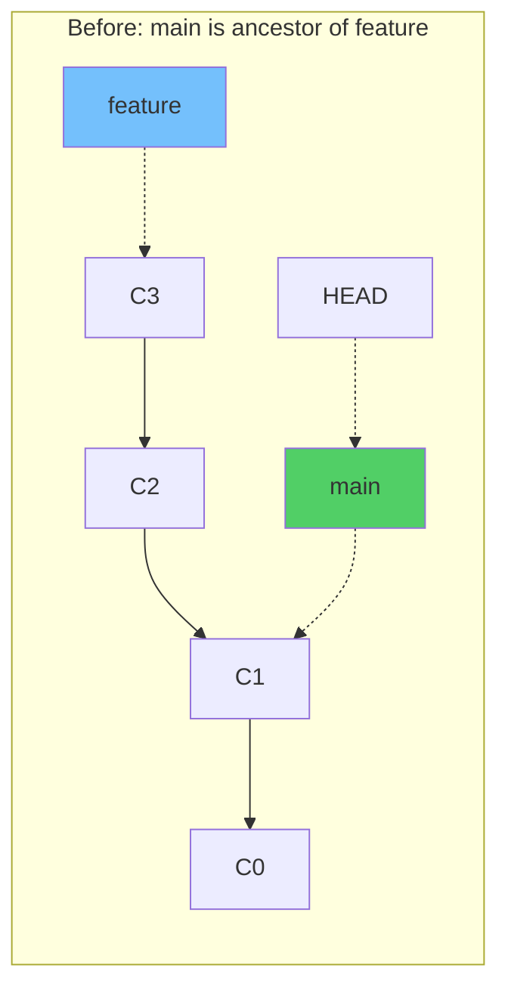
```mermaid
graph RL
    subgraph "Before: main is ancestor of feature"
        C1A["C1"] --> C0A["C0"]
        C2A["C2"] --> C1A
        C3A["C3"] --> C2A
        MAINA["main"] -.-> C1A
        FEATA["feature"] -.-> C3A
        HEADA["HEAD"] -.-> MAINA
    end
    
    style MAINA fill:#51cf66
    style FEATA fill:#74c0fc
```

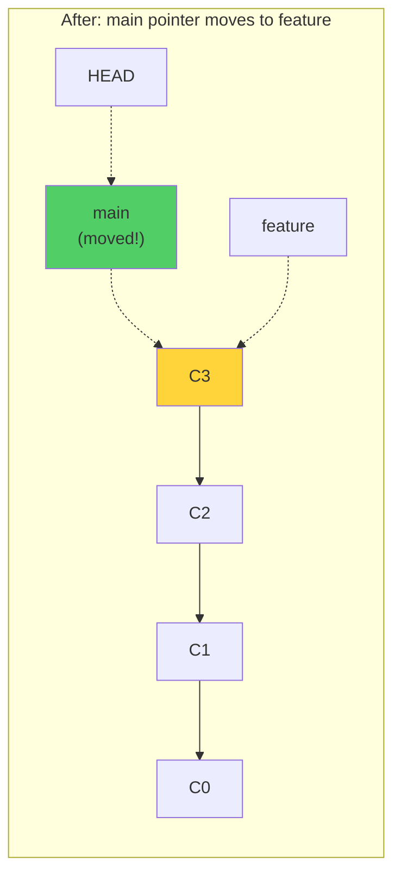
```mermaid
graph RL
    subgraph "After: main pointer moves to feature"
        C1B["C1"] --> C0B["C0"]
        C2B["C2"] --> C1B
        C3B["C3"] --> C2B
        MAINB["main<br/>(moved!)"] -.-> C3B
        FEATB["feature"] -.-> C3B
        HEADB["HEAD"] -.-> MAINB
    end
    
    style MAINB fill:#51cf66
    style C3B fill:#ffd43b
```

> **No merge commit** is created — the pointer just moves forward. History stays linear.

```bash
git switch main
git merge feature
# Output: Fast-forward

# Force a merge commit even when fast-forward is possible
git merge --no-ff feature
```

---

## 3. Three-Way Merge

When both branches have diverged (each has unique commits), Git performs a three-way merge.

### The Three "Ways" (Inputs)

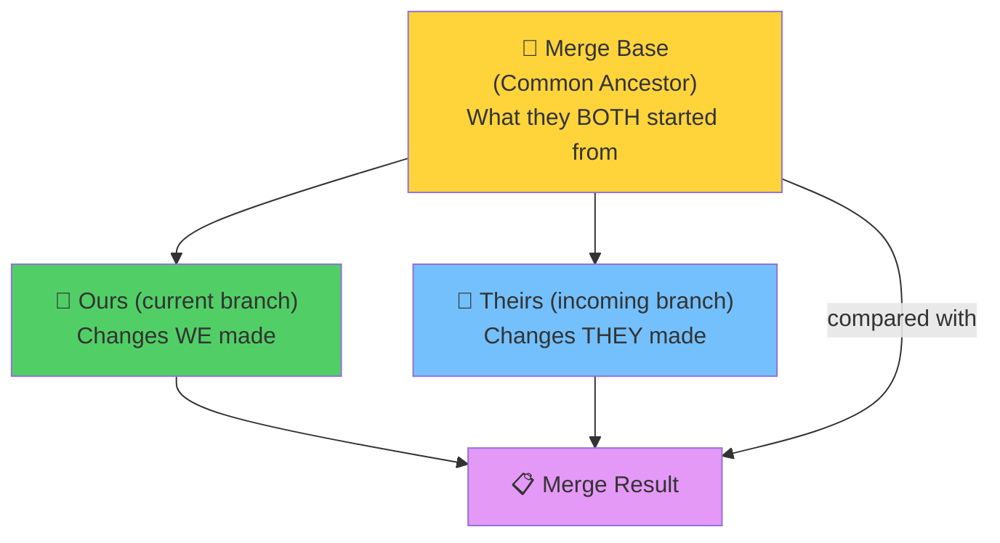
```mermaid
graph TD
    BASE["📌 Merge Base<br/>(Common Ancestor)<br/>What they BOTH started from"]
    OURS["📗 Ours (current branch)<br/>Changes WE made"]
    THEIRS["📘 Theirs (incoming branch)<br/>Changes THEY made"]
    RESULT["📋 Merge Result"]
    
    BASE --> OURS
    BASE --> THEIRS
    OURS --> RESULT
    THEIRS --> RESULT
    BASE -->|"compared with"| RESULT
    
    style BASE fill:#ffd43b
    style OURS fill:#51cf66
    style THEIRS fill:#74c0fc
    style RESULT fill:#e599f7
```

### How Git Resolves the Merge

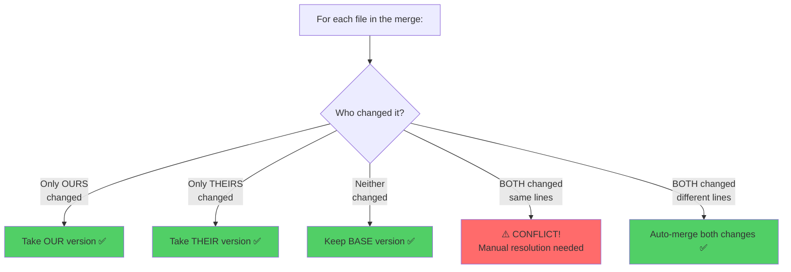
```mermaid
flowchart TD
    A["For each file in the merge:"] --> B{"Who changed it?"}
    
    B -->|"Only OURS<br/>changed"| C["Take OUR version ✅"]
    B -->|"Only THEIRS<br/>changed"| D["Take THEIR version ✅"]
    B -->|"Neither<br/>changed"| E["Keep BASE version ✅"]
    B -->|"BOTH changed<br/>same lines"| F["⚠️ CONFLICT!<br/>Manual resolution needed"]
    B -->|"BOTH changed<br/>different lines"| G["Auto-merge both changes ✅"]
    
    style C fill:#51cf66
    style D fill:#51cf66
    style E fill:#51cf66
    style F fill:#ff6b6b
    style G fill:#51cf66
```

### Three-Way Merge in Action

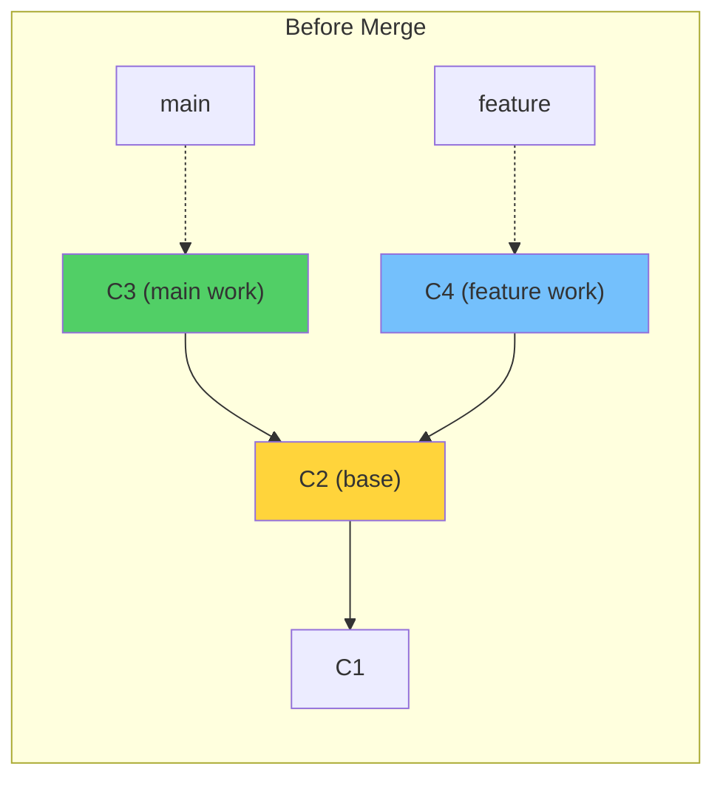
```mermaid
graph RL
    subgraph "Before Merge"
        C1["C1"] 
        C2["C2 (base)"] --> C1
        C3["C3 (main work)"] --> C2
        C4["C4 (feature work)"] --> C2
        MAIN1["main"] -.-> C3
        FEAT1["feature"] -.-> C4
    end
    
    style C2 fill:#ffd43b
    style C3 fill:#51cf66
    style C4 fill:#74c0fc
```

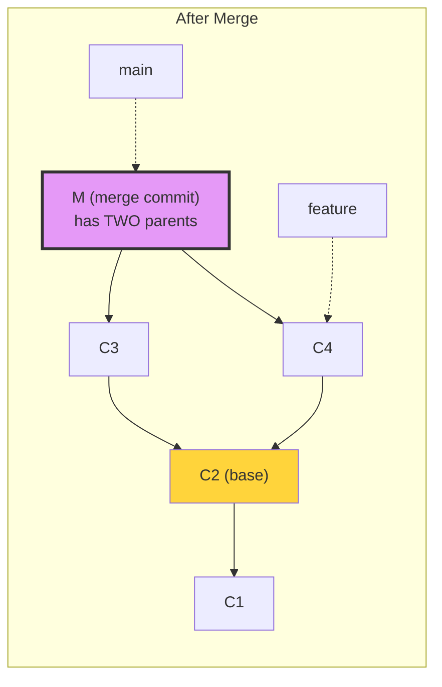
```mermaid
graph RL
    subgraph "After Merge"
        C1B["C1"]
        C2B["C2 (base)"] --> C1B
        C3B["C3"] --> C2B
        C4B["C4"] --> C2B
        M["M (merge commit)<br/>has TWO parents"] --> C3B
        M --> C4B
        MAIN2["main"] -.-> M
        FEAT2["feature"] -.-> C4B
    end
    
    style M fill:#e599f7,stroke:#333,stroke-width:3px
    style C2B fill:#ffd43b
```

```bash
git switch main
git merge feature
# Auto-merging files...
# Merge made by the 'ort' strategy.
```

---

## 4. Merge Conflicts — Why and How

### When Conflicts Happen

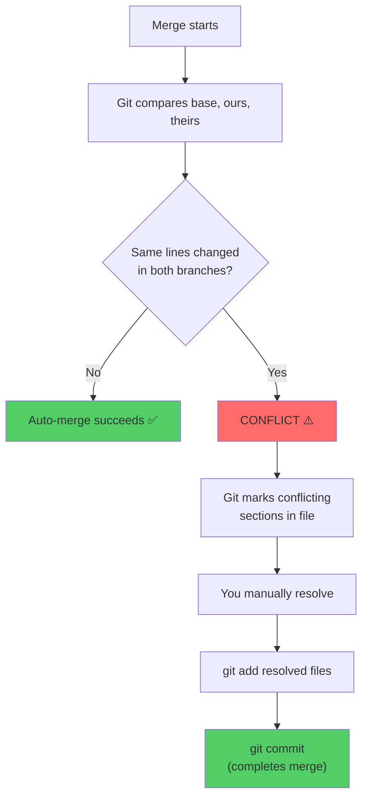
```mermaid
flowchart TD
    A["Merge starts"] --> B["Git compares base, ours, theirs"]
    B --> C{"Same lines changed<br/>in both branches?"}
    C -->|"No"| D["Auto-merge succeeds ✅"]
    C -->|"Yes"| E["CONFLICT ⚠️"]
    E --> F["Git marks conflicting<br/>sections in file"]
    F --> G["You manually resolve"]
    G --> H["git add resolved files"]
    H --> I["git commit<br/>(completes merge)"]
    
    style D fill:#51cf66
    style E fill:#ff6b6b
    style I fill:#51cf66
```

### Conflict Markers Explained

When a conflict occurs, Git marks the file like this:

```
<<<<<<< HEAD (ours — current branch)
const greeting = "Hello, World!";
=======
const greeting = "Hi, Universe!";
>>>>>>> feature (theirs — incoming branch)
```

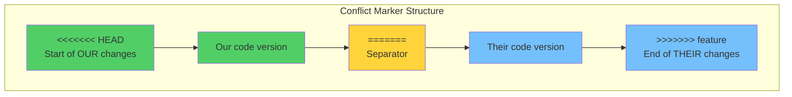
```mermaid
graph TD
    subgraph "Conflict Marker Structure"
        M1["<<<<<<< HEAD<br/>Start of OUR changes"]
        M2["Our code version"]
        M3["=======<br/>Separator"]
        M4["Their code version"]
        M5[">>>>>>> feature<br/>End of THEIR changes"]
    end
    
    M1 --> M2 --> M3 --> M4 --> M5
    
    style M1 fill:#51cf66
    style M2 fill:#51cf66
    style M3 fill:#ffd43b
    style M4 fill:#74c0fc
    style M5 fill:#74c0fc
```

### Using `diff3` Style (Recommended — Shows Base)

```bash
git config --global merge.conflictstyle diff3
```

Now conflicts show THREE versions:

```
<<<<<<< HEAD (ours)
const greeting = "Hello, World!";
||||||| merged common ancestor (base — original)
const greeting = "Hello";
=======
const greeting = "Hi, Universe!";
>>>>>>> feature (theirs)
```

This is much better because you can see **what the original was**, making it easier to understand what each side intended.

---

## 5. Resolving Conflicts Step-by-Step

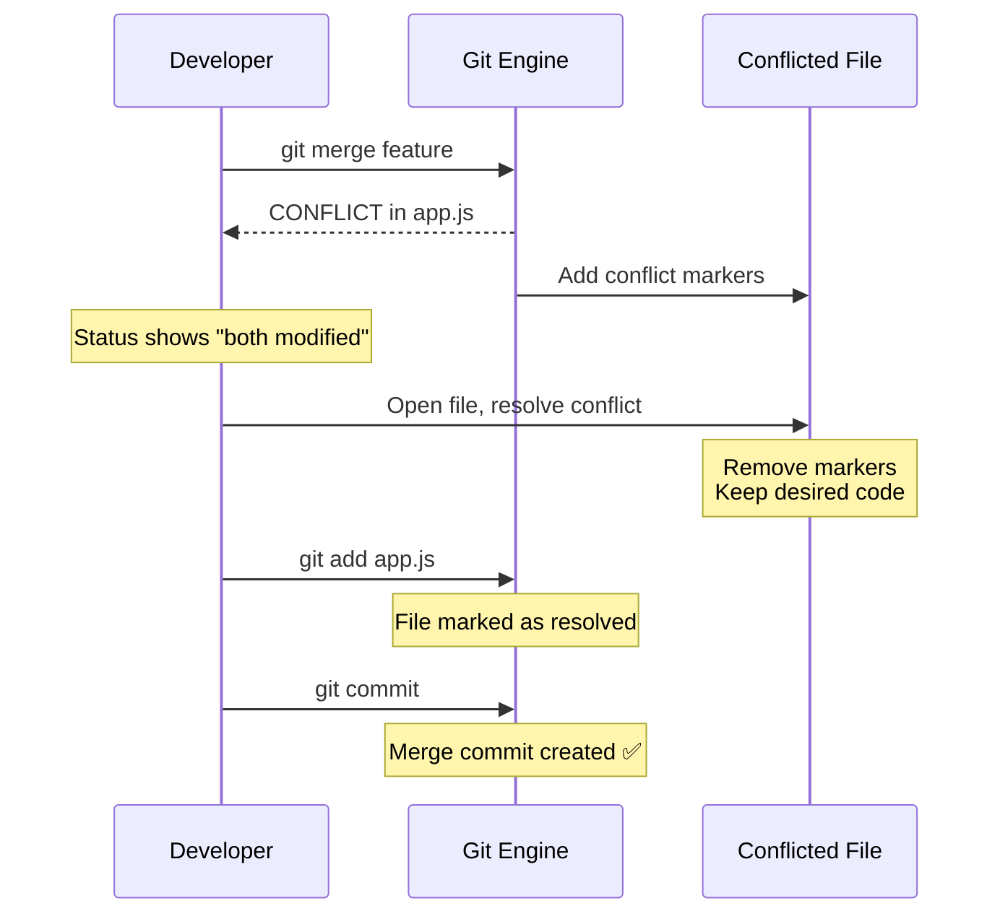
```mermaid
sequenceDiagram
    participant You as Developer
    participant Git as Git Engine
    participant File as Conflicted File
    
    You->>Git: git merge feature
    Git-->>You: CONFLICT in app.js
    Git->>File: Add conflict markers
    
    Note over You: Status shows "both modified"
    
    You->>File: Open file, resolve conflict
    Note over File: Remove markers<br/>Keep desired code
    
    You->>Git: git add app.js
    Note over Git: File marked as resolved
    
    You->>Git: git commit
    Note over Git: Merge commit created ✅
```

### Resolution Options

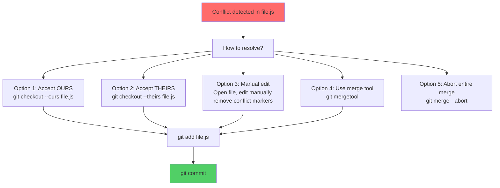
```mermaid
flowchart TD
    CONFLICT["Conflict detected in file.js"] --> OPTIONS["How to resolve?"]
    
    OPTIONS --> A["Option 1: Accept OURS<br/>git checkout --ours file.js"]
    OPTIONS --> B["Option 2: Accept THEIRS<br/>git checkout --theirs file.js"]
    OPTIONS --> C["Option 3: Manual edit<br/>Open file, edit manually,<br/>remove conflict markers"]
    OPTIONS --> D["Option 4: Use merge tool<br/>git mergetool"]
    OPTIONS --> E["Option 5: Abort entire merge<br/>git merge --abort"]
    
    A --> STAGE["git add file.js"]
    B --> STAGE
    C --> STAGE
    D --> STAGE
    STAGE --> FINISH["git commit"]
    
    style CONFLICT fill:#ff6b6b
    style FINISH fill:#51cf66
```

```bash
# During a conflict:

# Option 1: Take our version entirely
git checkout --ours -- file.js
git add file.js

# Option 2: Take their version entirely
git checkout --theirs -- file.js
git add file.js

# Option 3: Manual editing
# Open file, remove markers, keep desired code
git add file.js

# Option 4: Merge tool
git mergetool

# Option 5: Give up, abort
git merge --abort    # Go back to pre-merge state
```

---

## 6. Merge Strategies Overview

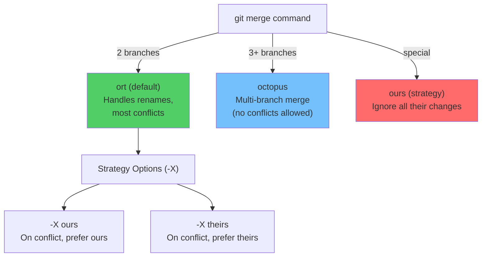
```mermaid
graph TD
    MERGE["git merge command"] --> |"2 branches"| ORT["ort (default)<br/>Handles renames,<br/>most conflicts"]
    MERGE --> |"3+ branches"| OCTOPUS["octopus<br/>Multi-branch merge<br/>(no conflicts allowed)"]
    MERGE --> |"special"| OURS_S["ours (strategy)<br/>Ignore all their changes"]
    
    ORT --> OPT["Strategy Options (-X)"]
    OPT --> OURS_O["-X ours<br/>On conflict, prefer ours"]
    OPT --> THEIRS_O["-X theirs<br/>On conflict, prefer theirs"]
    
    style ORT fill:#51cf66
    style OCTOPUS fill:#74c0fc
    style OURS_S fill:#ff6b6b
```

---

## 7. `--no-ff` vs Fast-Forward

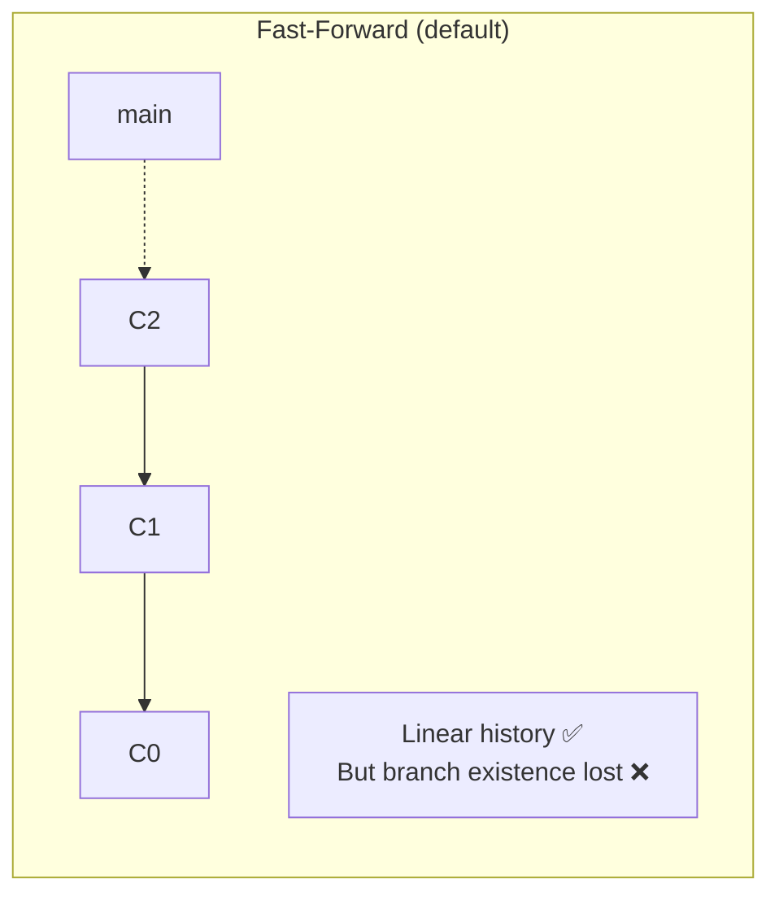
```mermaid
graph RL
    subgraph "Fast-Forward (default)"
        C1A["C1"] --> C0A["C0"]
        C2A["C2"] --> C1A
        MAINA["main"] -.-> C2A
        Note1["Linear history ✅<br/>But branch existence lost ❌"]
    end
```

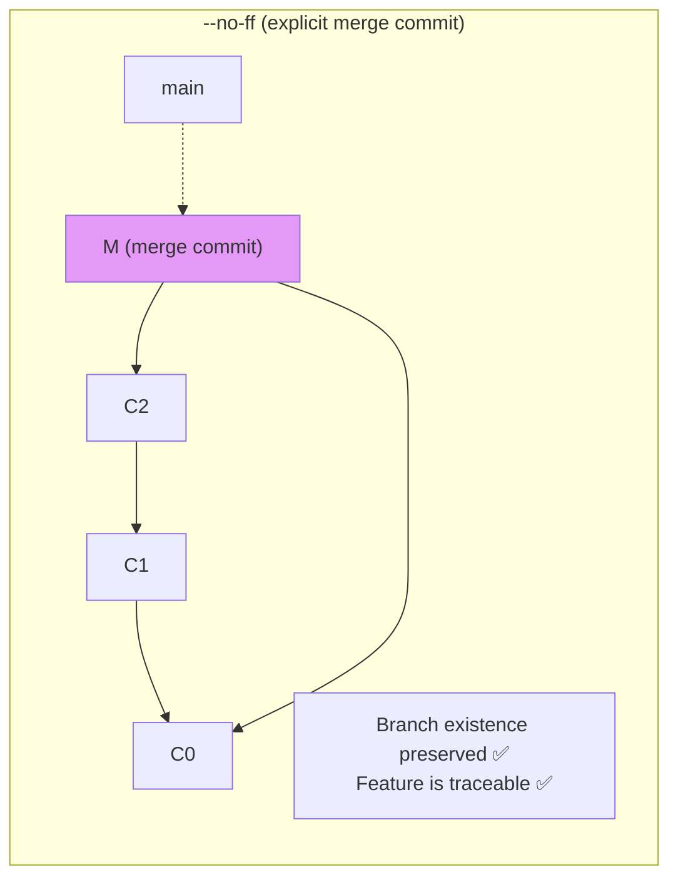
```mermaid
graph RL
    subgraph "--no-ff (explicit merge commit)"
        C1B["C1"] --> C0B["C0"]
        C2B["C2"] --> C1B
        MB["M (merge commit)"] --> C0B
        MB --> C2B
        MAINB["main"] -.-> MB
        Note2["Branch existence preserved ✅<br/>Feature is traceable ✅"]
    end
    
    style MB fill:#e599f7
```

```bash
# Explicit merge commit (recommended for feature branches)
git merge --no-ff feature/login
```

---

## 8. Squash Merge

Combine all feature commits into a single commit on the target branch:

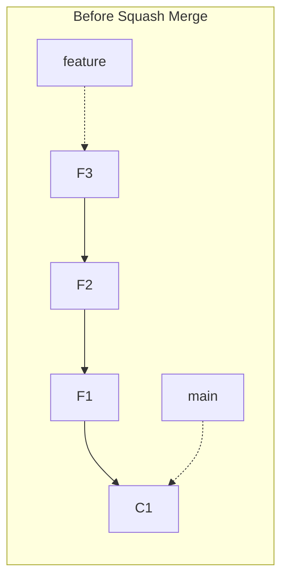
```mermaid
graph RL
    subgraph "Before Squash Merge"
        C1A["C1"] 
        F1["F1"] --> C1A
        F2["F2"] --> F1
        F3["F3"] --> F2
        MAINA["main"] -.-> C1A
        FEATA["feature"] -.-> F3
    end
```

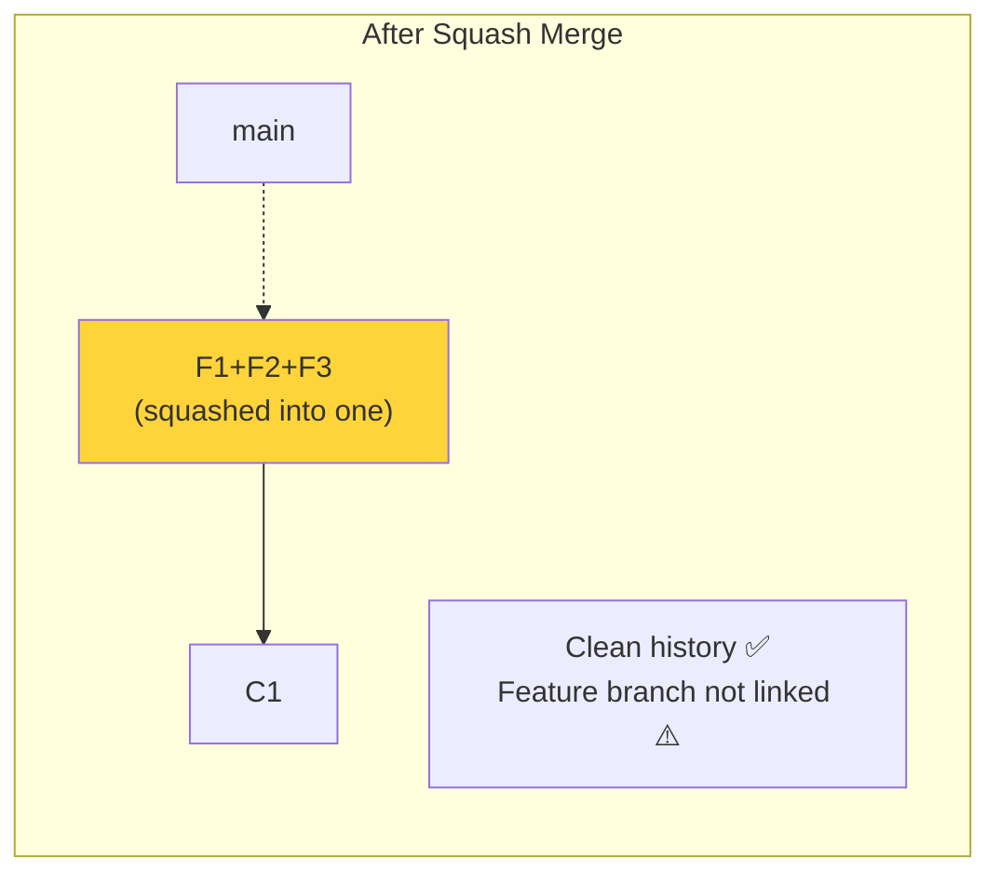
```mermaid
graph RL
    subgraph "After Squash Merge"
        C1B["C1"]
        SQ["F1+F2+F3<br/>(squashed into one)"] --> C1B
        MAINB["main"] -.-> SQ
        Note3["Clean history ✅<br/>Feature branch not linked ⚠️"]
    end
    
    style SQ fill:#ffd43b
```

```bash
git switch main
git merge --squash feature
git commit -m "feat: add complete login system"
```

---

## 🏋️ Exercises

1. Create two branches that modify different files — merge (fast-forward)
2. Create two branches that modify the **same file** — practice conflict resolution
3. Try `--no-ff` merge and compare the `git log --graph` with fast-forward
4. Practice `git merge --abort` to cancel a conflicted merge
5. Try squash merge and compare the history with regular merge
6. Set `merge.conflictstyle diff3` and resolve a conflict with the base version visible

---

## 🔑 Key Takeaways

1. **Fast-forward** happens when the target branch has no new commits — no merge commit created
2. **Three-way merge** compares the common ancestor (base) with both branches
3. Conflicts occur when the **same lines** are changed differently in both branches
4. Use `diff3` conflict style to see the **base** (original) version alongside both sides
5. `--no-ff` preserves the existence of feature branches in history
6. **Squash merge** combines all feature commits into one clean commit
7. `git merge --abort` is your escape hatch — always safe to use

---

**[← Module 05](../05-Branching-Basics/README.md)** | **[Module 07 →](../07-Remote-Repositories-and-GitHub-Basics/README.md)**
