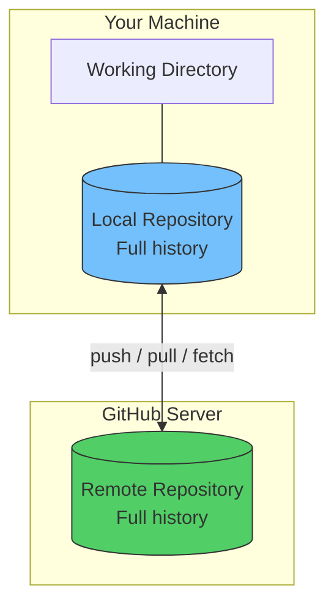
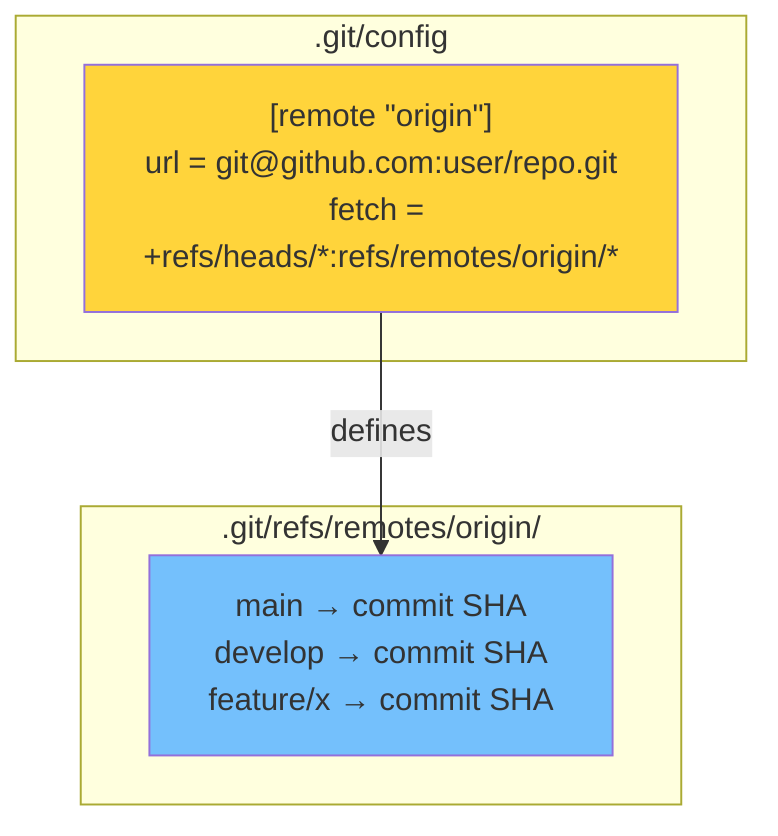
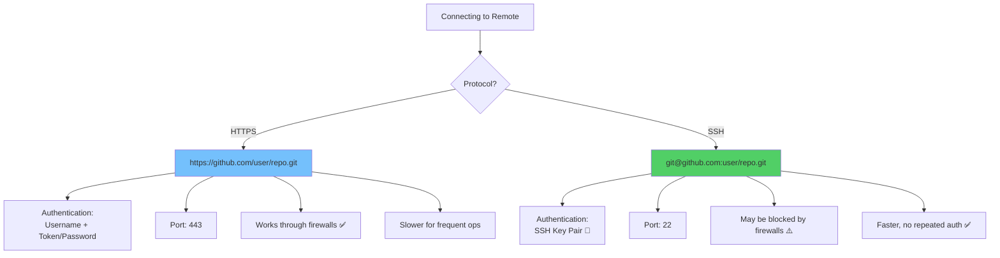
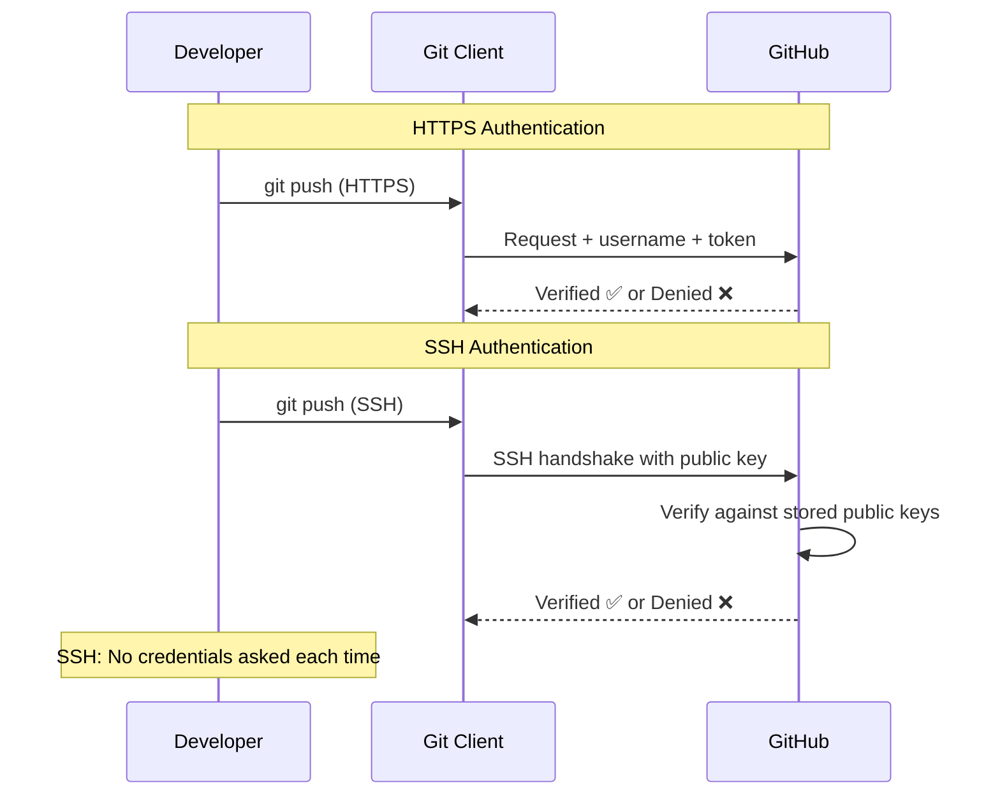
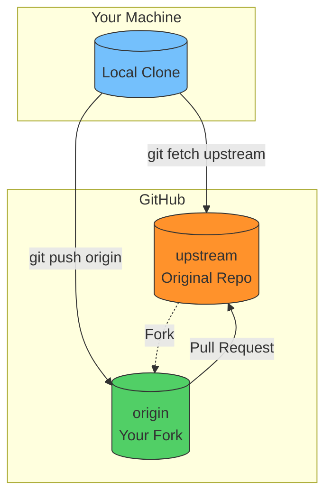
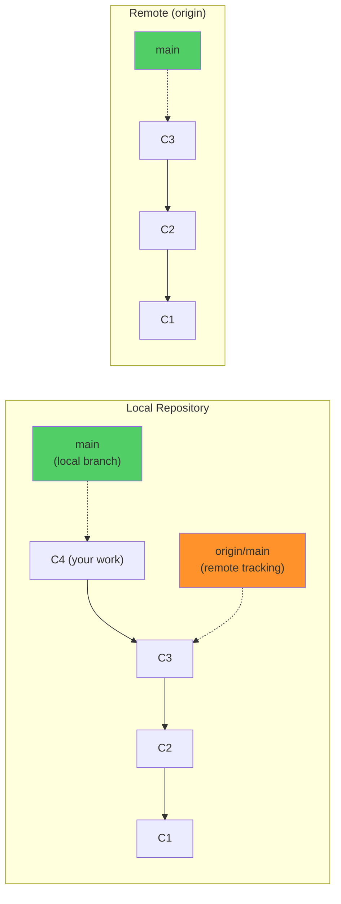
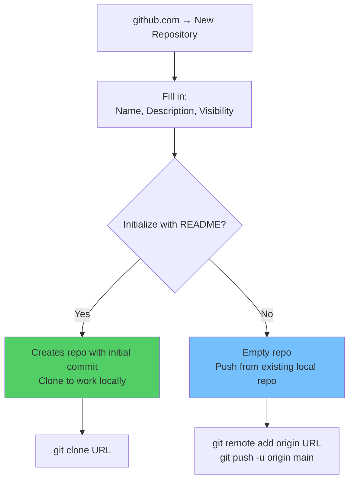
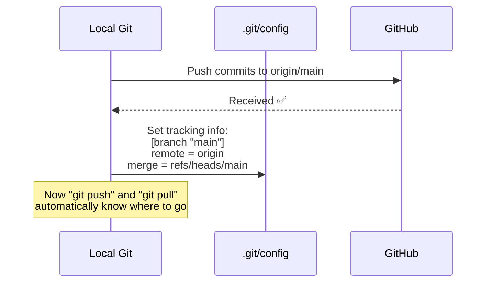
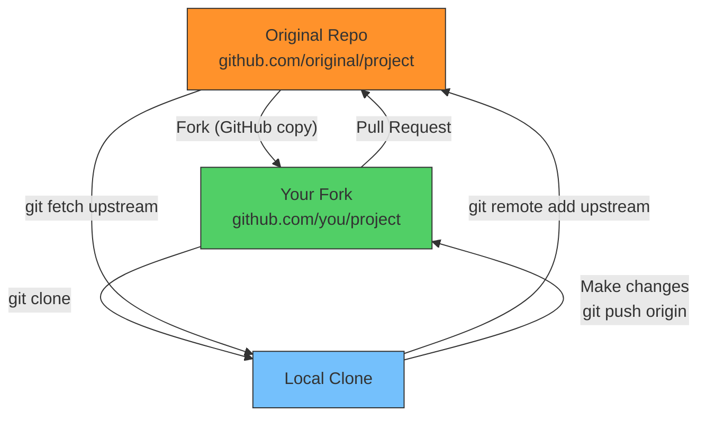

# Module 07: Remote Repositories & GitHub Basics

> **Level**: 🟡 Intermediate | **Time**: 3 hours | **Prerequisites**: [Module 06](../06-Merging-and-Conflict-Resolution/README.md)

---

## 📋 Learning Objectives

- Understand how remote repositories work internally
- Configure and manage remotes
- Master HTTPS vs SSH protocols
- Set up repositories on GitHub
- Understand the forking workflow

---

## 1. What Is a Remote Repository?

A remote is a **reference to another copy** of your repository, usually hosted on a server.



### How Remotes Are Stored



---

## 2. Remote Protocols — How Data Travels



### How SSH vs HTTPS Authentication Differs



---

## 3. Managing Remotes

```bash
# List remotes
git remote -v
# origin  git@github.com:user/repo.git (fetch)
# origin  git@github.com:user/repo.git (push)

# Add a remote
git remote add origin git@github.com:user/repo.git
git remote add upstream git@github.com:original/repo.git

# Remove a remote
git remote remove upstream

# Rename a remote
git remote rename origin github

# Change URL
git remote set-url origin git@github.com:user/new-repo.git

# Show detailed remote info
git remote show origin
```

### Multiple Remotes — Fork Workflow



---

## 4. Remote Tracking Branches

Remote tracking branches are **read-only local references** to the state of branches on the remote:



```bash
# View remote tracking branches
git branch -r
# origin/main
# origin/develop
# origin/feature/auth

# View all branches (local + remote tracking)
git branch -a

# See tracking relationship
git branch -vv
# * main    abc1234 [origin/main: ahead 1] Your commit message
```

---

## 5. Creating a GitHub Repository

### Via GitHub Web UI



### Connecting Local Repo to GitHub

```bash
# 1. Create repo on GitHub (empty, no README)

# 2. In your local project:
git remote add origin git@github.com:user/repo.git

# 3. Push with tracking
git push -u origin main
# -u sets up tracking: local main → origin/main
```

### How `git push -u` Works Internally



---

## 6. Forking — How It Works



### Fork vs Clone

| Feature | Fork | Clone |
|---------|------|-------|
| Where | On GitHub (server-side copy) | On your machine (local copy) |
| Created by | GitHub's Fork button | `git clone` command |
| Purpose | Contribute to others' repos | Work on any repo locally |
| Linked to original | Yes (can create PRs) | No (just a copy) |

---

## 🏋️ Exercises

1. Create a GitHub repo and link it to a local project
2. Set up both `origin` and `upstream` remotes
3. Practice switching between HTTPS and SSH: `git remote set-url`
4. View remote tracking branches with `git branch -r` and `git branch -vv`
5. Fork a public repo and clone your fork locally

---

## 🔑 Key Takeaways

1. A remote is a **reference** to another repository (stored in `.git/config`)
2. SSH is faster and more secure; HTTPS works through firewalls
3. `origin` = your fork/primary remote; `upstream` = the original repo
4. Remote tracking branches (`origin/main`) are read-only local snapshots of remote state
5. `git push -u` sets up tracking so future push/pull knows where to go
6. Fork = server-side copy on GitHub; Clone = local copy on your machine

---

**[← Module 06](../06-Merging-and-Conflict-Resolution/README.md)** | **[Module 08 →](../08-Collaboration-Push-Pull-Fetch/README.md)**
