# Module 08: Collaboration — Push, Pull, Fetch

> **Level**: 🟡 Intermediate | **Time**: 3 hours | **Prerequisites**: [Module 07](../07-Remote-Repositories-and-GitHub-Basics/README.md)

---

## 📋 Learning Objectives

- Understand the internal mechanics of push, pull, and fetch
- Handle diverged branches and pull strategies
- Set up tracking branches
- Collaborate effectively with teams

---

## 1. `git fetch` — Download Without Merging

### What Fetch Actually Does

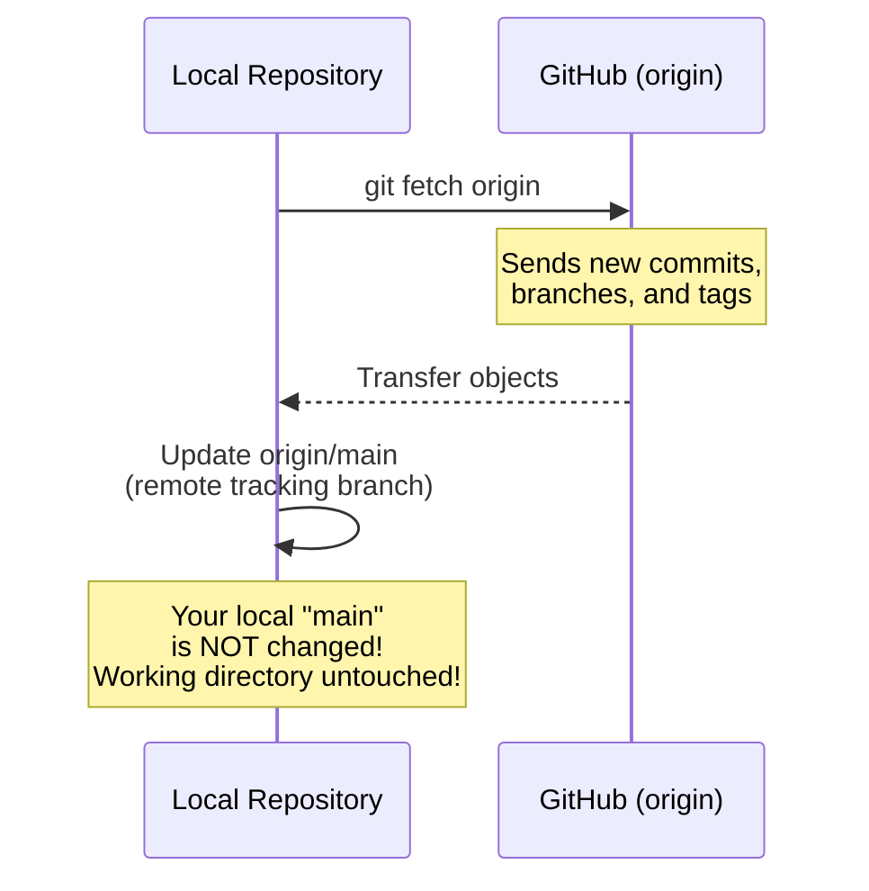

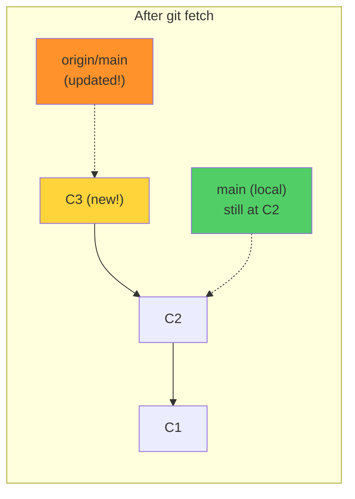

```bash
git fetch origin              # Fetch from origin
git fetch --all               # Fetch from all remotes
git fetch origin main         # Fetch specific branch
git fetch --prune             # Remove deleted remote branches
```

> **Key Insight**: Fetch is always **safe** — it never changes your working directory or local branches.

---

## 2. `git pull` — Fetch + Merge (or Rebase)

### How Pull Works Internally

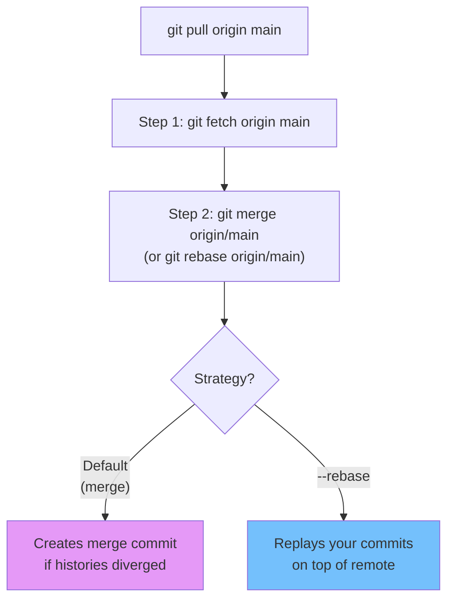

### Pull with Merge (Default)

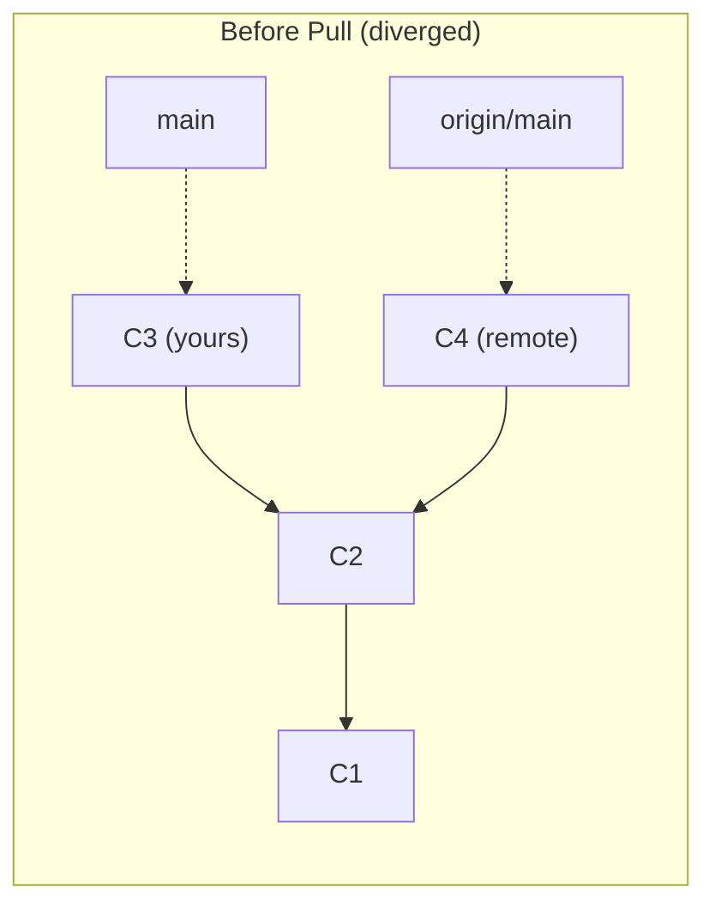

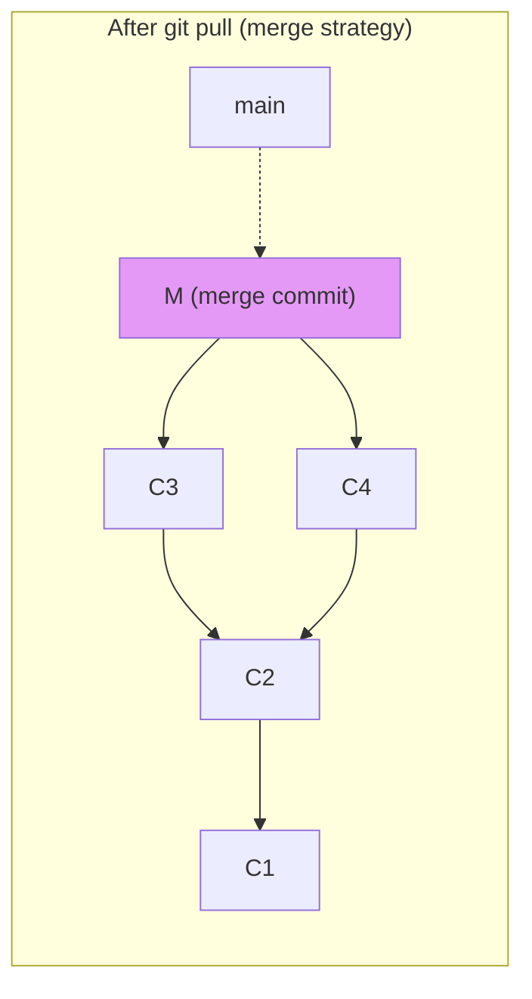

### Pull with Rebase

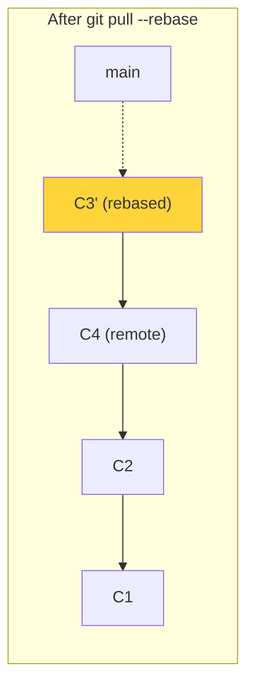

```bash
# Pull with merge (default)
git pull origin main

# Pull with rebase (recommended for clean history)
git pull --rebase origin main

# Set rebase as default pull strategy
git config --global pull.rebase true
```

---

## 3. `git push` — Upload Your Work

### How Push Works Internally

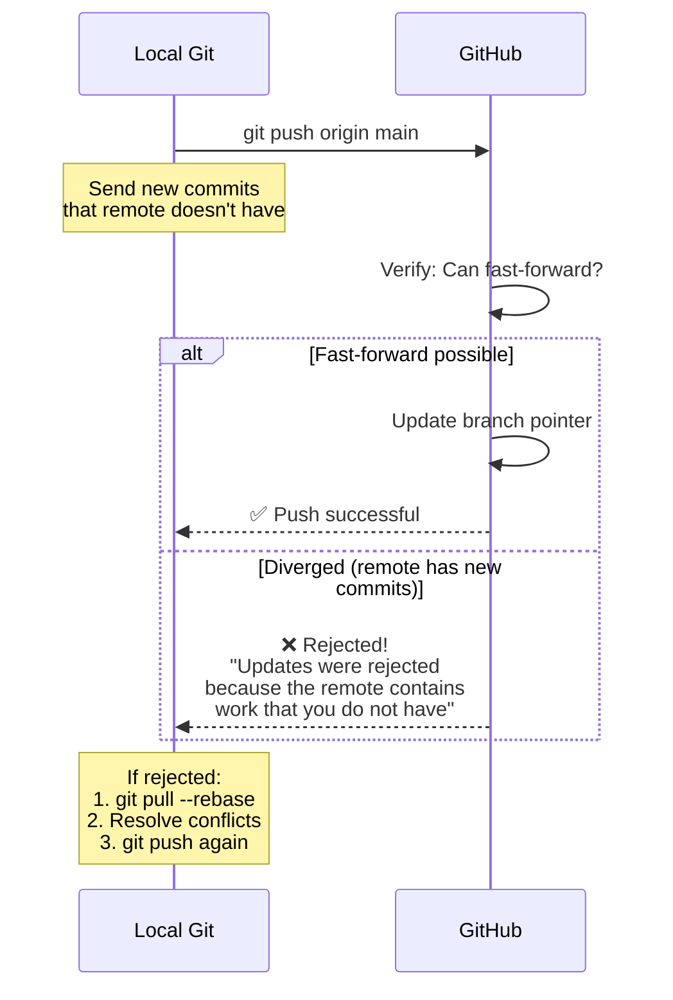

### Push Rejection and Resolution

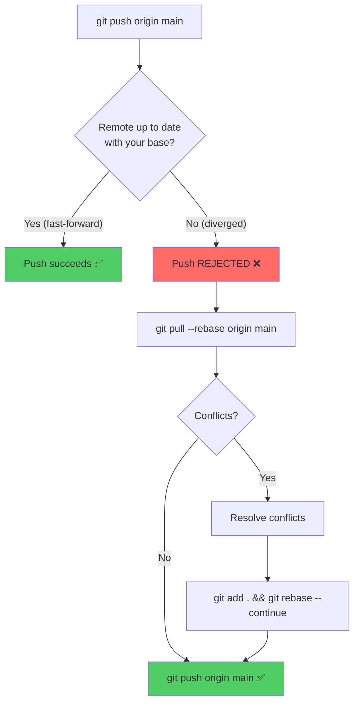

```bash
# Basic push
git push origin main

# Push with tracking (first push)
git push -u origin main

# Push all branches
git push --all origin

# Push tags
git push --tags

# Force push (DANGEROUS — use only on private branches)
git push --force origin feature/my-branch

# Safe force push (checks for remote changes first)
git push --force-with-lease origin feature/my-branch
```

---

## 4. Force Push — `--force` vs `--force-with-lease`

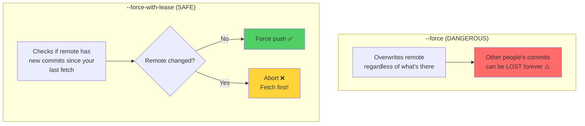

---

## 5. The Complete Collaboration Flow

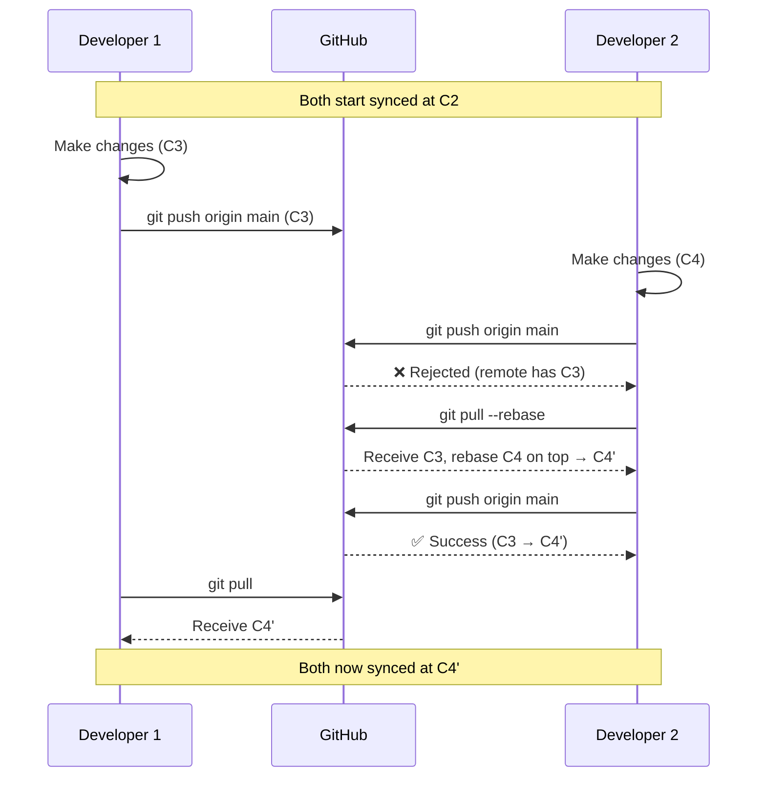

---

## 6. Tracking Branches

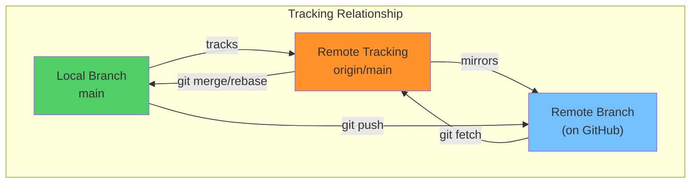

```bash
# View tracking info
git branch -vv
# * main     abc1234 [origin/main] Latest commit
# develop    def5678 [origin/develop: ahead 2, behind 1]
# feature    ghi9012 (no tracking)

# Set tracking for existing branch
git branch --set-upstream-to=origin/main main
# Or shorter:
git branch -u origin/main
```

### Understanding "ahead" and "behind"

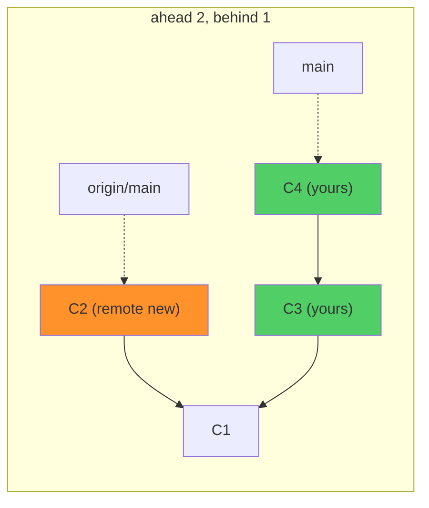

- **Ahead 2**: You have 2 commits the remote doesn't have
- **Behind 1**: The remote has 1 commit you don't have

---

## 🏋️ Exercises

1. Practice the full cycle: `fetch → pull → push` with a partner or second GitHub account
2. Create a diverged state and resolve it with `git pull --rebase`
3. Set up tracking: push a new branch with `-u` and verify with `git branch -vv`
4. Try `--force-with-lease` on a feature branch after amending a commit
5. Use `git fetch --prune` to clean up deleted remote branches

---

## 🔑 Key Takeaways

1. **Fetch** downloads remote changes without modifying your local branches — always safe
2. **Pull** = fetch + merge (or rebase, if configured)
3. **Push** fails if the remote has commits you don't have — pull first
4. Use `pull --rebase` for cleaner history (avoids unnecessary merge commits)
5. **Never force push** to shared branches; use `--force-with-lease` on private branches
6. Tracking branches let `git push/pull` know where to send/receive data

---

**[← Module 07](../07-Remote-Repositories-and-GitHub-Basics/README.md)** | **[Module 09 →](../09-Rebasing-and-Cherry-Picking/README.md)**
