# Module 09: Rebasing & Cherry-Picking

> **Level**: 🟡 Intermediate | **Time**: 3.5 hours | **Prerequisites**: [Module 08](../08-Collaboration-Push-Pull-Fetch/README.md)

---

## 📋 Learning Objectives

- Understand how rebase works at the object level
- Know when to rebase vs merge
- Use cherry-pick to apply specific commits
- Follow the golden rule of rebasing

---

## 1. What Is Rebase? — The Internal Mechanics

Rebase **re-applies** your commits on top of a different base commit, creating **new commits** with new SHAs.

### Before vs After

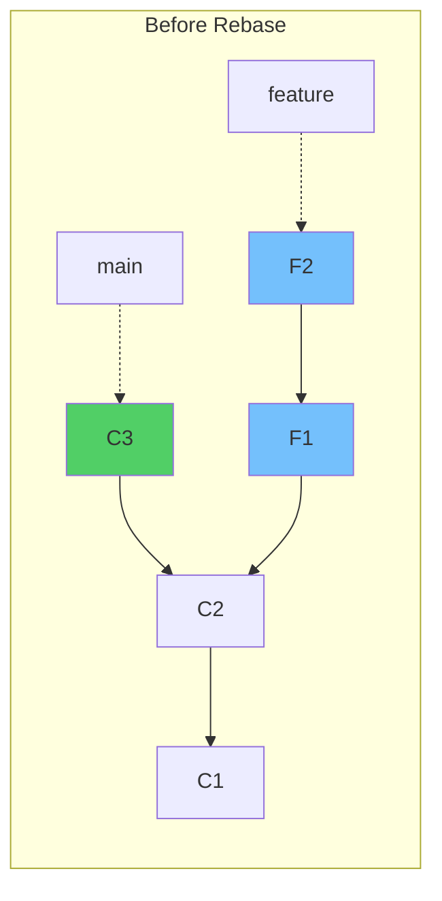

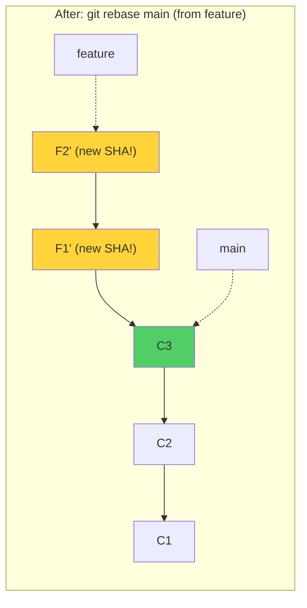

> The `'` marks indicate these are **new commits** — same changes but different parent, so different SHA.

### Step-by-Step: What Git Does Internally

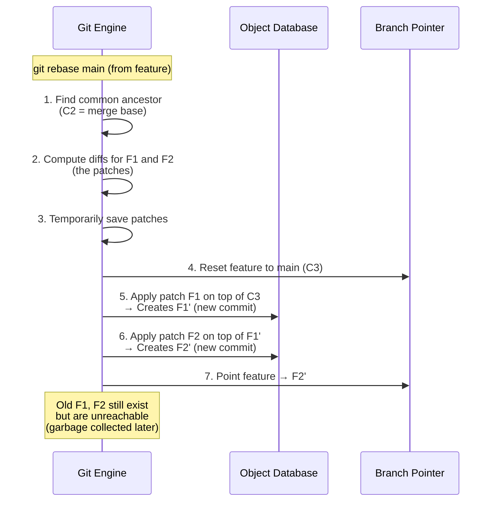

### Rebase Algorithm Flowchart

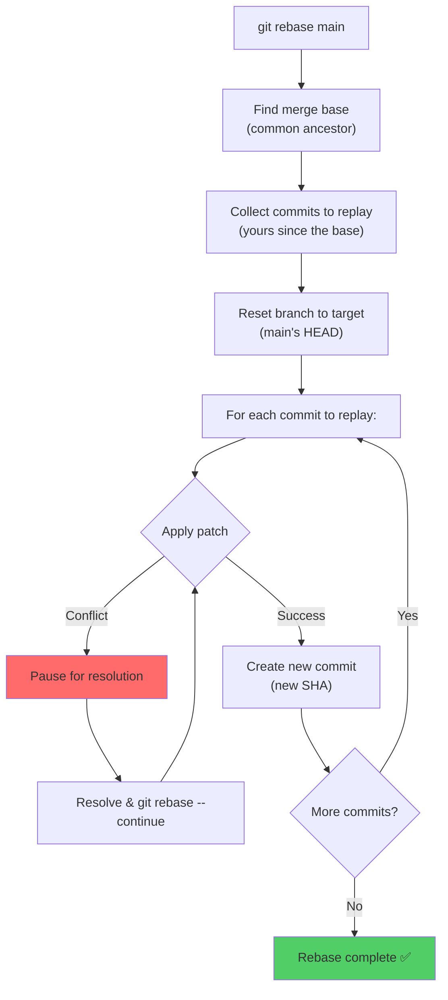

---

## 2. Merge vs Rebase — Visual Comparison

### Merge: Preserves True History

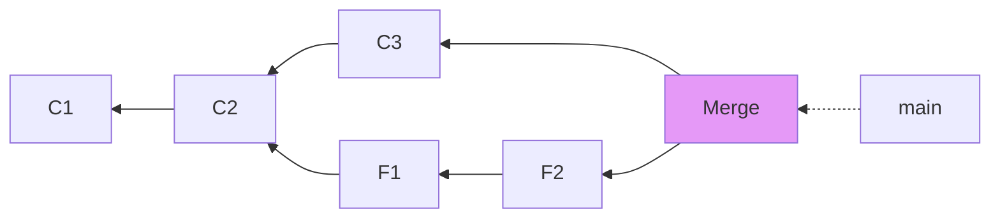

### Rebase: Creates Linear History

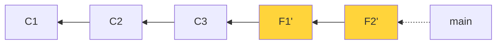

### Decision Flowchart

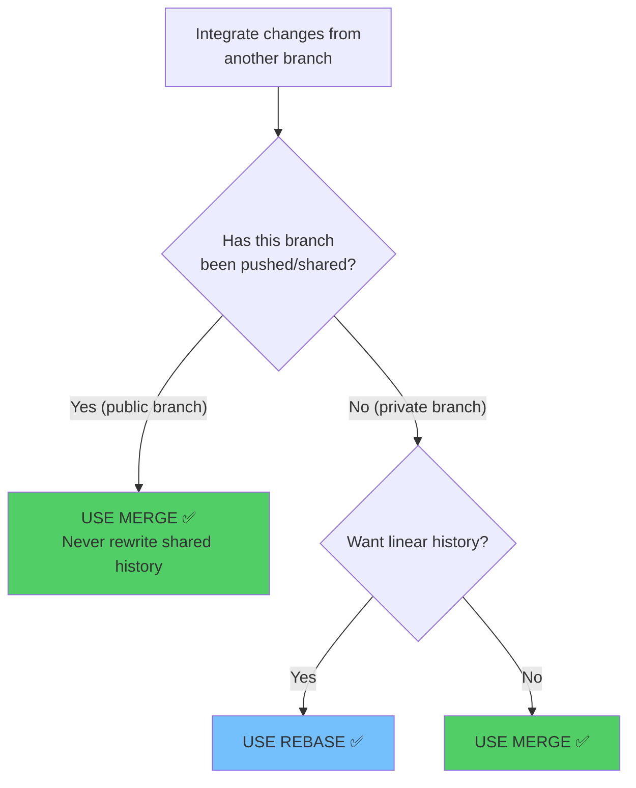

---

## 3. The Golden Rule of Rebasing

> **🚨 NEVER rebase commits that have been pushed to a shared branch.**

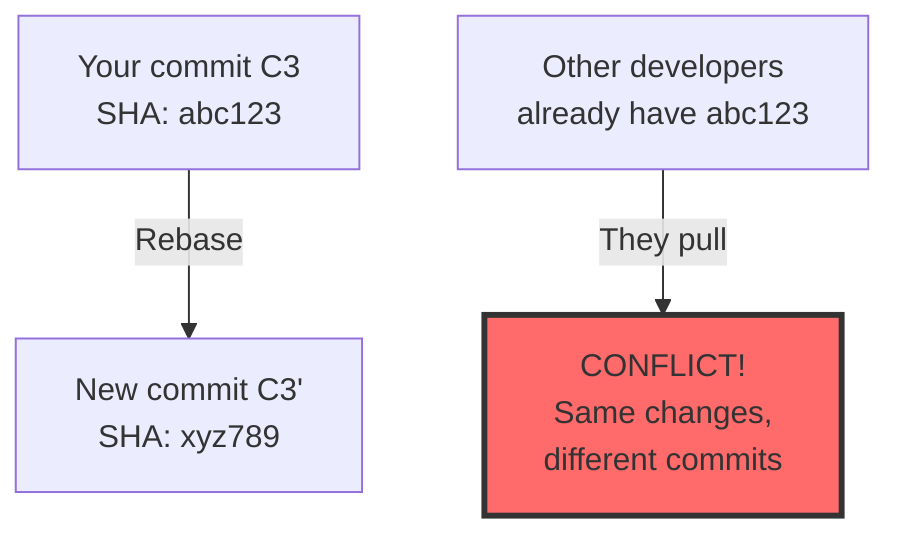

### Why?

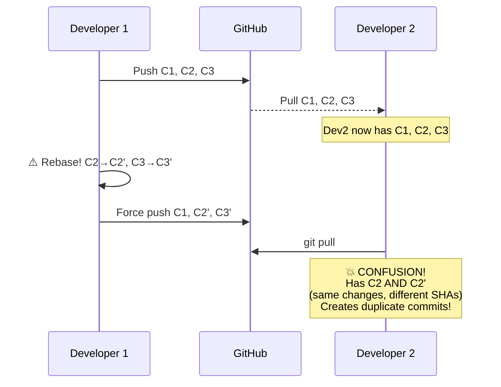

---

## 4. Cherry-Pick — How It Works

Cherry-pick **copies the changes** from a specific commit and applies them as a **new commit** on your current branch.

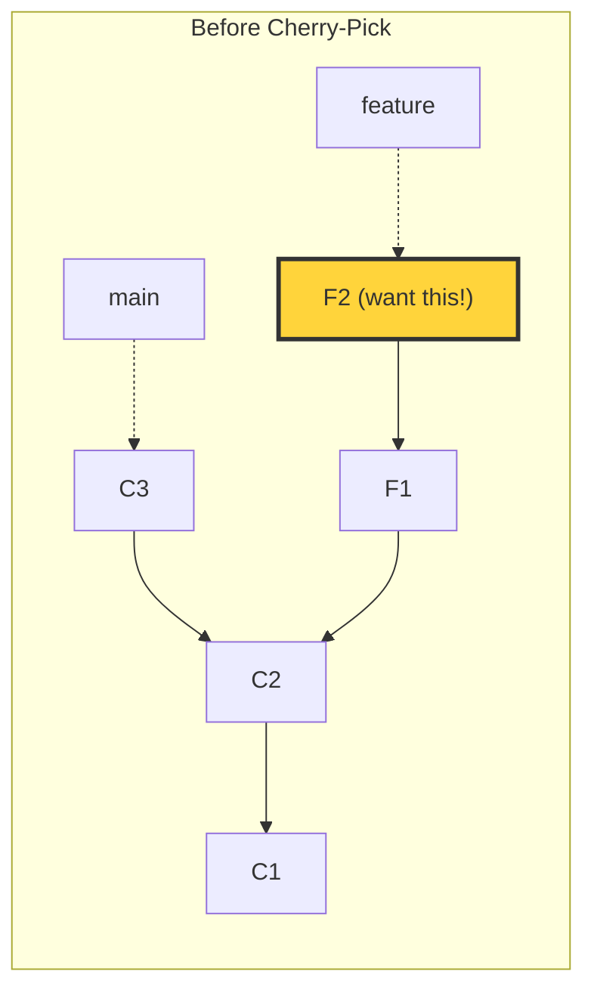

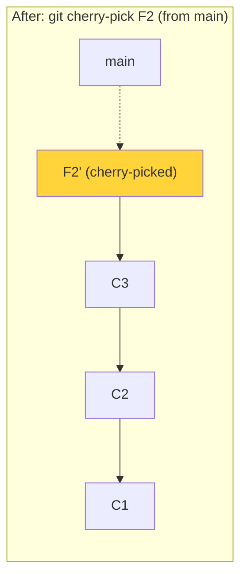

### Cherry-Pick Internally

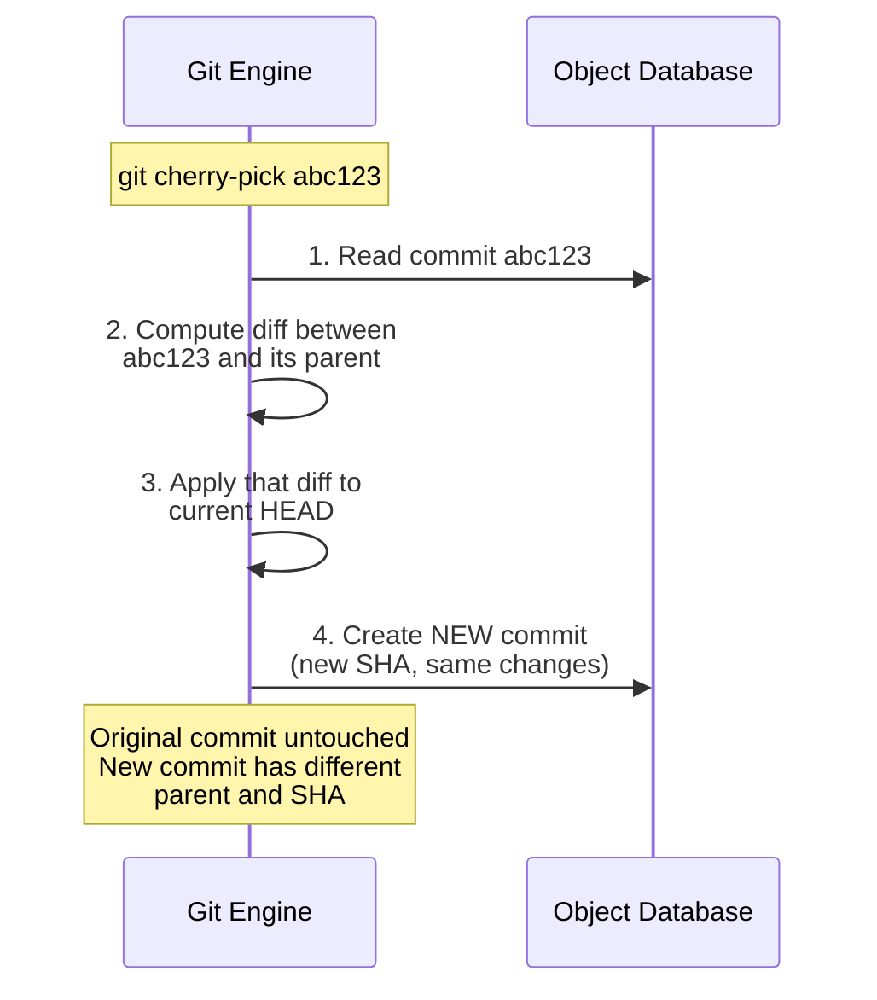

```bash
# Cherry-pick a single commit
git cherry-pick abc1234

# Cherry-pick without committing (stage only)
git cherry-pick --no-commit abc1234

# Cherry-pick multiple commits
git cherry-pick abc1234 def5678

# Cherry-pick a range
git cherry-pick abc1234..def5678  # Exclusive start
git cherry-pick abc1234^..def5678 # Inclusive start

# Abort cherry-pick (on conflict)
git cherry-pick --abort
```

### When to Use Cherry-Pick

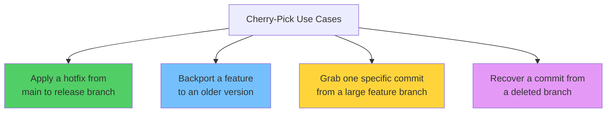

---

## 5. Rebase Conflict Resolution

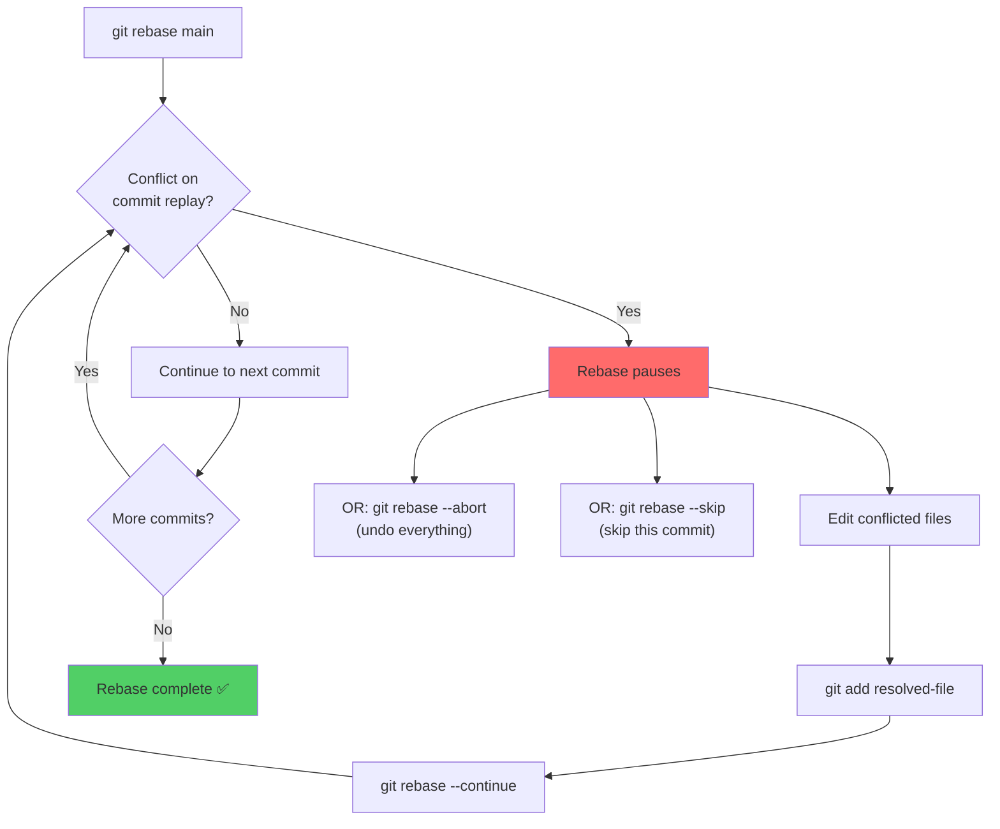

---

## 🏋️ Exercises

1. Create a feature branch, add commits on both branches, then rebase
2. Compare `git log --graph` before and after rebase vs merge
3. Cherry-pick a specific commit from one branch to another
4. Practice resolving rebase conflicts with `--continue` and `--abort`
5. Try cherry-picking a range of commits

---

## 🔑 Key Takeaways

1. Rebase **replays commits** on a new base — creates new SHAs
2. **Merge preserves history** (non-linear); **rebase creates linear history**
3. 🚨 **Never rebase public/shared branches** — it rewrites history
4. Cherry-pick copies a single commit's changes as a new commit
5. During rebase conflicts: resolve → `git add` → `git rebase --continue`
6. Use rebase for local cleanup; merge for integrating shared branches

---

**[← Module 08](../08-Collaboration-Push-Pull-Fetch/README.md)** | **[Module 10 →](../10-Stashing-and-Cleaning/README.md)**
