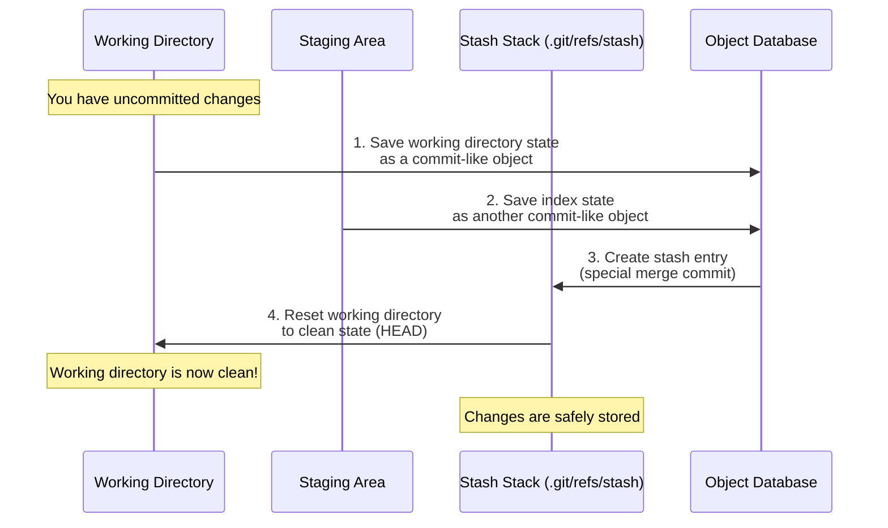
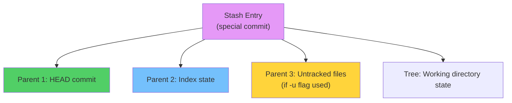
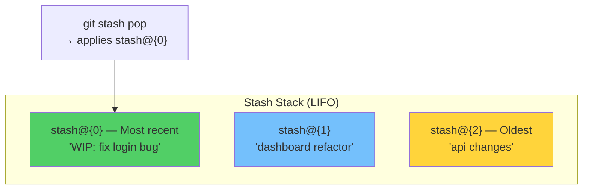
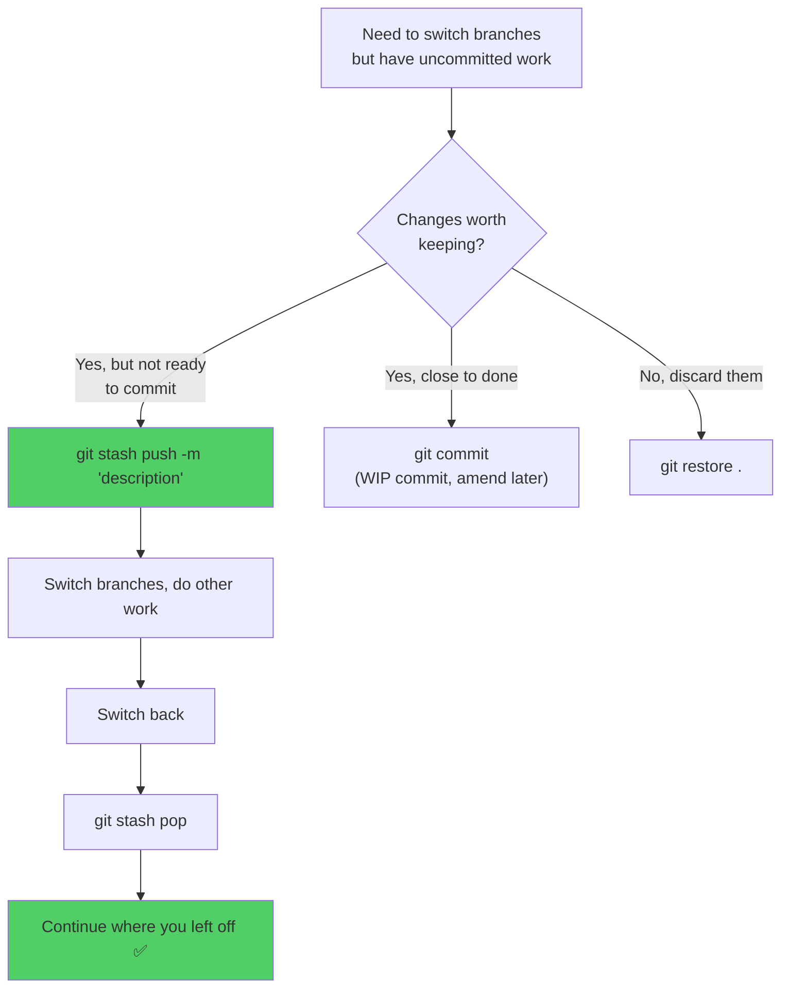
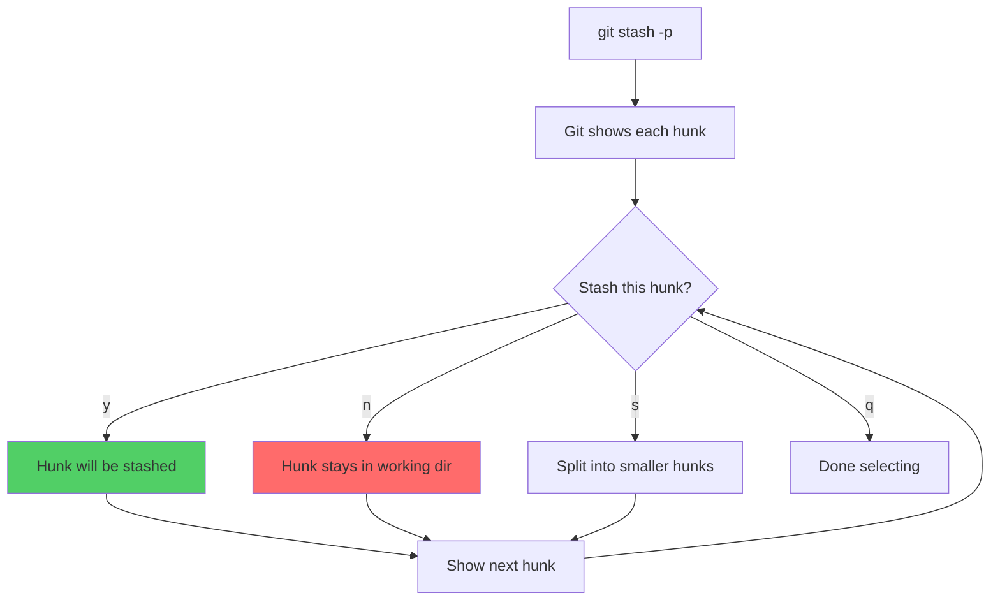
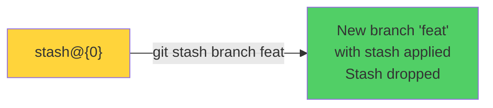
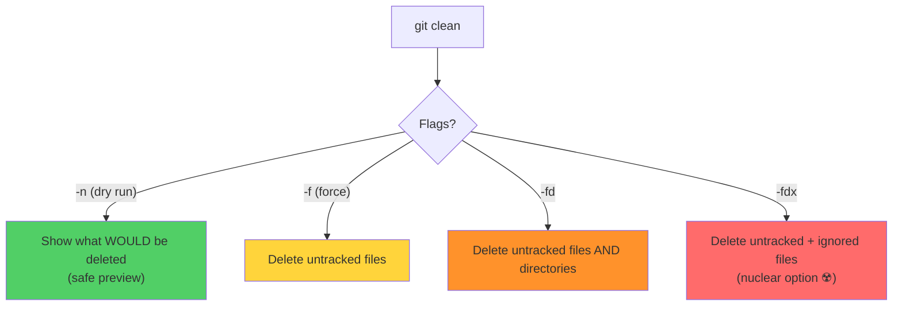
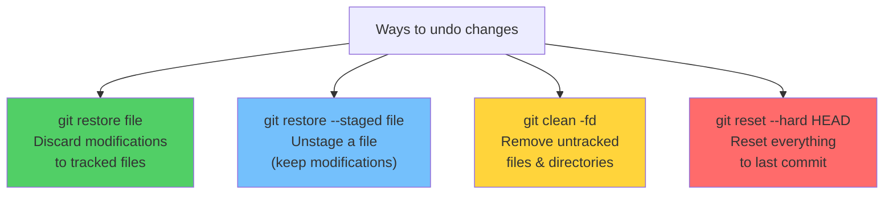

# Module 10: Stashing & Cleaning

> **Level**: 🟡 Intermediate | **Time**: 2 hours | **Prerequisites**: [Module 09](../09-Rebasing-and-Cherry-Picking/README.md)

---

## 📋 Learning Objectives

- Understand how stash works internally
- Master all stash operations
- Clean untracked files safely

---

## 1. What Is `git stash`? — Internal Mechanics

Stash **temporarily shelves** uncommitted changes so you can work on something else, then come back.

### How Stash Works Internally



### Stash Object Structure



> A stash is essentially a special merge commit with 2-3 parents: HEAD, staged changes, and optionally untracked files.

---

## 2. Stash Operations

### The Stash Stack



### Common Stash Commands

```bash
# Save changes to stash
git stash                         # Default message
git stash push -m "description"   # With message

# Include untracked files
git stash -u
git stash --include-untracked

# Include ALL files (even ignored)
git stash -a
git stash --all

# List stashes
git stash list

# Apply stash (keep in stack)
git stash apply                   # Latest stash
git stash apply stash@{2}        # Specific stash

# Apply AND remove from stack
git stash pop                     # Latest stash
git stash pop stash@{2}          # Specific stash

# View stash contents
git stash show                    # Summary
git stash show -p                 # Full diff
git stash show stash@{1} -p     # Specific stash diff

# Delete stashes
git stash drop stash@{0}         # Delete specific
git stash clear                   # Delete ALL stashes
```

### Stash Workflow Decision



---

## 3. Partial Stash (`git stash -p`)



---

## 4. Creating a Branch from Stash

```bash
git stash branch new-feature-branch stash@{0}
# Creates branch, checks it out, applies stash, drops stash
```



---

## 5. `git clean` — Removing Untracked Files

### How Clean Works



```bash
# Preview what would be deleted (always do this first!)
git clean -n

# Delete untracked files
git clean -f

# Delete untracked files + directories
git clean -fd

# Delete including ignored files (e.g., node_modules, build)
git clean -fdx

# Interactive mode
git clean -i
```

### Clean vs Restore vs Reset



---

## 🏋️ Exercises

1. Make changes, stash them, switch branches, come back, and pop stash
2. Use `git stash -p` to selectively stash only some changes
3. Create a branch from a stash with `git stash branch`
4. Practice `git clean -n` before `git clean -fd` for safe cleanup
5. Compare `git stash show -p` output between multiple stashes

---

## 🔑 Key Takeaways

1. Stash stores uncommitted changes as special commit objects in a stack
2. Always use `-m` to describe your stash — unnamed stashes are confusing
3. `pop` = apply + drop; `apply` = apply without removing from stack
4. Use `-u` to include untracked files in the stash
5. Always `git clean -n` (dry run) before `git clean -f` to preview deletions
6. Stash, restore, clean, and reset solve different "undo" scenarios

---

**[← Module 09](../09-Rebasing-and-Cherry-Picking/README.md)** | **[Module 11 →](../11-Tags-Releases-and-Semantic-Versioning/README.md)**
