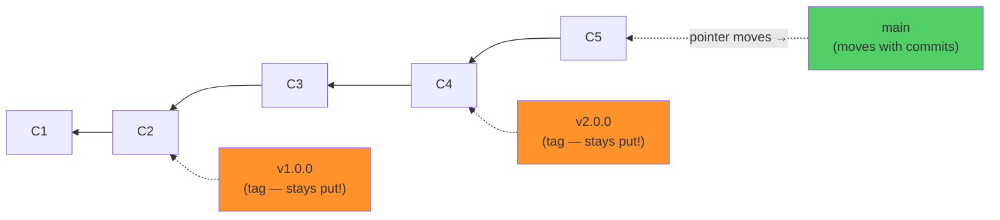
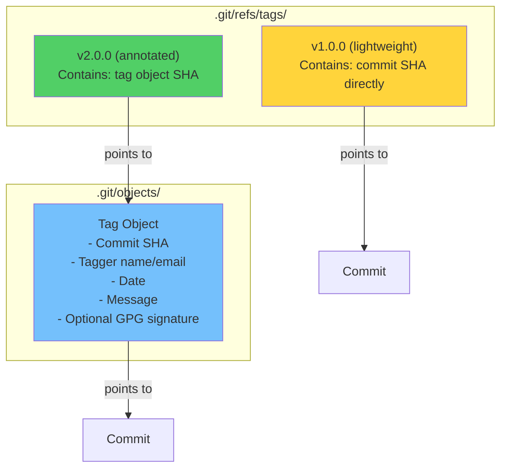
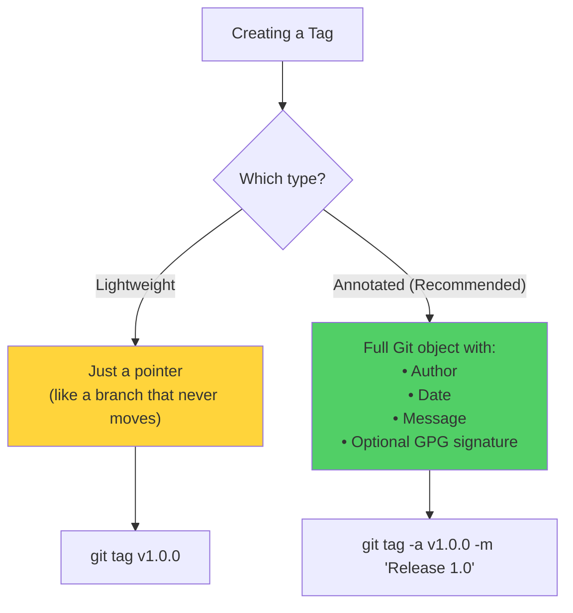
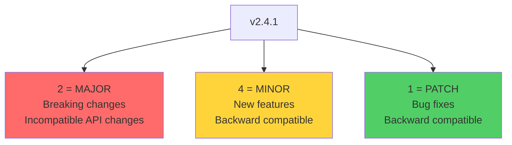
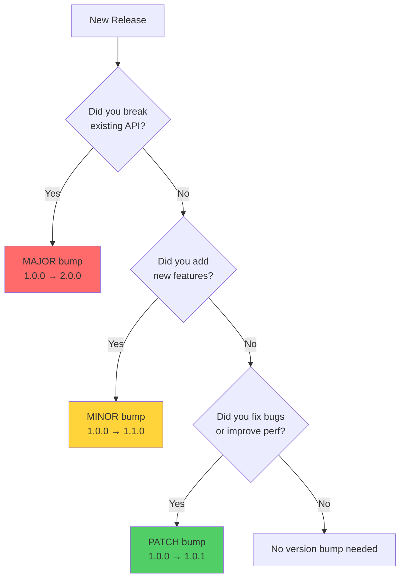
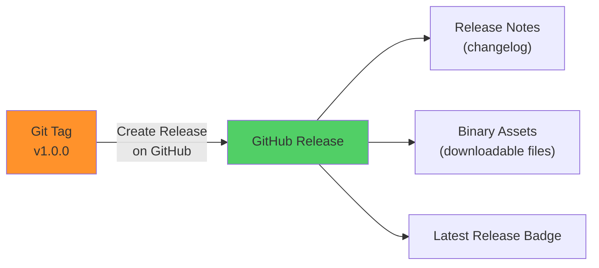

# Module 11: Tags, Releases & Semantic Versioning

> **Level**: 🟡 Intermediate | **Time**: 2.5 hours | **Prerequisites**: [Module 10](../10-Stashing-and-Cleaning/README.md)

---

## 📋 Learning Objectives

- Understand Git tags and how they differ from branches
- Create lightweight vs annotated tags
- Master Semantic Versioning
- Create GitHub Releases

---

## 1. What Are Tags? — Internal Model

Tags are **permanent pointers** to specific commits. Unlike branches, they **don't move**.



### How Tags Are Stored



---

## 2. Lightweight vs Annotated Tags



| Feature | Lightweight | Annotated |
|---------|------------|-----------|
| Stored as | Pointer (ref) | Full Git object |
| Has author | ❌ | ✅ |
| Has date | ❌ | ✅ |
| Has message | ❌ | ✅ |
| GPG signable | ❌ | ✅ |
| For releases | ❌ | ✅ Recommended |
| For temp marks | ✅ | Overkill |

```bash
# Lightweight
git tag v1.0.0
git tag temp-mark

# Annotated (recommended for releases)
git tag -a v1.0.0 -m "First stable release"

# Tag a specific commit
git tag -a v0.9.0 abc1234 -m "Beta release"

# List tags
git tag
git tag -l "v2.*"        # Filter by pattern

# Show tag details
git show v1.0.0

# Delete local tag
git tag -d v1.0.0

# Push tags
git push origin v1.0.0   # Single tag
git push origin --tags    # All tags

# Delete remote tag
git push origin --delete v1.0.0
```

---

## 3. Semantic Versioning (SemVer)



### Version Bump Decision Flow



### Pre-Release Versions

```
v1.0.0-alpha.1    ← Very early, unstable
v1.0.0-beta.1     ← Feature complete, may have bugs
v1.0.0-rc.1       ← Release candidate, nearly done
v1.0.0            ← Stable release
```

---

## 4. GitHub Releases



```bash
# Create release via GitHub CLI
gh release create v1.0.0 --title "v1.0.0" --notes "First release"

# Auto-generate notes from commit history
gh release create v1.0.0 --generate-notes

# Create release with assets
gh release create v1.0.0 ./dist/app.zip --title "v1.0.0"

# Create draft release
gh release create v1.0.0 --draft

# List releases
gh release list
```

---

## 🏋️ Exercises

1. Create both lightweight and annotated tags and compare with `git show`
2. Tag a past commit and push the tag to GitHub
3. Delete a tag locally and remotely
4. Create a GitHub Release with auto-generated notes using `gh release create`
5. Practice SemVer: given a changelog, determine the correct version bump

---

## 🔑 Key Takeaways

1. Tags are **permanent pointers** — they don't move like branches
2. Use **annotated tags** for releases (includes metadata and can be signed)
3. SemVer: MAJOR (breaking) . MINOR (features) . PATCH (fixes)
4. GitHub Releases wrap tags with release notes and downloadable assets
5. Always push tags explicitly — `git push` doesn't push tags by default

---

**[← Module 10](../10-Stashing-and-Cleaning/README.md)** | **[Module 12 →](../12-Git-Diff-Blame-and-Bisect/README.md)**
