# Module 12: Git Diff, Blame & Bisect

> **Level**: 🟡 Intermediate | **Time**: 3 hours | **Prerequisites**: [Module 11](../11-Tags-Releases-and-Semantic-Versioning/README.md)

---

## 📋 Learning Objectives

- Master `git diff` in all its forms
- Track authorship with `git blame`
- Use `git bisect` for binary search debugging
- Combine tools for effective investigation

---

## 1. `git diff` — How It Works Internally

`git diff` computes the **difference** between two Git trees (working directory, index, or commits).

### What Gets Compared

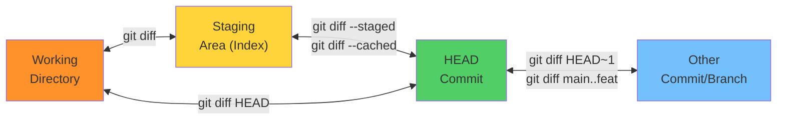

### Diff Algorithm — How Git Finds Changes

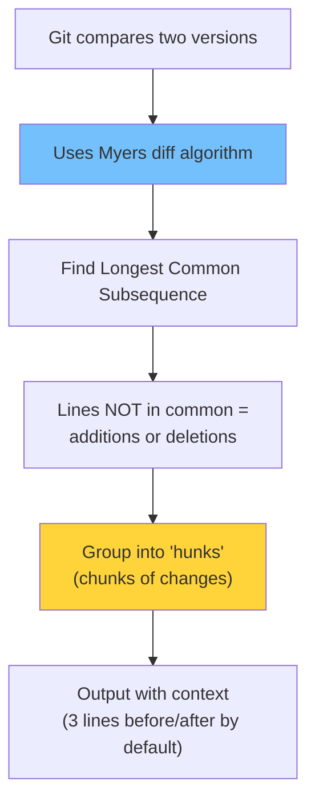

### Reading Diff Output (Anatomy)

```diff
diff --git a/app.js b/app.js    ← Files being compared
index abc1234..def5678 100644   ← Blob SHAs and permissions
--- a/app.js                    ← Old version (a/)
+++ b/app.js                    ← New version (b/)
@@ -15,8 +15,10 @@ function login() {  ← Hunk header
   // existing code              ← Context (space prefix)
-  return null;                  ← Removed (minus)
+  return {                      ← Added (plus)
+    success: true,              ← Added
+    token: jwt                  ← Added
+  };                            ← Added
   console.log("done");          ← Context
```

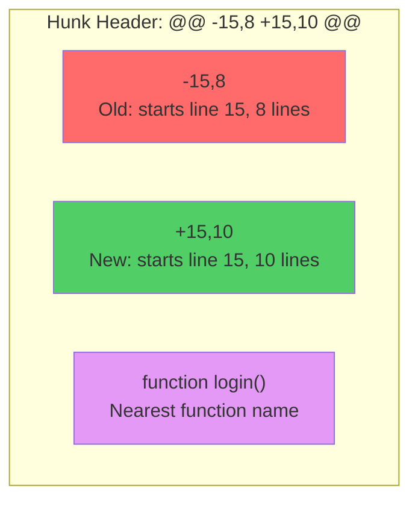

### Advanced Diff Options

```bash
# Word-level diff (instead of line-level)
git diff --word-diff

# Show only file names
git diff --name-only
git diff --name-status       # With A(dded)/M(odified)/D(eleted)

# Stats summary
git diff --stat

# Show changes in specific file
git diff -- path/to/file.js

# Ignore whitespace
git diff -w
git diff --ignore-space-change

# Between two branches
git diff main..feature
git diff main...feature     # Changes since branches diverged
```

### Two-Dot vs Three-Dot Diff

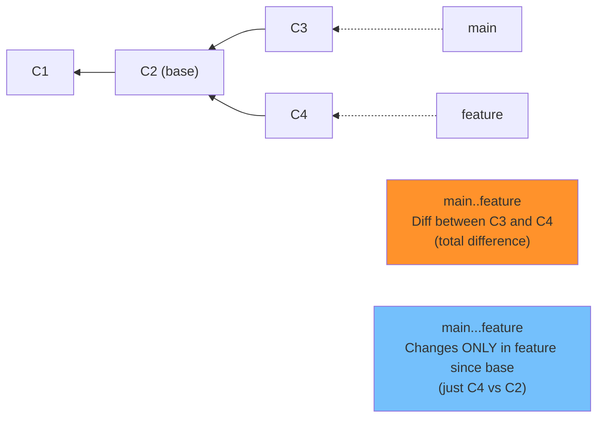

---

## 2. `git blame` — Who Changed What?

### How Blame Works

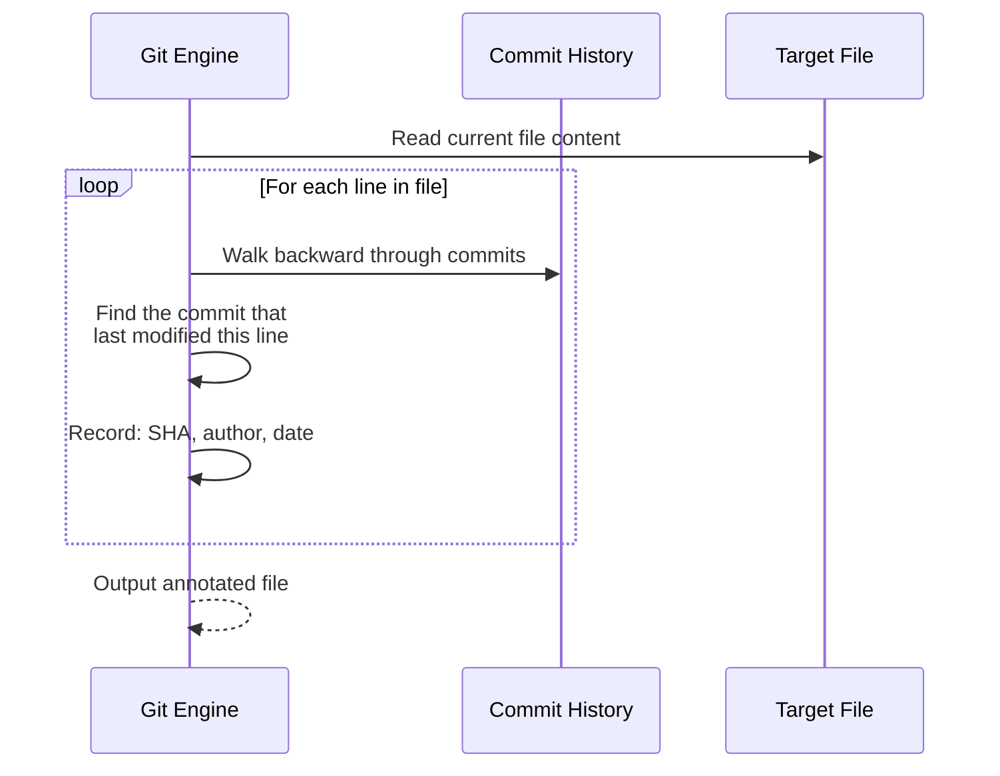

### Blame Output Explained

```
abc1234 (Alice   2026-01-10 14:30 +0530  1) const express = require('express');
def5678 (Bob     2026-01-15 09:15 +0530  2) const cors = require('cors');
abc1234 (Alice   2026-01-10 14:30 +0530  3) 
ghi9012 (Charlie 2026-02-01 16:45 +0530  4) const app = express();
^first  (Alice   2026-01-10 14:30 +0530  5) app.listen(3000);
```

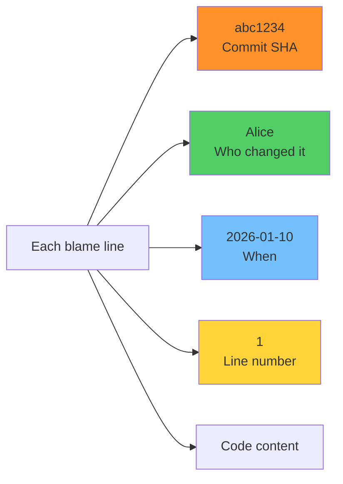

```bash
# Blame entire file
git blame file.js

# Blame specific lines
git blame -L 10,20 file.js

# Blame specific function
git blame -L :functionName file.js

# Ignore whitespace changes
git blame -w file.js

# Show email instead of name
git blame -e file.js

# Show moves/copies across files
git blame -C file.js

# Show original commit (before renames)
git blame -C -C -C file.js
```

---

## 3. `git bisect` — Binary Search for Bugs

### The Concept

Instead of checking every commit, bisect uses **binary search** to find the bug-introducing commit.

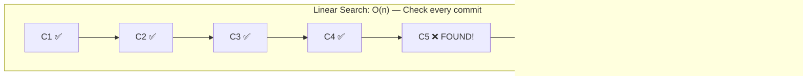

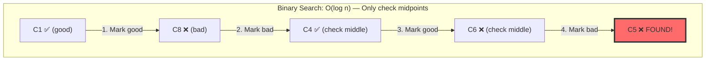

With 1024 commits, linear search needs **1024** checks. Bisect needs only **10** (log₂ 1024).

### How Bisect Works Internally

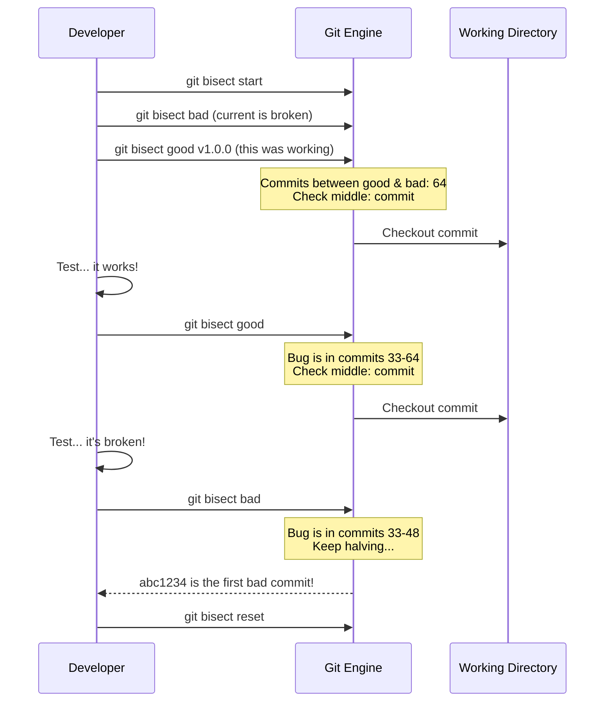

### Bisect Commands

```bash
# Start bisect
git bisect start

# Mark current as bad
git bisect bad

# Mark a known good commit
git bisect good v1.0.0

# Git checks out middle commit. Test it, then:
git bisect good    # If it works
git bisect bad     # If it's broken

# Repeat until Git finds the culprit

# End bisect (return to original branch)
git bisect reset

# Skip a commit (can't test this one)
git bisect skip
```

### Automated Bisect

```bash
# Run a test script automatically
git bisect start HEAD v1.0.0
git bisect run npm test
# Git will run "npm test" at each step
# Exit code 0 = good, non-zero = bad
```

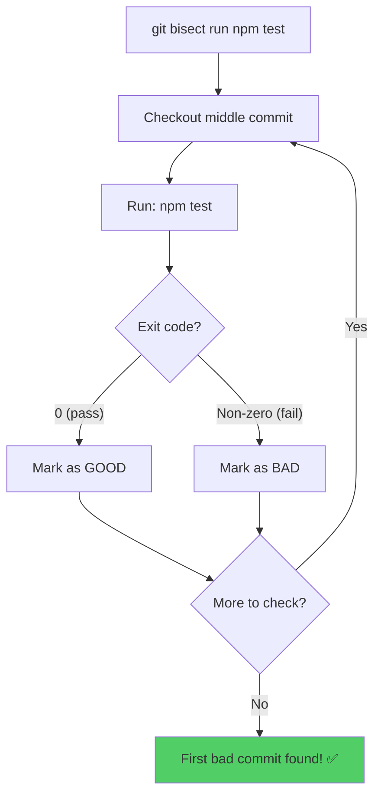

---

## 4. Combining Tools — Investigation Workflow

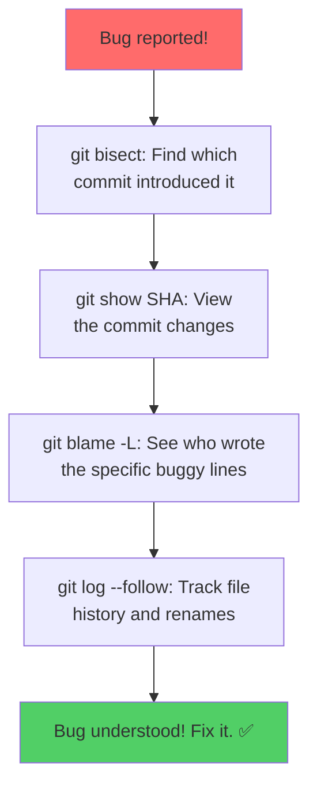

---

## 🏋️ Exercises

1. Use `git diff --word-diff` to compare line-level vs word-level diffs
2. Run `git blame` on a file and trace a line back to its original commit
3. Simulate a bug: make 10 commits, introduce a bug midway, use `git bisect` to find it
4. Try automated bisect: `git bisect run` with a test script
5. Compare `main..feature` vs `main...feature` diff output

---

## 🔑 Key Takeaways

1. `git diff` compares working dir, staging, and commits — know which you're comparing
2. **Two dots** (`..`) = total difference; **three dots** (`...`) = changes since divergence
3. `git blame` shows the last commit that modified each line — great for accountability
4. `git bisect` uses binary search — finds bugs in O(log n) instead of O(n)
5. Automated bisect (`git bisect run`) is the most efficient debugging tool in Git
6. Combine diff + blame + bisect for a complete investigation workflow

---

**[← Module 11](../11-Tags-Releases-and-Semantic-Versioning/README.md)** | **[Module 13 →](../13-Git-Internals-Objects-SHA-DAG/README.md)**
