# Module 13: Git Internals — Objects, SHA, DAG

> **Level**: 🔵 Advanced | **Time**: 4 hours | **Prerequisites**: [Module 12](../12-Git-Diff-Blame-and-Bisect/README.md)

---

## 📋 Learning Objectives

- Understand Git's content-addressable storage model
- Explore the four Git object types
- Navigate the Directed Acyclic Graph (DAG)
- Use plumbing commands to inspect internals

---

## 1. Git's Content-Addressable Filesystem

Git is fundamentally a **content-addressable filesystem** — a key-value store where every piece of data is retrieved by its **SHA-1 hash**.

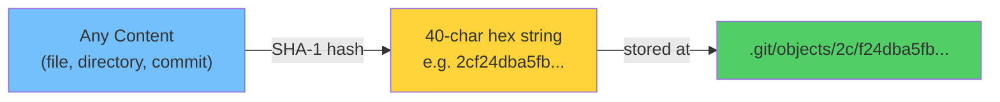

```bash
# Hash some content
echo "Hello World" | git hash-object --stdin
# Output: 557db03de997c86a4a028e1ebd3a1ceb225be238

# Same content ALWAYS produces same hash
echo "Hello World" | git hash-object --stdin
# Output: 557db03de997c86a4a028e1ebd3a1ceb225be238  (identical!)
```

### Object Storage Layout

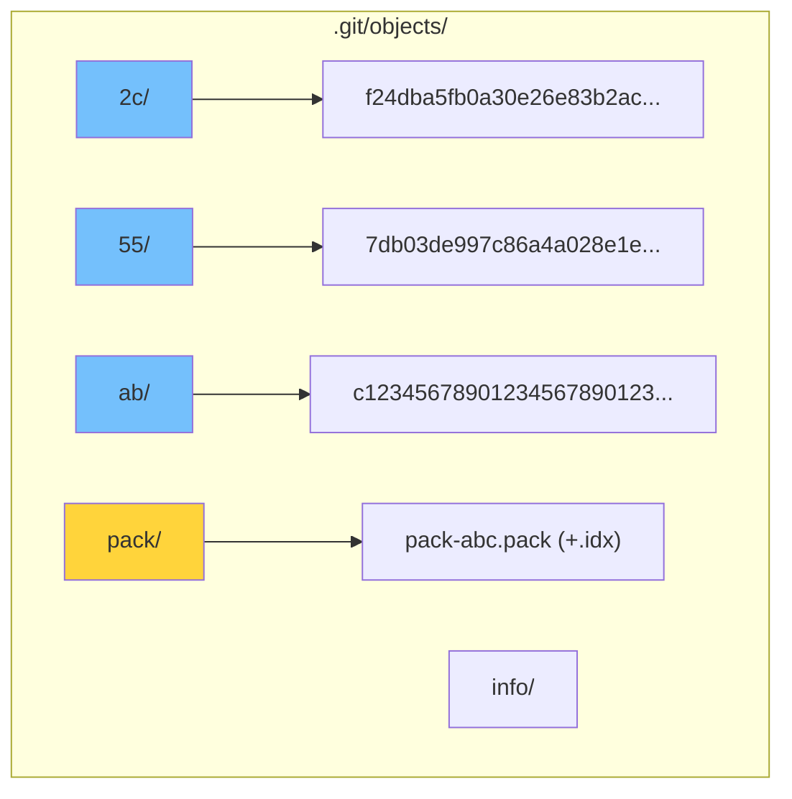

> Objects are stored as compressed files. First 2 hex characters = directory, remaining 38 = filename.

---

## 2. The Four Object Types

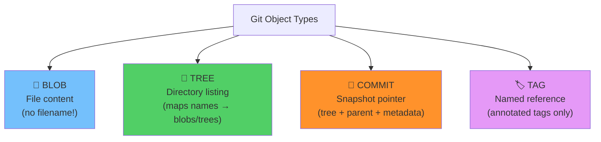

### 2.1 Blob Object — File Content

A blob stores **raw file content** — nothing else. No filename, no permissions.

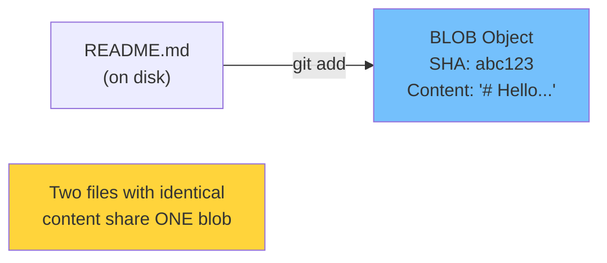

```bash
# Create a blob
echo "Hello World" | git hash-object -w --stdin
# Returns SHA: 557db03...

# Read a blob
git cat-file -p 557db03
# Output: Hello World

git cat-file -t 557db03
# Output: blob

git cat-file -s 557db03
# Output: 12 (bytes)
```

### 2.2 Tree Object — Directory Structure

A tree maps **filenames to blobs** (and subdirectories to sub-trees):

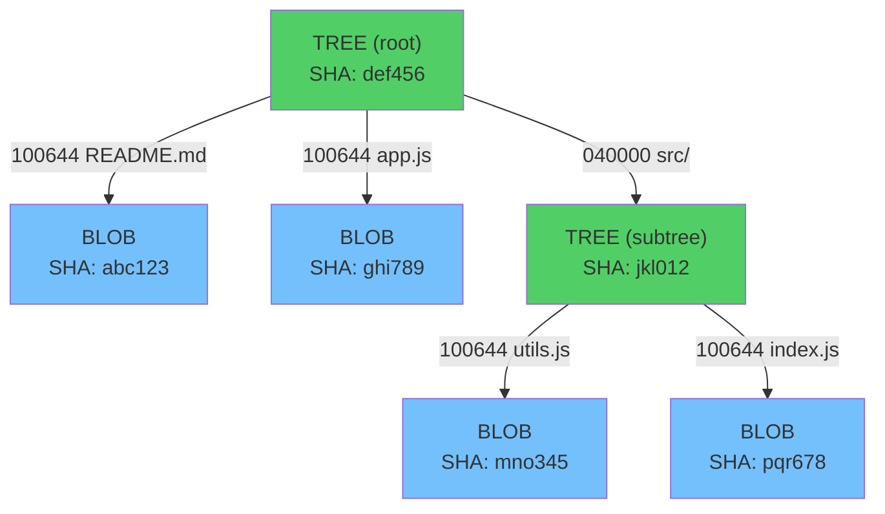

```bash
# View a tree
git ls-tree HEAD
# 100644 blob abc123    README.md
# 100644 blob ghi789    app.js
# 040000 tree jkl012    src

# Recursive listing
git ls-tree -r HEAD
```

#### File Mode Codes

| Mode | Meaning |
|------|---------|
| `100644` | Regular file (not executable) |
| `100755` | Executable file |
| `120000` | Symbolic link |
| `040000` | Subdirectory (tree) |
| `160000` | Submodule (gitlink) |

### 2.3 Commit Object — The Snapshot

A commit ties everything together:

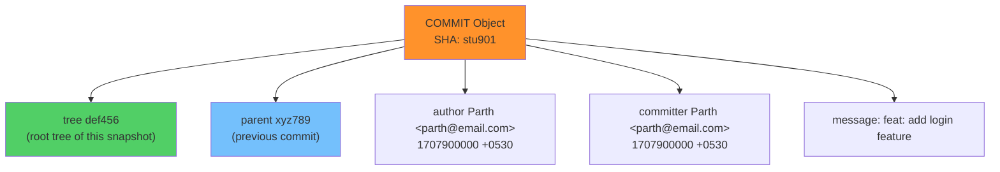

```bash
# View commit object
git cat-file -p HEAD
# tree def456789...
# parent abc123456...
# author Parth <parth@email.com> 1707900000 +0530
# committer Parth <parth@email.com> 1707900000 +0530
#
# feat: add login feature
```

### 2.4 Complete Object Graph

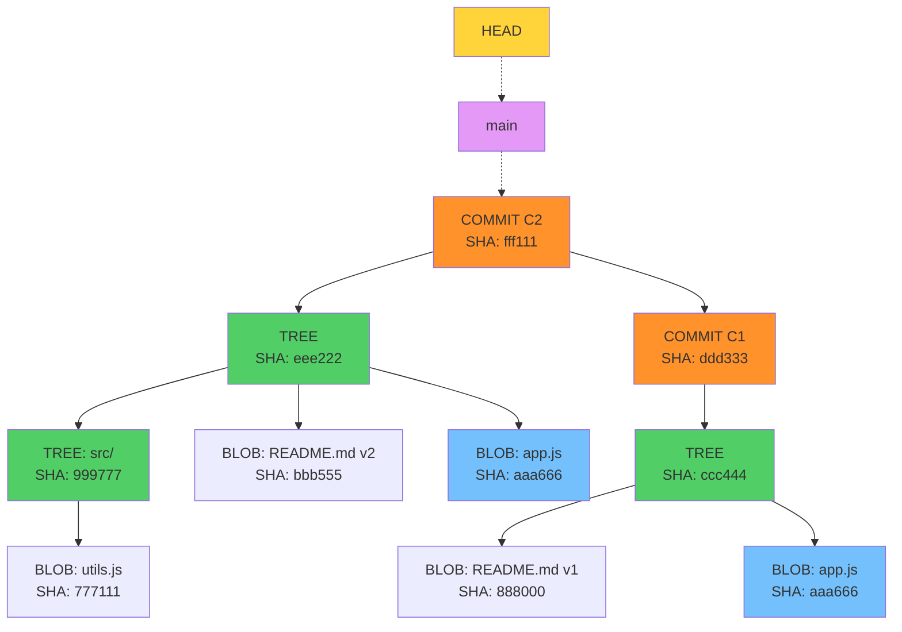

> Notice: `app.js` (SHA: aaa666) appears in BOTH trees because it didn't change — Git reuses the same blob object!

---

## 3. The Directed Acyclic Graph (DAG)

Git's commit history forms a DAG — a graph where commits point to their parents, and no cycles exist.

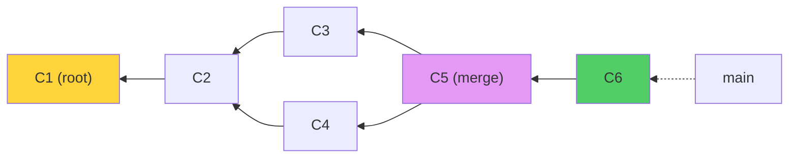

### Properties of Git's DAG

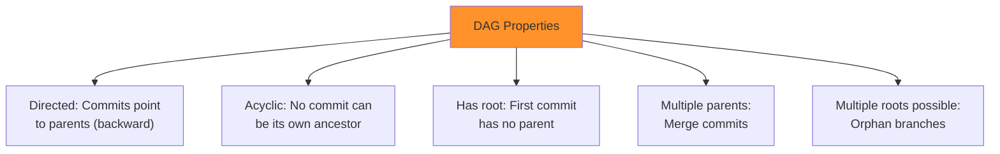

---

## 4. SHA-1 Hashing — How It Works

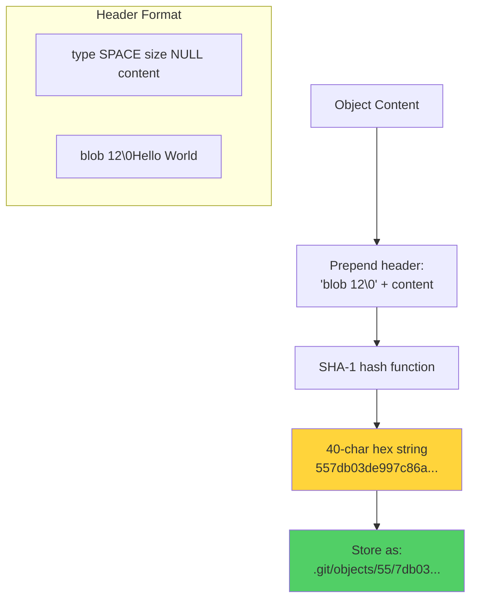

### How Git Computes a Blob Hash

```bash
# What Git actually hashes (for "Hello World\n"):
# "blob 12\0Hello World\n"
#  ↑     ↑  ↑
#  type  size null-byte + content

# Verify manually:
printf "blob 12\0Hello World\n" | sha1sum
# Output: 557db03de997c86a4a028e1ebd3a1ceb225be238
```

---

## 5. Packfiles — How Git Optimizes Storage

Over time, Git packs loose objects into efficient packfiles:

```mermaid
flowchart TD
    A["Loose Objects<br/>.git/objects/ab/c123...<br/>.git/objects/de/f456..."] 
    -->|"git gc<br/>(garbage collection)"| 
    B["Packfile<br/>.git/objects/pack/pack-abc.pack<br/>.git/objects/pack/pack-abc.idx"]
    
    B --> C["Delta compression:<br/>Similar objects stored as diffs<br/>of each other"]
    B --> D["Index file (.idx):<br/>Maps SHA → offset in packfile<br/>for fast lookup"]
    
    style A fill:#ff922b
    style B fill:#51cf66
```

```bash
# View object statistics
git count-objects -v

# Trigger garbage collection
git gc

# Verify object database integrity
git fsck
```

---

## 6. Plumbing vs Porcelain Commands

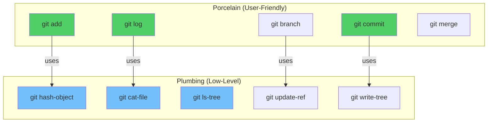

### Essential Plumbing Commands

```bash
# READING objects
git cat-file -t <SHA>      # Object type
git cat-file -p <SHA>      # Object content (pretty print)
git cat-file -s <SHA>      # Object size
git ls-tree <tree-SHA>     # List tree contents

# WRITING objects
git hash-object -w <file>  # Write blob to object database
git write-tree             # Write staging area as tree object
git commit-tree <tree>     # Create commit from tree

# REFERENCES
git rev-parse HEAD         # Resolve ref to SHA
git update-ref refs/heads/main <SHA>  # Update branch pointer
git symbolic-ref HEAD      # What does HEAD point to?
```

---

## 🏋️ Exercises

1. Use `git cat-file -p HEAD` to explore your latest commit's tree structure
2. Follow the chain: commit → tree → blob manually using `cat-file`
3. Create a blob manually: `echo "test" | git hash-object -w --stdin`
4. Verify that two files with identical content share the same blob SHA
5. Run `git count-objects -v` and then `git gc`, compare results
6. Draw the complete object graph of your last 3 commits

---

## 🔑 Key Takeaways

1. Git stores everything as **objects** (blob, tree, commit, tag) addressed by SHA-1 hash
2. **Blobs** store content (no filename); **Trees** map names to blobs; **Commits** point to trees
3. Same content = same hash = same blob (deduplication built-in)
4. Git's history is a **DAG** — directed acyclic graph of commits
5. **Packfiles** compress objects using delta encoding for storage efficiency
6. Porcelain = user-friendly commands; Plumbing = low-level building blocks

---

**[← Module 12](../12-Git-Diff-Blame-and-Bisect/README.md)** | **[Module 14 →](../14-Reset-Revert-and-Reflog/README.md)**
