# Module 14: Reset, Revert & Reflog

> **Level**: 🔵 Advanced | **Time**: 3 hours | **Prerequisites**: [Module 13](../13-Git-Internals-Objects-SHA-DAG/README.md)

---

## 📋 Learning Objectives

- Understand the three modes of `git reset`
- Use `git revert` for safe public branch undo
- Master `git reflog` for disaster recovery
- Know when to use each undo mechanism

---

## 1. `git reset` — How It Works at Each Level

Reset moves the branch pointer and optionally affects the staging area and working directory.

### The Three Reset Modes

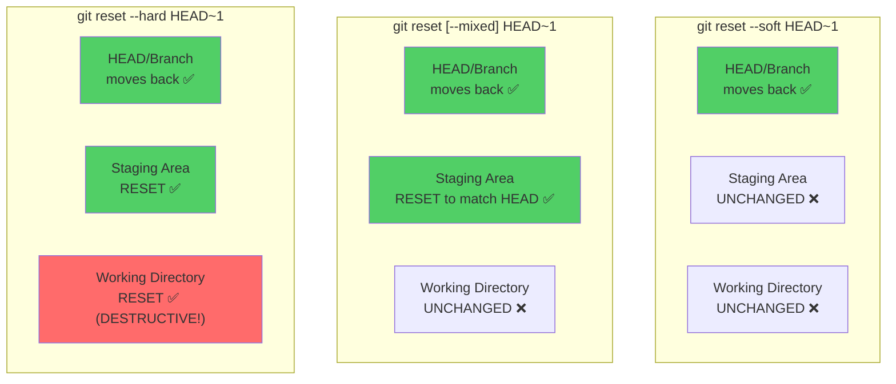

### Visual: What Each Mode Affects

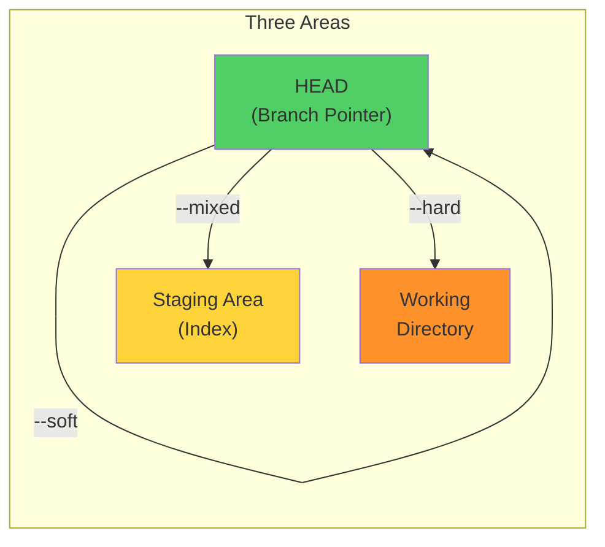

| Mode | Moves HEAD | Resets Index | Resets Working Dir | Data Loss? |
|------|-----------|-------------|-------------------|------------|
| `--soft` | ✅ | ❌ | ❌ | No |
| `--mixed` (default) | ✅ | ✅ | ❌ | No |
| `--hard` | ✅ | ✅ | ✅ | **YES** ⚠️ |

### Step-by-Step: What Happens Internally

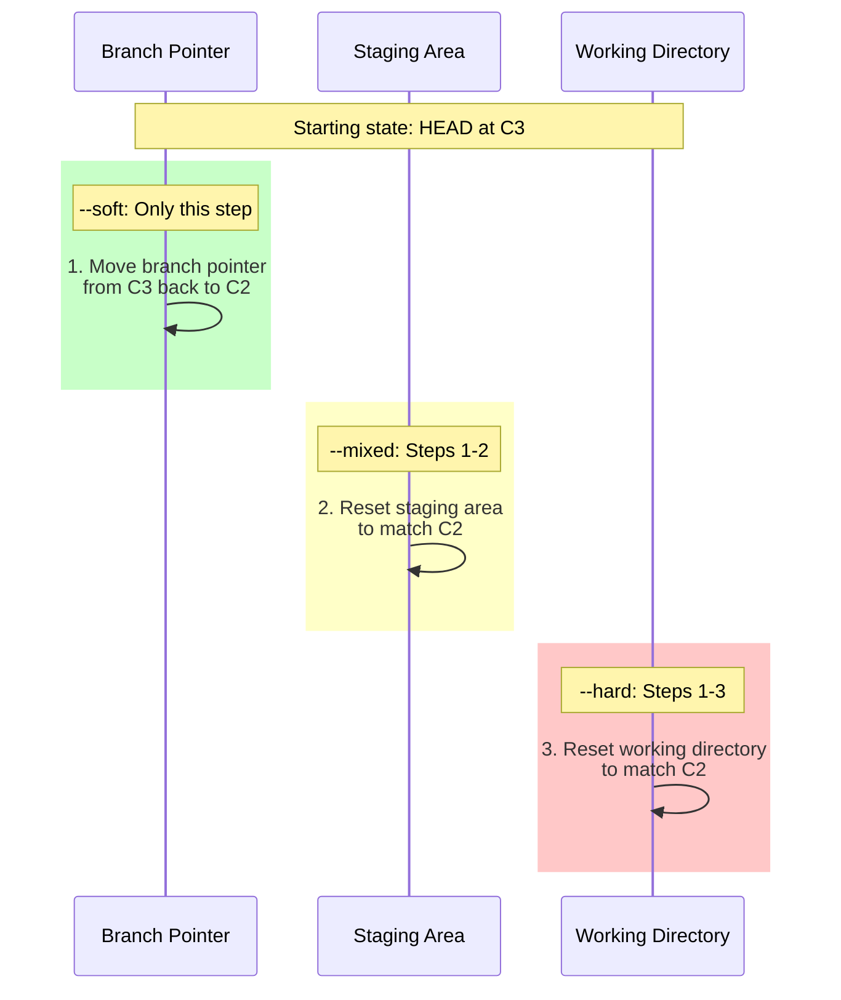

### Use Cases

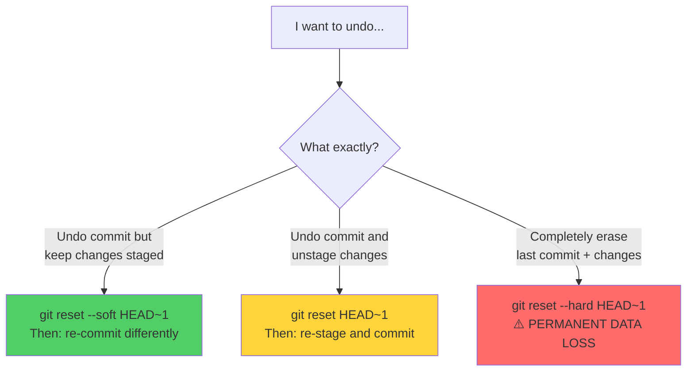

```bash
# Soft: Undo commit, keep everything staged
git reset --soft HEAD~1

# Mixed (default): Undo commit + unstage
git reset HEAD~1

# Hard: Undo everything (DANGEROUS)
git reset --hard HEAD~1

# Reset specific file (unstage it)
git reset HEAD -- file.txt
# Modern equivalent:
git restore --staged file.txt
```

---

## 2. `git revert` — Safe Undo for Shared Branches

### How Revert Differs from Reset

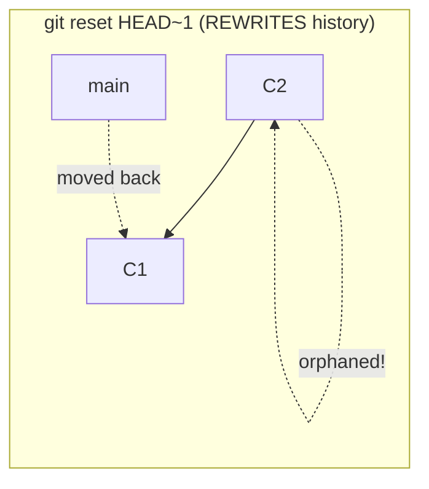

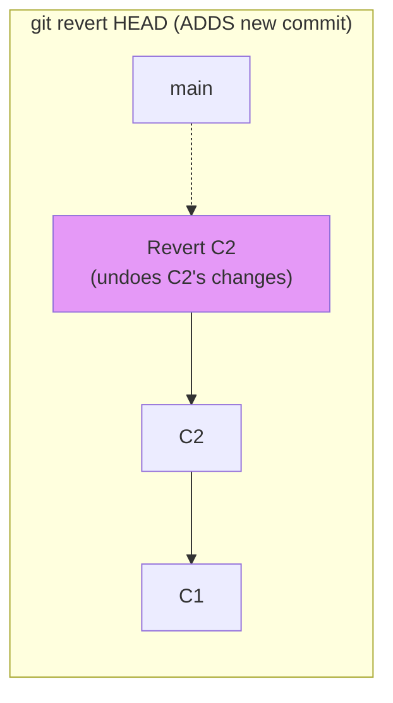

### How Revert Works Internally

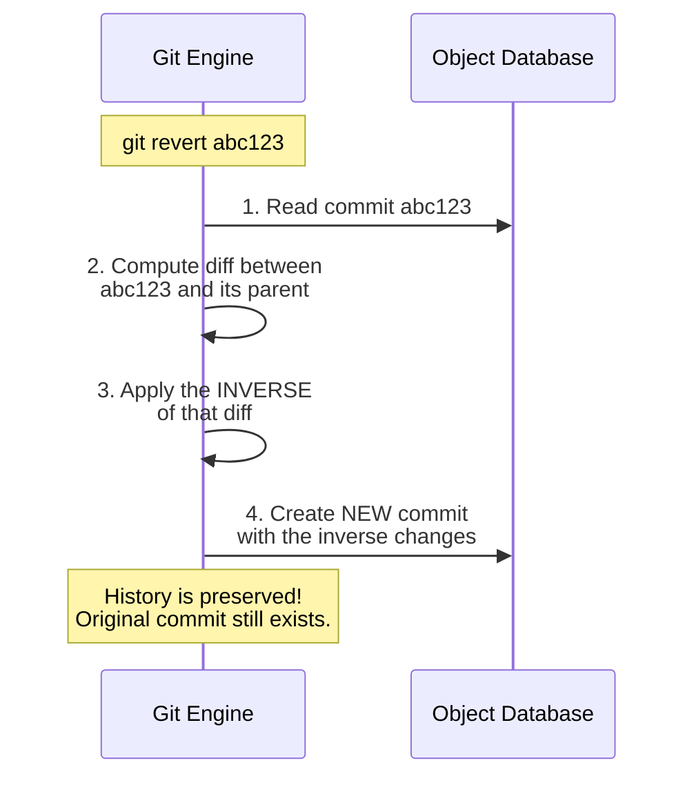

```bash
# Revert a single commit
git revert abc1234

# Revert without auto-committing
git revert --no-commit abc1234

# Revert a merge commit (specify which parent)
git revert -m 1 <merge-commit-SHA>

# Abort a revert (if conflicts)
git revert --abort
```

---

## 3. Reset vs Revert — Decision Flowchart

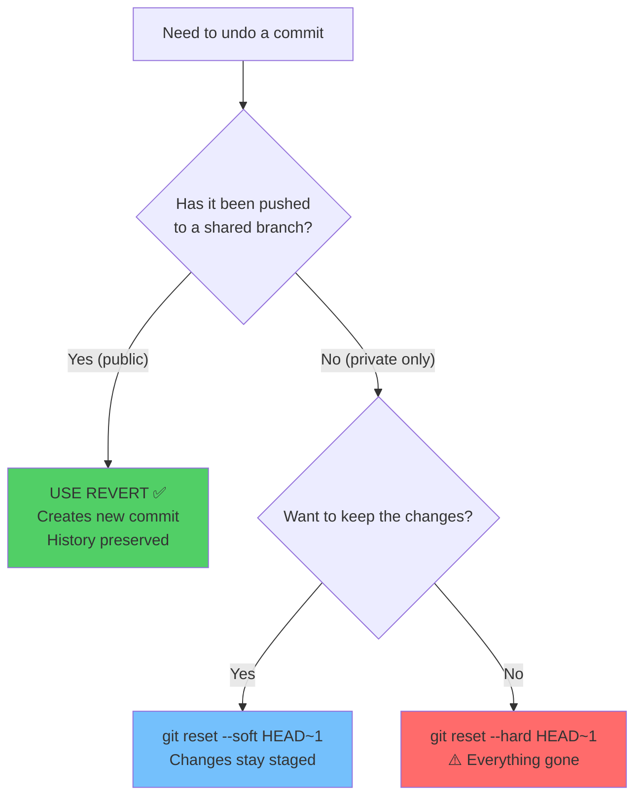

---

## 4. `git reflog` — Your Safety Net

The reflog records **every time HEAD moves** — it's your undo history.

### How Reflog Works Internally

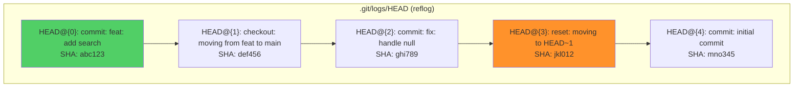

```bash
# View reflog
git reflog
# abc1234 HEAD@{0}: commit: feat: add search
# def5678 HEAD@{1}: checkout: moving from feature to main
# ghi9012 HEAD@{2}: reset: moving to HEAD~1
# jkl3456 HEAD@{3}: commit: this was "lost"!

# Recover from accidental reset
git reset --hard HEAD@{3}
# This restores to jkl3456 — the "lost" commit!
```

### Disaster Recovery Scenarios

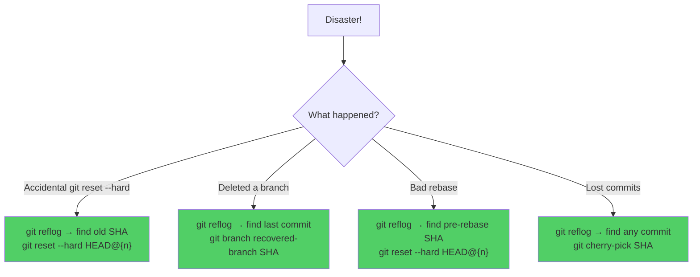

### Reflog Expiry

```bash
# Reflog entries expire after 90 days by default
# Unreachable entries expire after 30 days

# Configure expiry
git config gc.reflogExpire 120.days
git config gc.reflogExpireUnreachable 60.days

# View reflog for a specific branch
git reflog show feature/login

# View with dates
git reflog --date=relative
```

---

## 5. Complete Undo Strategy Decision Tree

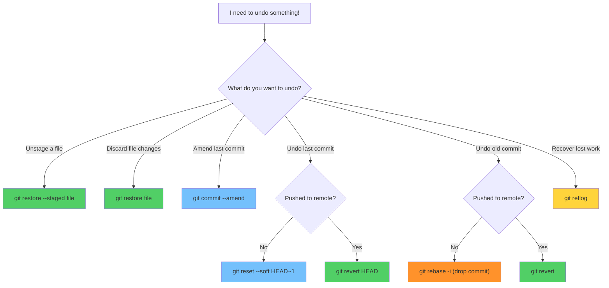

---

## 🏋️ Exercises

1. Create 3 commits, then `reset --soft` and observe staged files
2. Try `reset --mixed` and see changes become unstaged
3. Try `reset --hard` and verify changes are gone, then recover with `reflog`
4. Revert a specific commit and verify history is preserved
5. Delete a branch, then recover it using `reflog`

---

## 🔑 Key Takeaways

1. `reset --soft` = undo commit (keep staged); `--mixed` = undo + unstage; `--hard` = destroy all
2. **Reset rewrites history** — never use on shared/pushed branches
3. **Revert is safe** — creates a new commit that undoes changes
4. **Reflog is your safety net** — records every HEAD movement for 90 days
5. Even `--hard` reset can be recovered via reflog (within the expiry period)
6. When in doubt: **revert** (safe) instead of **reset** (destructive)

---

**[← Module 13](../13-Git-Internals-Objects-SHA-DAG/README.md)** | **[Module 15 →](../15-Interactive-Rebase-and-History-Rewriting/README.md)**
