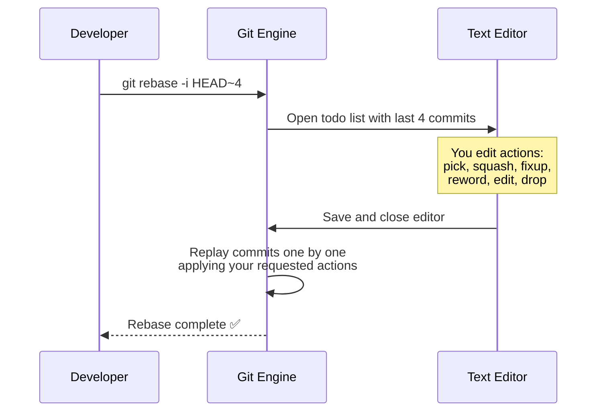
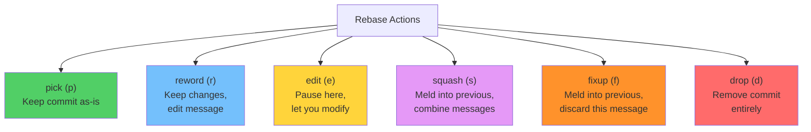
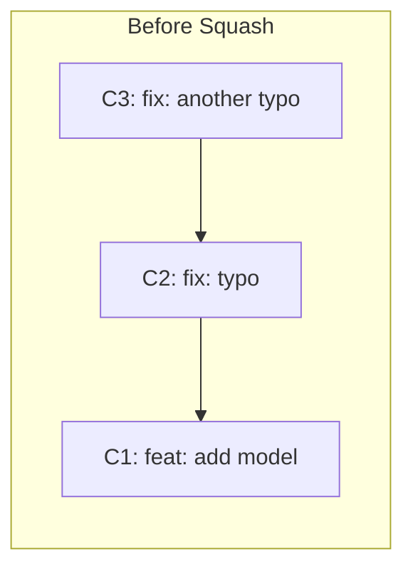
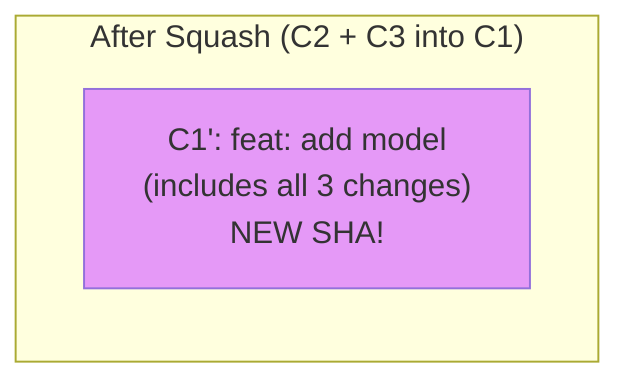
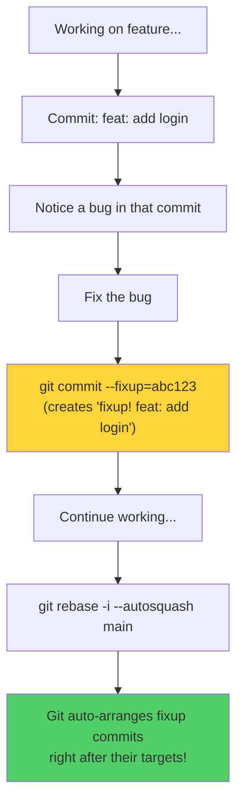
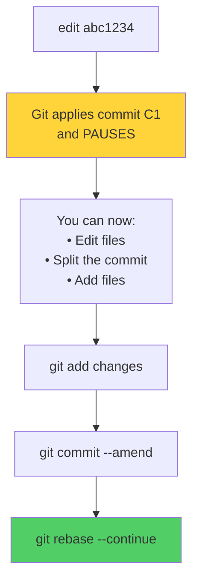
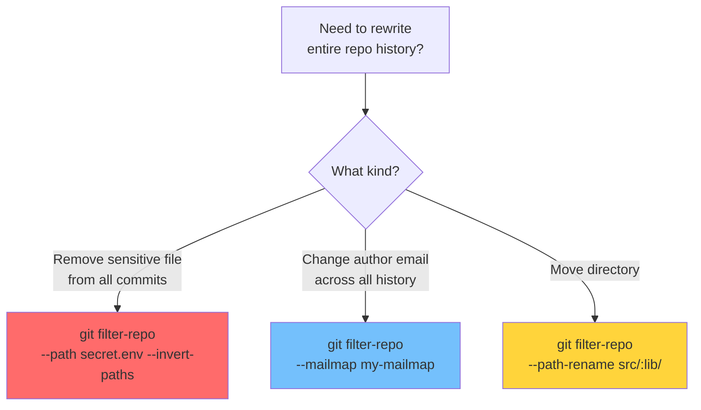
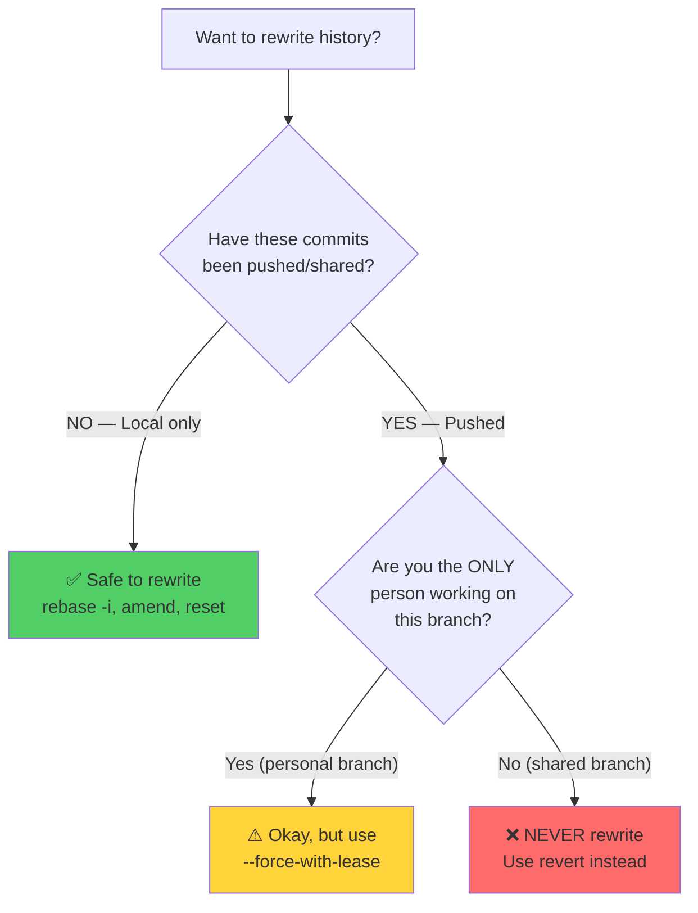

# Module 15: Interactive Rebase & History Rewriting

> **Level**: 🔵 Advanced | **Time**: 3 hours | **Prerequisites**: [Module 14](../14-Reset-Revert-and-Reflog/README.md)

---

## 📋 Learning Objectives

- Master interactive rebase (`git rebase -i`)
- Squash, fixup, reorder, edit, and drop commits
- Use `git commit --fixup` and `--autosquash`
- Understand when history rewriting is safe

---

## 1. Interactive Rebase — How It Works



### The Todo List

```
pick abc1234 feat: add user model
pick def5678 fix: typo in user model
pick ghi9012 feat: add login endpoint
pick jkl3456 docs: add API docs
```

---

## 2. Interactive Rebase Actions



### Squash Example





Todo file:
```
pick abc1234 feat: add model
squash def5678 fix: typo
squash ghi9012 fix: another typo
```

### Fixup Example

Like squash, but **discards** the fixup commit's message:

```
pick abc1234 feat: add model
fixup def5678 fix: typo          # ← message discarded
fixup ghi9012 fix: another typo  # ← message discarded
```

Result: Single commit "feat: add model" with all changes combined.

---

## 3. `--fixup` and `--autosquash` Workflow



```bash
# Create fixup commit
git commit --fixup=abc1234

# Auto-arrange and squash during rebase
git rebase -i --autosquash main

# Make autosquash the default
git config --global rebase.autosquash true
```

---

## 4. Reordering Commits

Simply change the order of lines in the todo file:

```
# Before (original order):
pick abc1234 feat: add user model
pick def5678 docs: add README
pick ghi9012 feat: add login

# After (reordered):
pick abc1234 feat: add user model
pick ghi9012 feat: add login
pick def5678 docs: add README
```

---

## 5. Edit Mode — Pausing to Modify



### Splitting a Commit

```bash
# In the todo, change "pick" to "edit" for the commit to split
# When Git pauses at that commit:

git reset HEAD~1            # Undo the commit (keep files)
git add file1.js
git commit -m "Part 1: add file1"
git add file2.js
git commit -m "Part 2: add file2"
git rebase --continue       # Resume rebase
```

---

## 6. Other History Rewriting Tools

### `git filter-branch` / `git filter-repo`



```bash
# Install git-filter-repo (recommended over filter-branch)
pip install git-filter-repo

# Remove a file from entire history
git filter-repo --path passwords.txt --invert-paths

# Change author across all commits
git filter-repo --email-callback '
    return email.replace(b"old@email.com", b"new@email.com")
'
```

---

## 7. Safety Rules for History Rewriting



---

## 🏋️ Exercises

1. Create 5 messy commits, then use `rebase -i` to squash WIP commits together
2. Reorder commits so docs come after all feature commits
3. Use `--fixup` and `--autosquash` to fix a bug in an earlier commit
4. Split one commit into two using `edit` mode
5. Use `reword` to fix a commit message without changing any code

---

## 🔑 Key Takeaways

1. Interactive rebase lets you **rewrite local history** before sharing
2. **Squash** combines commits and merges messages; **fixup** discards the message
3. `--fixup` + `--autosquash` is the cleanest workflow for fixing earlier commits
4. **Edit** mode lets you pause and modify (or split) any commit
5. Never rewrite history that has been pushed to shared branches
6. Run `git rebase -i` before every PR to create a clean, professional history

---

**[← Module 14](../14-Reset-Revert-and-Reflog/README.md)** | **[Module 16 →](../16-Git-Hooks-and-Automation/README.md)**
