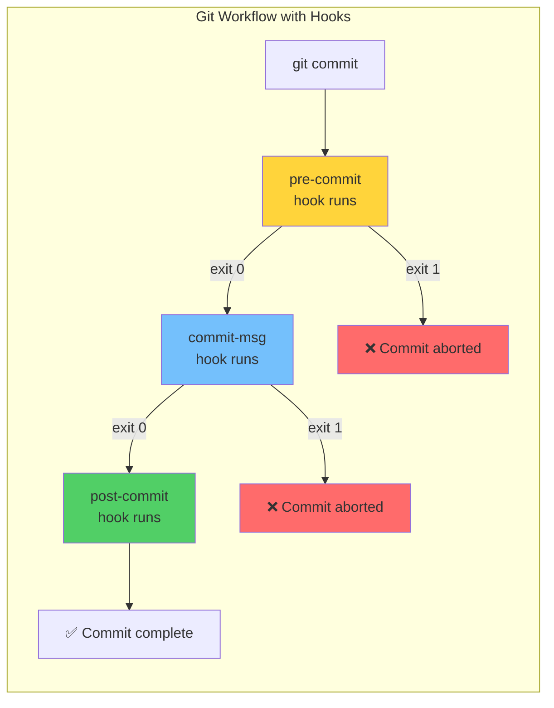
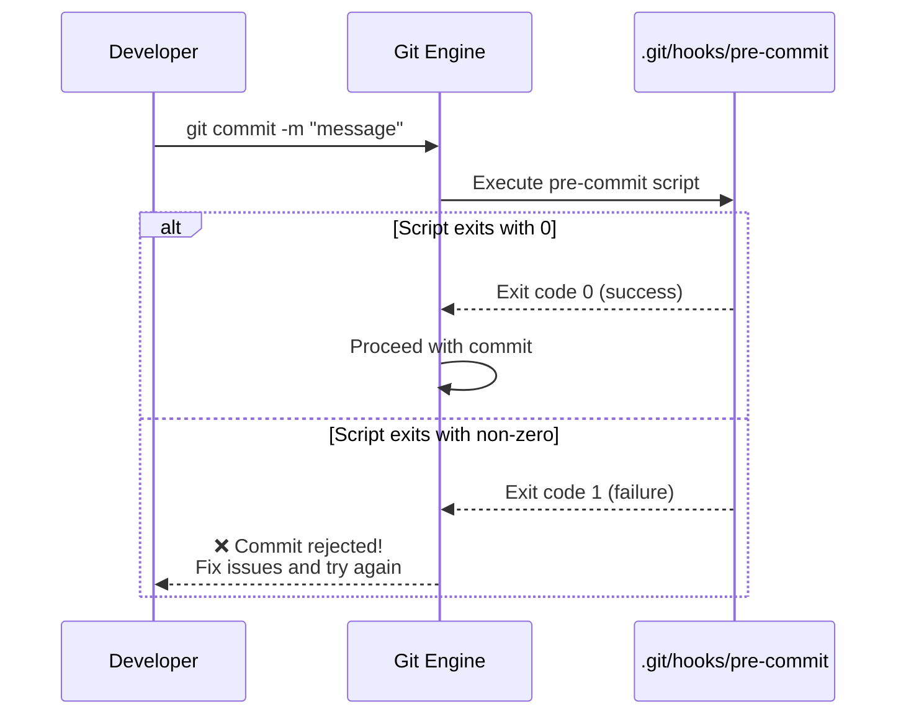
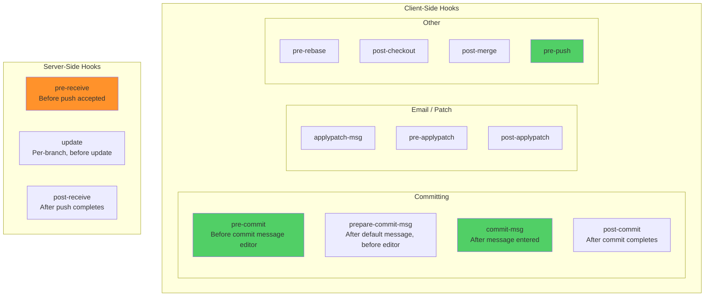
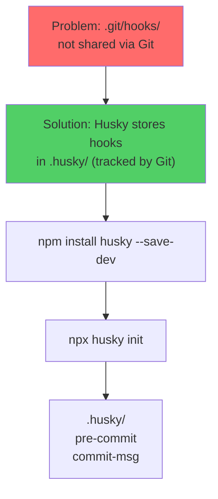
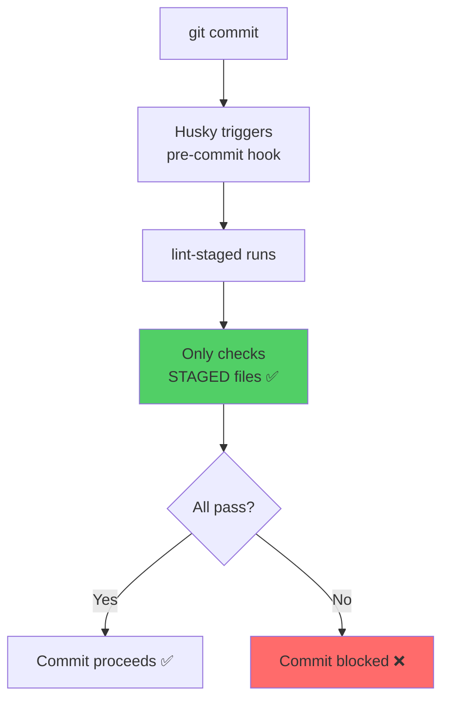
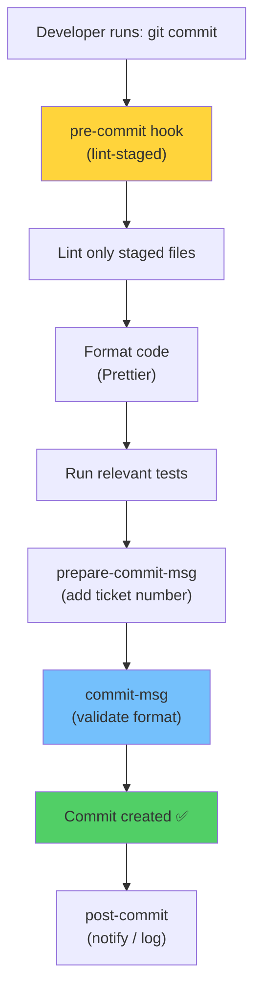

# Module 16: Git Hooks & Automation

> **Level**: 🔵 Advanced | **Time**: 3 hours | **Prerequisites**: [Module 15](../15-Interactive-Rebase-and-History-Rewriting/README.md)

---

## 📋 Learning Objectives

- Understand Git hooks and their trigger points
- Implement client-side and server-side hooks
- Use Husky and lint-staged for modern workflows
- Automate code quality enforcement

---

## 1. What Are Git Hooks?

Git hooks are **scripts** that run automatically at specific points in the Git workflow.



### How Hooks Work Internally



---

## 2. Hook Types and Trigger Points



### Most Important Hooks

| Hook | When | Common Use |
|------|------|-----------|
| `pre-commit` | Before commit | Lint, format, run tests |
| `commit-msg` | After message entered | Validate commit message format |
| `pre-push` | Before push | Run full test suite |
| `pre-receive` | Server: before accepting push | Enforce policies |
| `post-receive` | Server: after accepting push | Deploy, notify |

---

## 3. Creating Hooks

Hooks are stored in `.git/hooks/` as executable scripts:

```bash
# Create a pre-commit hook
cat > .git/hooks/pre-commit << 'EOF'
#!/bin/sh
# Run linting before commit
echo "Running linter..."
npm run lint

if [ $? -ne 0 ]; then
    echo "❌ Lint failed. Fix issues before committing."
    exit 1
fi

echo "✅ Lint passed!"
exit 0
EOF

# Make it executable
chmod +x .git/hooks/pre-commit
```

### commit-msg Hook (Validate Format)

```bash
#!/bin/sh
# .git/hooks/commit-msg
# Enforce Conventional Commits format

commit_msg=$(cat "$1")
pattern="^(feat|fix|docs|style|refactor|test|chore|perf|ci|build)(\(.+\))?: .{1,72}$"

if ! echo "$commit_msg" | grep -qE "$pattern"; then
    echo "❌ Invalid commit message format!"
    echo "Expected: type(scope): description"
    echo "Example: feat(auth): add JWT login"
    exit 1
fi
exit 0
```

---

## 4. Husky — Modern Hook Management



```bash
# Install Husky
npm install --save-dev husky

# Initialize
npx husky init

# Create pre-commit hook
echo "npm run lint" > .husky/pre-commit

# Create commit-msg hook
echo 'npx commitlint --edit "$1"' > .husky/commit-msg
```

---

## 5. lint-staged — Only Lint Staged Files



```json
// package.json
{
  "lint-staged": {
    "*.{js,ts}": ["eslint --fix", "prettier --write"],
    "*.{css,scss}": ["prettier --write"],
    "*.{json,md}": ["prettier --write"]
  }
}
```

---

## 6. Complete Hook Pipeline



---

## 🏋️ Exercises

1. Create a `pre-commit` hook that prevents committing `console.log` statements
2. Create a `commit-msg` hook that enforces Conventional Commits format
3. Set up Husky + lint-staged in a Node.js project
4. Create a `pre-push` hook that runs tests before pushing
5. Try adding a hook that fails — observe how Git prevents the operation

---

## 🔑 Key Takeaways

1. Git hooks are scripts that run automatically at specific workflow points
2. Exit code 0 = proceed; non-zero = abort the operation
3. `.git/hooks/` is **not tracked** by Git — use Husky to share hooks via version control
4. **lint-staged** only checks staged files — fast and focused
5. Common pipeline: lint → format → test → validate message → commit
6. Hooks enforce quality gates automatically — no manual checks needed

---

**[← Module 15](../15-Interactive-Rebase-and-History-Rewriting/README.md)** | **[Module 17 →](../17-Submodules-and-Subtrees/README.md)**
