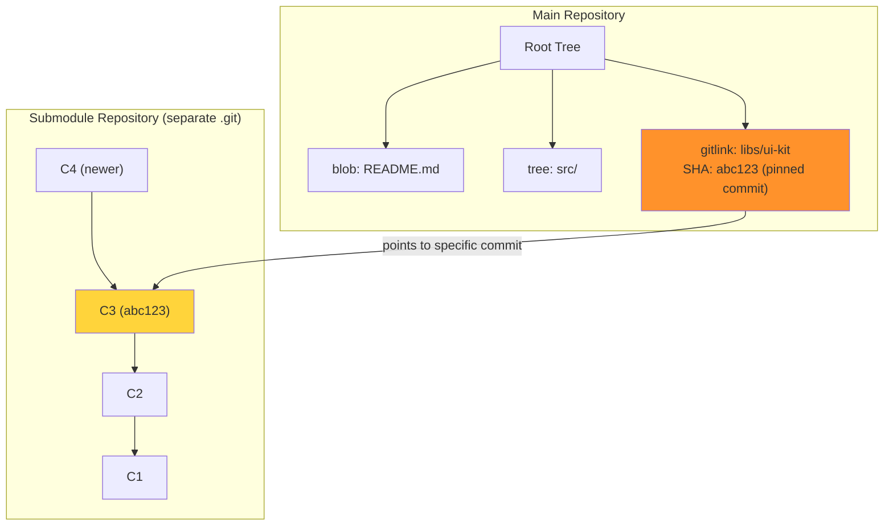
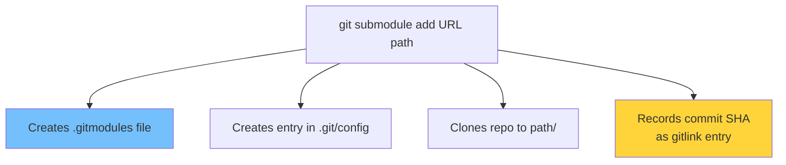
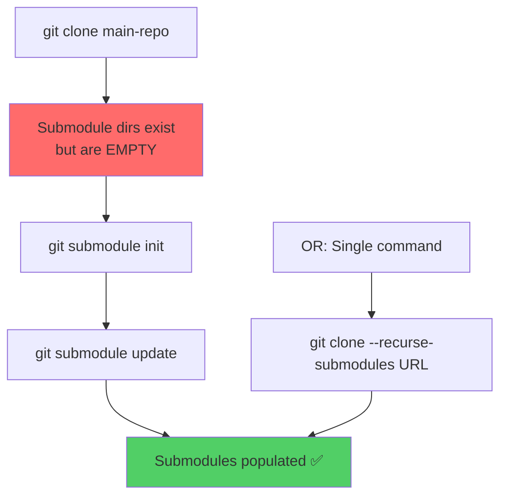
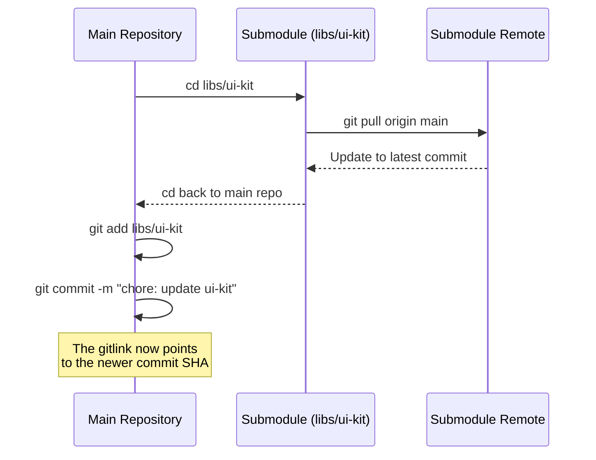
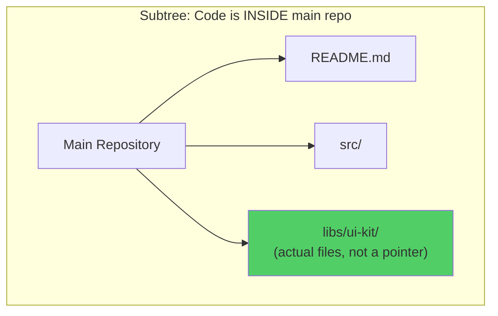
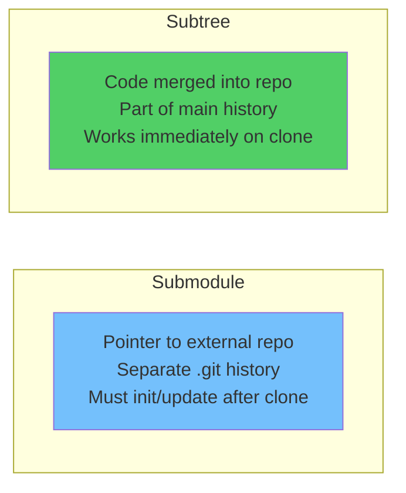
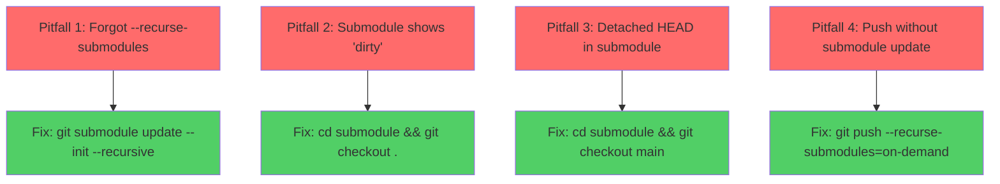

# Module 17: Submodules & Subtrees

> **Level**: 🔵 Advanced | **Time**: 3 hours | **Prerequisites**: [Module 16](../16-Git-Hooks-and-Automation/README.md)

---

## 📋 Learning Objectives

- Include external repositories within your project
- Compare submodules vs subtrees
- Manage and update nested repositories
- Handle common submodule pitfalls

---

## 1. Submodules — How They Work Internally

A submodule is a **pointer to a specific commit** in another repository.



### What Creates a Submodule



```bash
# Add a submodule
git submodule add https://github.com/lib/ui-kit.git libs/ui-kit

# .gitmodules (created/updated)
# [submodule "libs/ui-kit"]
#     path = libs/ui-kit
#     url = https://github.com/lib/ui-kit.git
```

---

## 2. Submodule Operations

### Cloning a Project with Submodules



```bash
# Clone with submodules in one step
git clone --recurse-submodules https://github.com/user/project.git

# Or initialize after cloning
git submodule init
git submodule update

# Combined
git submodule update --init --recursive
```

### Update Submodule to Latest



```bash
# Update all submodules to their latest
git submodule update --remote

# Update specific submodule
git submodule update --remote libs/ui-kit
```

---

## 3. Subtrees — The Alternative

Subtrees **merge** another repo's code directly into your repository:



```bash
# Add a subtree
git subtree add --prefix=libs/ui-kit https://github.com/lib/ui-kit.git main --squash

# Pull updates
git subtree pull --prefix=libs/ui-kit https://github.com/lib/ui-kit.git main --squash

# Push changes back to the library
git subtree push --prefix=libs/ui-kit https://github.com/lib/ui-kit.git main
```

---

## 4. Submodules vs Subtrees



| Feature | Submodule | Subtree |
|---------|-----------|---------|
| Storage | Pointer (gitlink) | Actual files in repo |
| Clone complexity | Must `--recurse-submodules` | Just works |
| History | Separate repo history | Merged into main history |
| Update upstream | `git submodule update --remote` | `git subtree pull` |
| Contribute back | cd into submodule, commit | `git subtree push` |
| Repo size | Smaller main repo | Larger (includes all files) |
| Best for | Large libraries, strict versioning | Small shared code |

---

## 5. Common Submodule Pitfalls



---

## 🏋️ Exercises

1. Add a public GitHub repo as a submodule to your project
2. Clone your project fresh and observe empty submodule directories
3. Use `--recurse-submodules` and compare the experience
4. Update a submodule to its latest version and commit the change
5. Try adding the same library as a subtree and compare the approaches

---

## 🔑 Key Takeaways

1. Submodules = **pointers** to specific commits in external repos
2. Subtrees = external code **merged directly** into your repository
3. Submodules require explicit init/update; subtrees "just work" on clone
4. Always use `--recurse-submodules` when cloning projects with submodules
5. Submodules are better for large dependencies; subtrees for small shared code
6. Submodule directories are in **detached HEAD** state by default

---

**[← Module 16](../16-Git-Hooks-and-Automation/README.md)** | **[Module 18 →](../18-Advanced-Merge-Strategies/README.md)**
