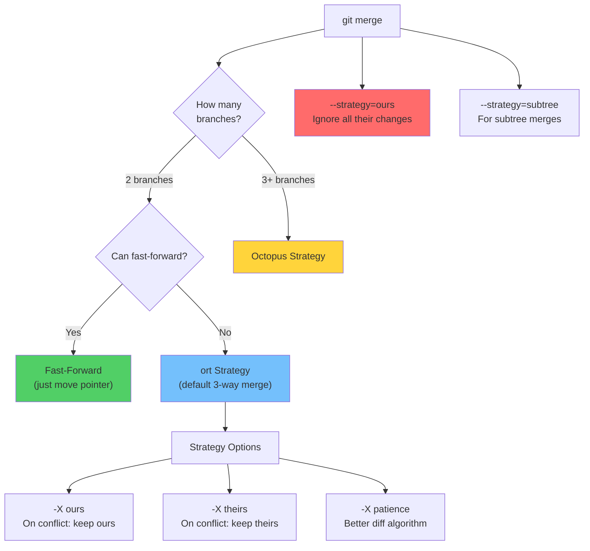
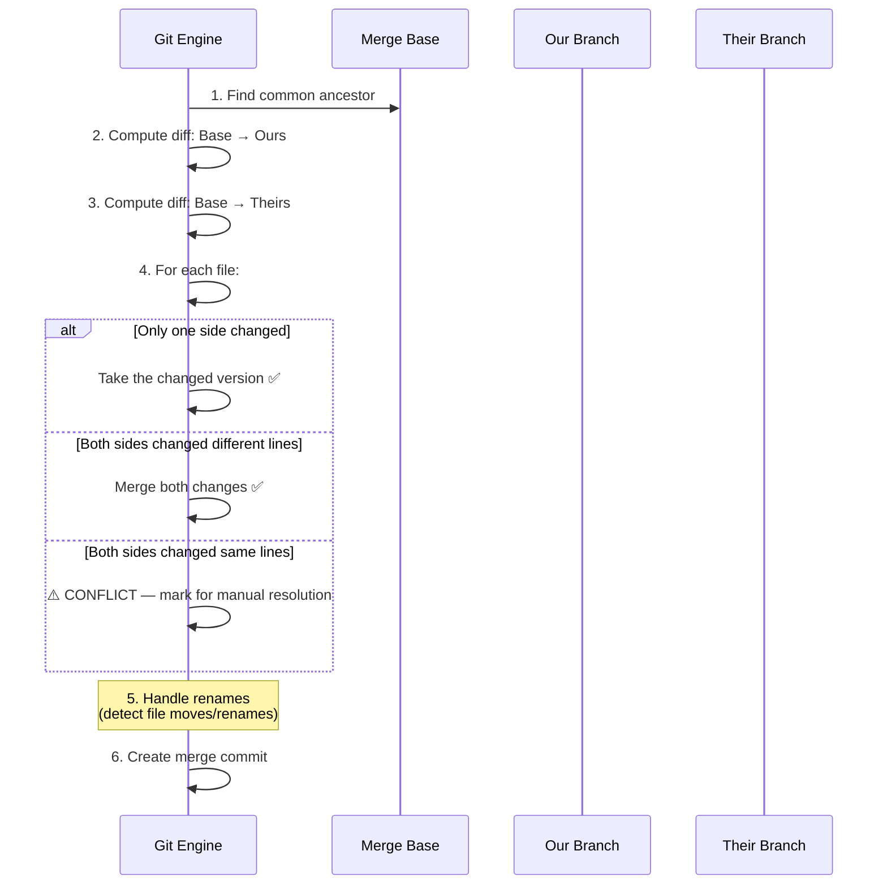
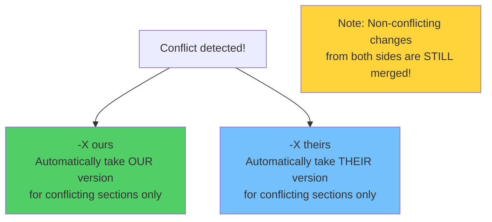
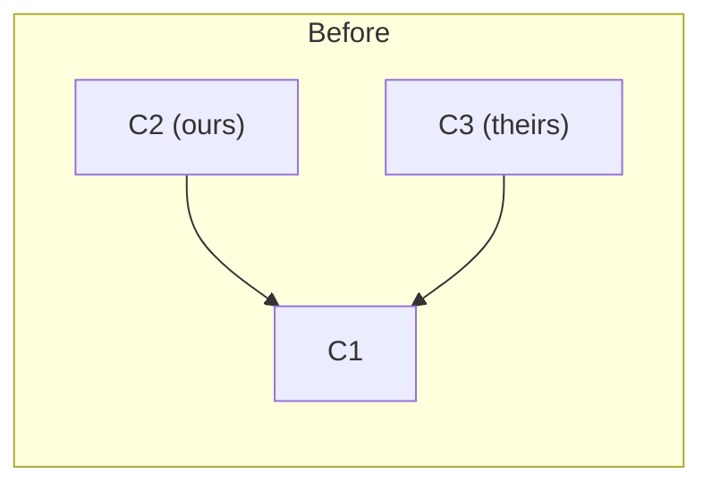
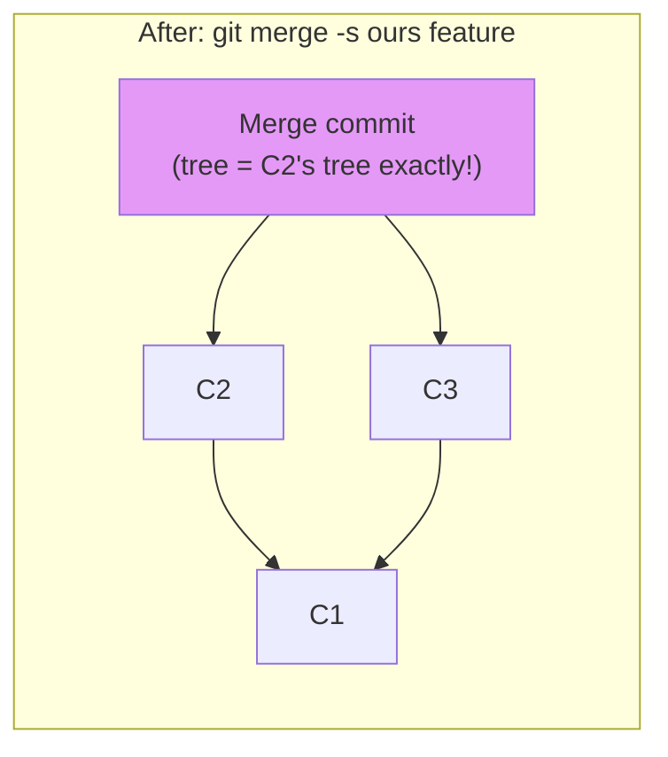
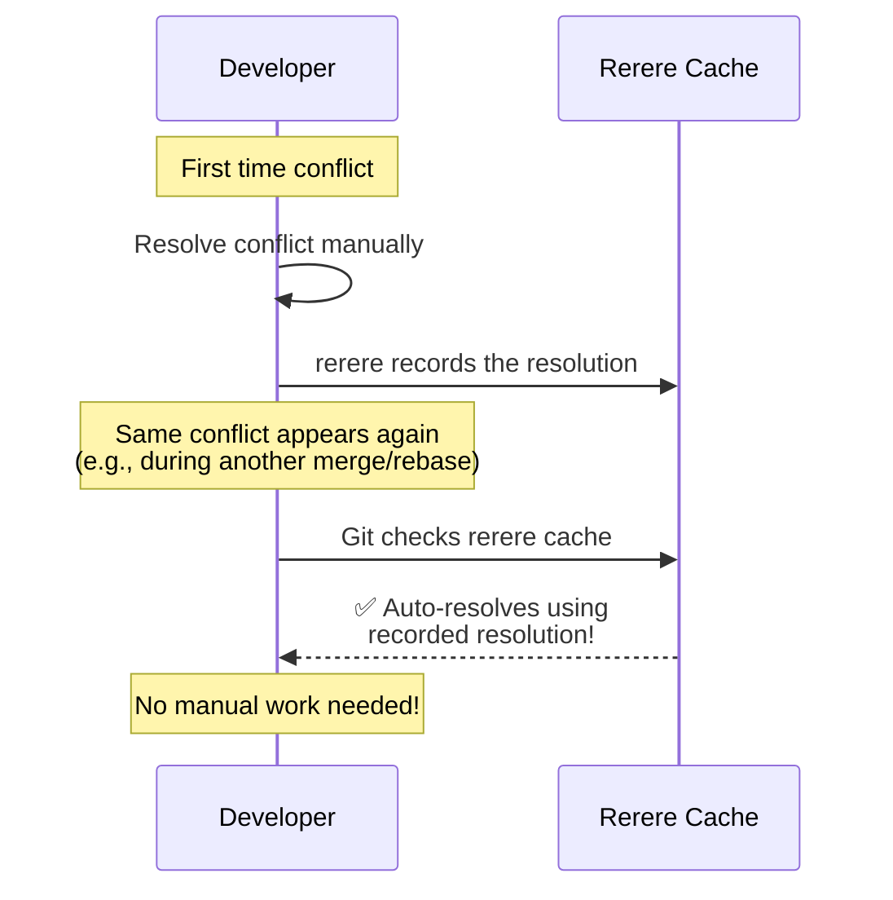
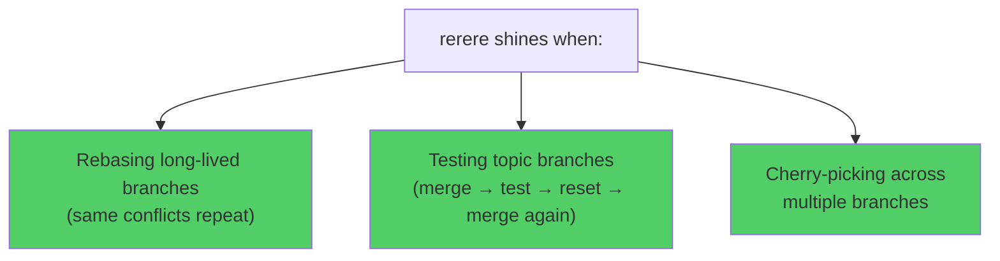
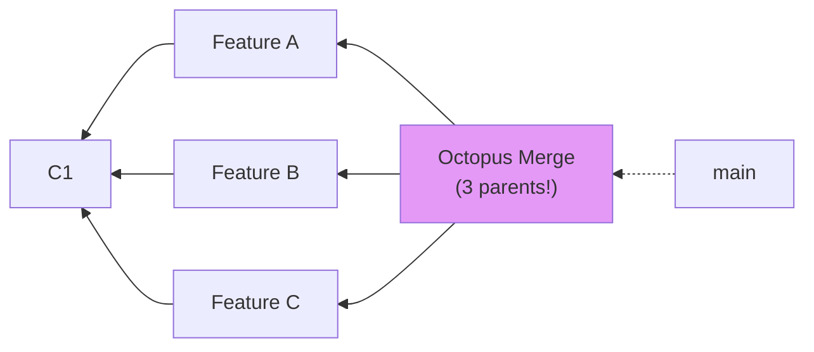
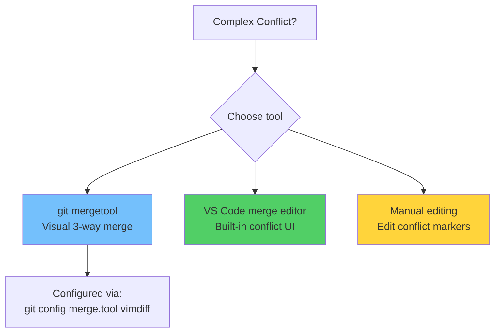

# Module 18: Advanced Merge Strategies

> **Level**: 🔵 Advanced | **Time**: 2.5 hours | **Prerequisites**: [Module 17](../17-Submodules-and-Subtrees/README.md)

---

## 📋 Learning Objectives

- Understand all Git merge strategies
- Use `git rerere` for automatic conflict resolution
- Handle complex merge scenarios
- Choose the right merge strategy for each situation

---

## 1. Merge Strategies Overview



### Strategy Comparison

| Strategy | When Used | Commits | Handles Renames |
|----------|----------|---------|----------------|
| Fast-forward | Linear history | No merge commit | N/A |
| ort (default) | 2 diverged branches | Merge commit | ✅ |
| Octopus | 3+ branches | Merge commit | Limited |
| ours | Discard their changes | Merge commit | N/A |
| subtree | Subtree merges | Merge commit | ✅ |

---

## 2. The `ort` Strategy (Default) — Deep Dive



### `-X ours` vs `-X theirs` (Strategy Options)



```bash
# For conflicts, prefer our changes
git merge -X ours feature

# For conflicts, prefer their changes
git merge -X theirs feature
```

### `--strategy=ours` (Ignore All Their Changes)





> **All of feature's changes are discarded.** The merge commit's tree is identical to ours.

---

## 3. `git rerere` — Reuse Recorded Resolution

### How rerere Works



```bash
# Enable rerere
git config --global rerere.enabled true

# View recorded resolutions
git rerere status

# Forget a specific resolution
git rerere forget path/to/file

# Clear all recorded resolutions
git rerere clear

# Show diff of what rerere would apply
git rerere diff
```

### When rerere Is Most Useful



---

## 4. Octopus Merge (3+ Branches)



```bash
# Merge multiple branches at once
git merge feature-a feature-b feature-c
# Uses octopus strategy automatically

# Cannot handle conflicts — use regular merge instead
```

---

## 5. Advanced Conflict Resolution Tools



```bash
# Set merge tool
git config --global merge.tool vscode
git config --global mergetool.vscode.cmd 'code --wait --merge $REMOTE $LOCAL $BASE $MERGED'

# Launch merge tool for conflicts
git mergetool
```

---

## 🏋️ Exercises

1. Practice `-X ours` vs `-X theirs` with conflicting branches
2. Enable `rerere`, create a conflict, resolve it, then recreate the same conflict
3. Try `--strategy=ours` and verify the resulting tree matches your branch exactly
4. Merge 3 branches simultaneously using octopus strategy
5. Configure and use `git mergetool` for conflict resolution

---

## 🔑 Key Takeaways

1. **ort** is the default strategy — handles renames and most scenarios well
2. `-X ours/theirs` auto-resolves **only conflicting sections** (non-conflicting changes still merge)
3. `--strategy=ours` ignores **ALL** their changes (rarely used, but useful for placeholder merges)
4. **rerere** saves time by remembering how you resolved conflicts
5. Octopus merge handles 3+ branches but cannot resolve conflicts
6. Enable `rerere` globally — it's free insurance against repeated conflicts

---

**[← Module 17](../17-Submodules-and-Subtrees/README.md)** | **[Module 19 →](../19-GitHub-Issues-Projects-and-Wikis/README.md)**
