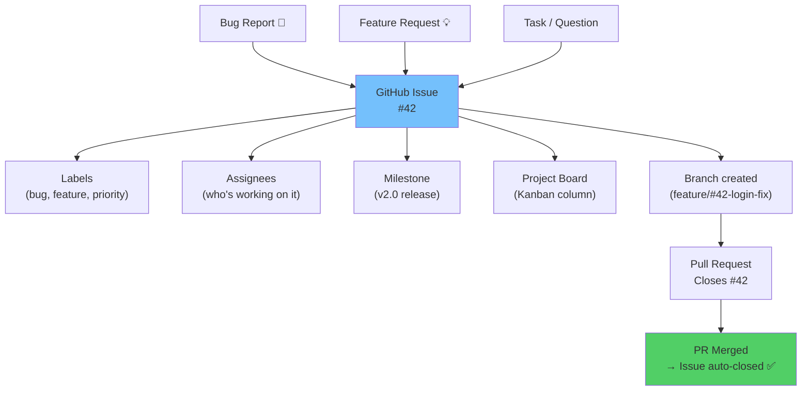
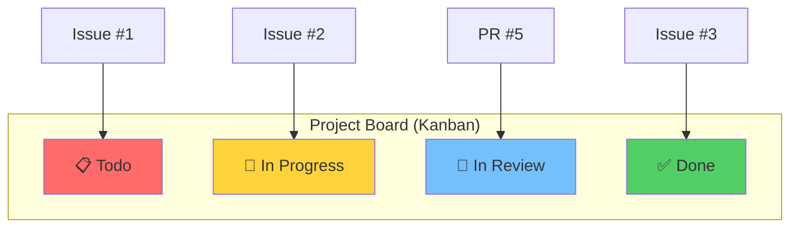
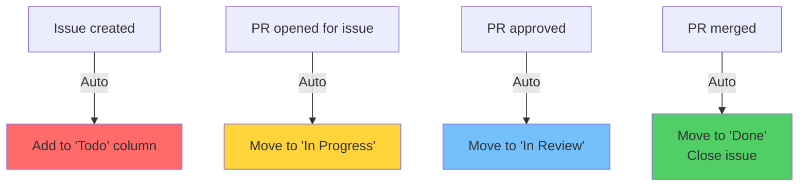

# Module 19: GitHub Issues, Projects & Wikis

> **Level**: 🟣 GitHub Deep-Dive | **Time**: 3 hours | **Prerequisites**: [Module 18](../18-Advanced-Merge-Strategies/README.md)

---

## 📋 Learning Objectives

- Use GitHub Issues for tracking bugs and features
- Set up issue templates and labels
- Use GitHub Projects v2 for project management
- Automate workflows with issue-linked PRs

---

## 1. GitHub Issues — How the Ecosystem Works



### Issue Templates

```yaml
# .github/ISSUE_TEMPLATE/bug_report.yml
name: Bug Report
description: Report a bug
labels: ["bug", "triage"]
body:
  - type: textarea
    id: description
    attributes:
      label: Bug Description
      placeholder: What happened?
    validations:
      required: true
  - type: textarea
    id: steps
    attributes:
      label: Steps to Reproduce
  - type: dropdown
    id: severity
    attributes:
      label: Severity
      options:
        - Critical
        - High
        - Medium
        - Low
```

### Linking Issues to PRs

```bash
# In commit message or PR description:
Closes #42        # Auto-closes when PR is merged
Fixes #42         # Same effect
Resolves #42      # Same effect
```

---

## 2. GitHub Projects v2



### Project Automations



---

## 3. Labels Strategy

| Label | Color | Purpose |
|-------|-------|---------|
| `bug` | 🔴 Red | Something broken |
| `feature` | 🟢 Green | New capability |
| `docs` | 🔵 Blue | Documentation |
| `priority: high` | 🟠 Orange | Urgent |
| `good first issue` | 🟣 Purple | Newcomer friendly |
| `wontfix` | ⚪ White | Will not address |

---

## 🏋️ Exercises

1. Create issue templates for bug reports and feature requests
2. Set up a GitHub Project board with custom columns
3. Create an issue, branch, and PR — verify auto-close on merge
4. Add labels and milestones to organize your issues

---

## 🔑 Key Takeaways

1. Issues are the **central tracking unit** for bugs, features, and tasks
2. Templates standardize issue reporting and speed up triage
3. Use `Closes #N` in PRs to **auto-close** issues on merge
4. GitHub Projects v2 provides Kanban boards with automations
5. Labels, milestones, and assignees organize work effectively

---

**[← Module 18](../18-Advanced-Merge-Strategies/README.md)** | **[Module 20 →](../20-Pull-Requests-and-Code-Reviews/README.md)**
