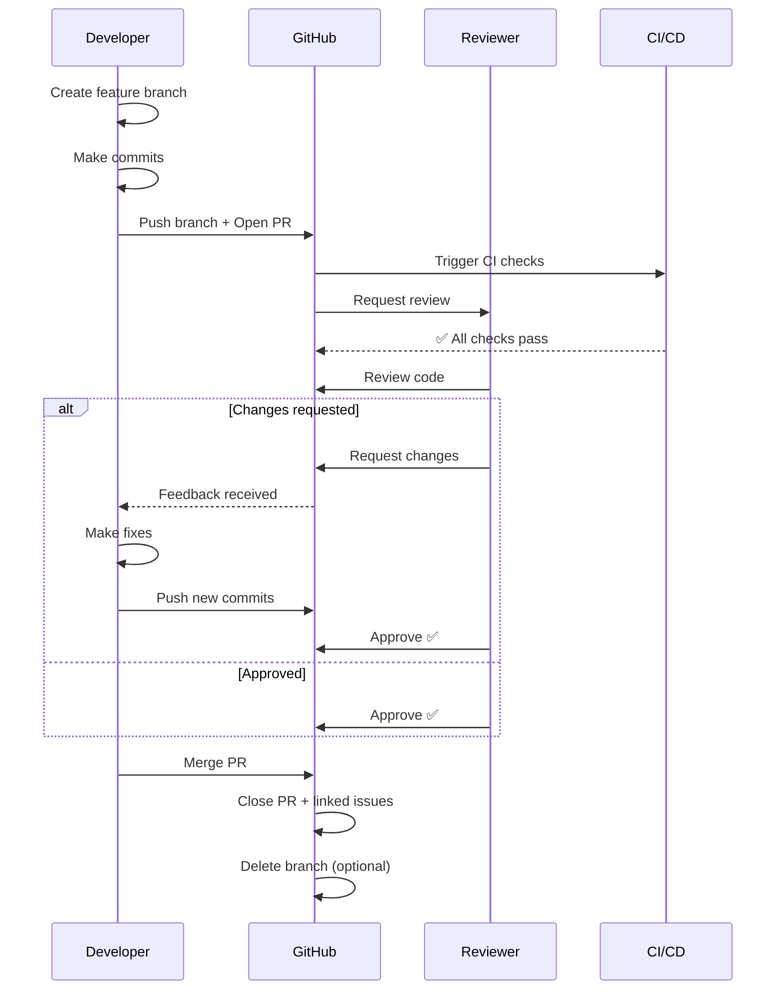
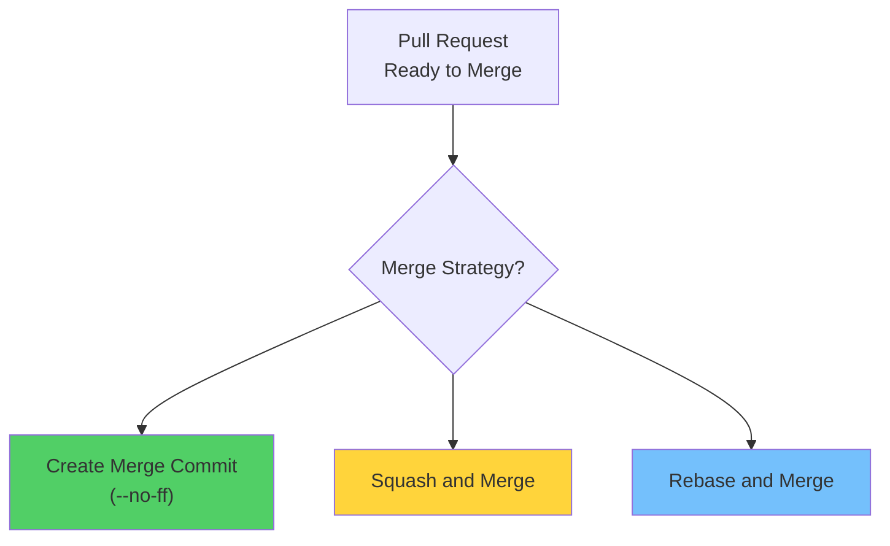
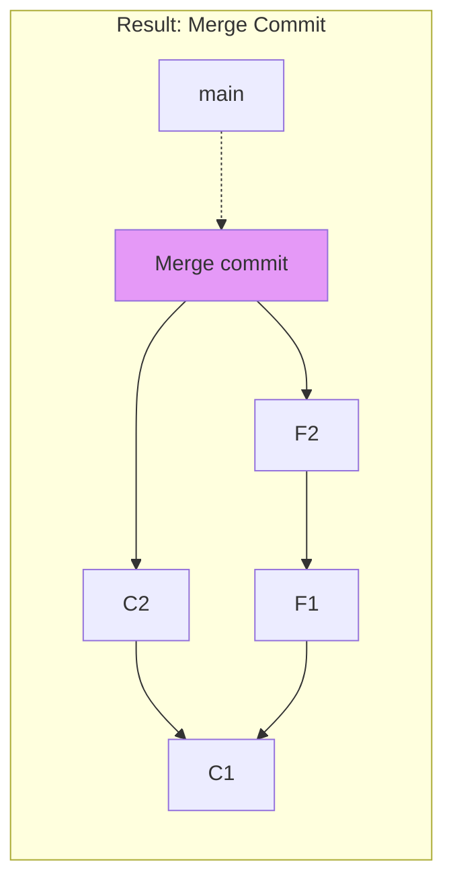
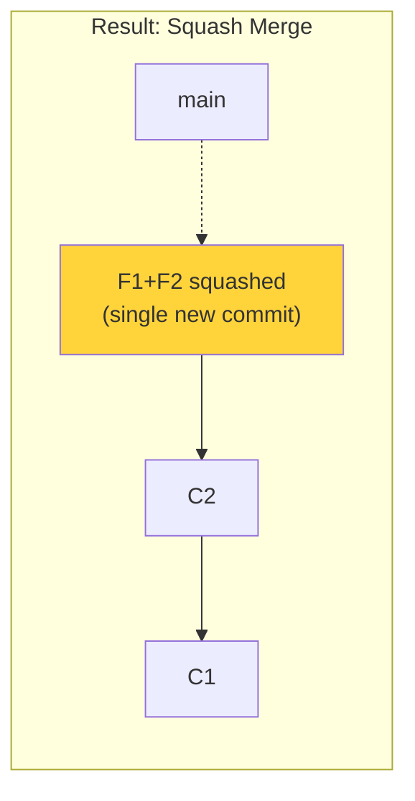
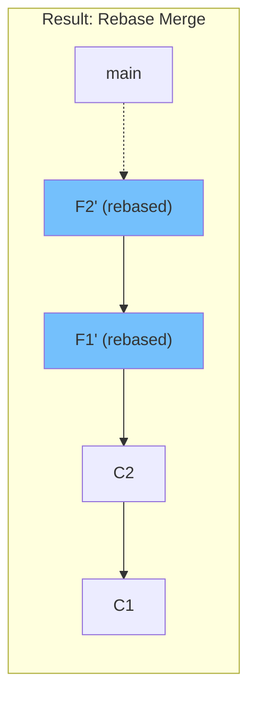
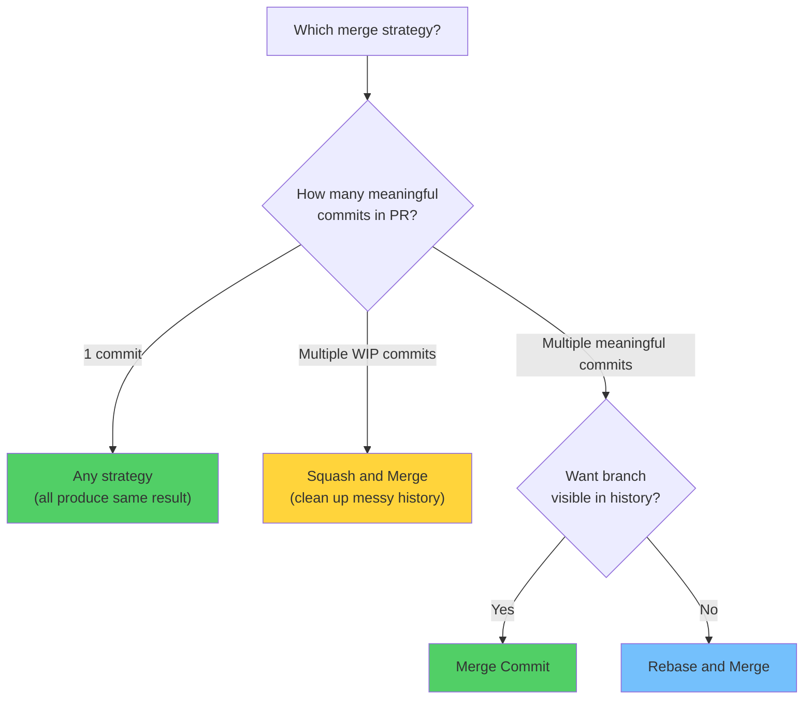
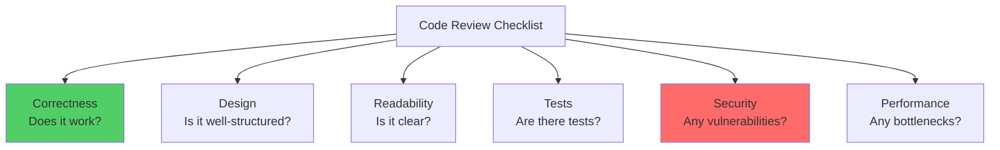
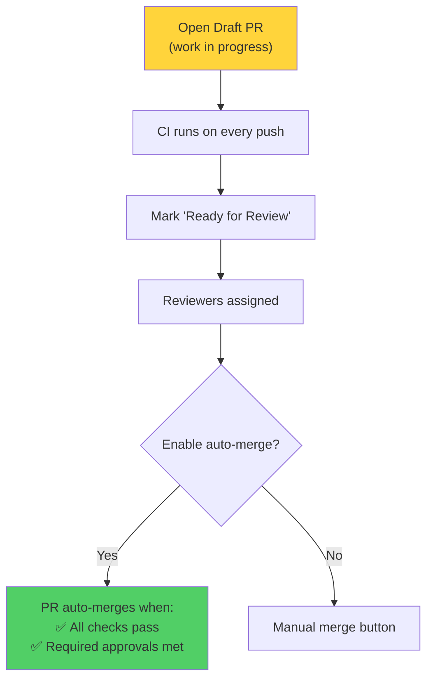

# Module 20: Pull Requests & Code Reviews

> **Level**: 🟣 GitHub Deep-Dive | **Time**: 3 hours | **Prerequisites**: [Module 19](../19-GitHub-Issues-Projects-and-Wikis/README.md)

---

## 📋 Learning Objectives

- Create effective pull requests
- Conduct thorough code reviews
- Understand PR merge strategies in depth
- Use PR automation features

---

## 1. Pull Request Lifecycle



---

## 2. PR Merge Strategies — What They Do Internally



### Merge Commit


**Preserves all commits + branch structure. Full history.**

### Squash and Merge


**All PR commits combined into one. Clean linear history.**

### Rebase and Merge


**Individual commits preserved, linear history, new SHAs.**

### Strategy Decision



---

## 3. Code Review Best Practices



### Review Comment Types

| Prefix | Meaning | Example |
|--------|---------|---------|
| `nit:` | Minor style issue | `nit: add trailing comma` |
| `suggestion:` | Take it or leave it | `suggestion: consider using map()` |
| `question:` | Need clarification | `question: why is this async?` |
| `issue:` | Must fix before merge | `issue: SQL injection vulnerability` |
| `praise:` | Positive feedback | `praise: elegant solution!` |

---

## 4. PR Template

```markdown
<!-- .github/pull_request_template.md -->

## Description
<!-- What does this PR do? -->

## Related Issue
Closes #

## Type of Change
- [ ] Bug fix
- [ ] New feature
- [ ] Breaking change
- [ ] Documentation

## Checklist
- [ ] Tests added/updated
- [ ] Documentation updated
- [ ] Self-review completed
- [ ] No console.log or debug code
```

---

## 5. Draft PRs and Auto-Merge



---

## 🏋️ Exercises

1. Create a PR with a detailed description using a PR template
2. Merge three PRs using each merge strategy and compare `git log --graph`
3. Practice code review: leave comments with proper prefixes
4. Set up a draft PR and convert it to ready for review
5. Enable auto-merge on a PR with required checks

---

## 🔑 Key Takeaways

1. PRs are the standard way to propose, review, and integrate changes
2. **Merge commit** preserves all history; **squash** cleans up; **rebase** linearizes
3. Good reviews check correctness, design, readability, tests, and security
4. Use PR templates to standardize the information contributors provide
5. Draft PRs let you get early CI feedback without requesting reviews
6. Auto-merge reduces manual work once all checks and approvals pass

---

**[← Module 19](../19-GitHub-Issues-Projects-and-Wikis/README.md)** | **[Module 21 →](../21-Branch-Protection-and-CODEOWNERS/README.md)**
