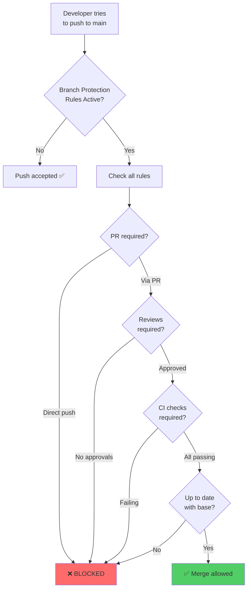
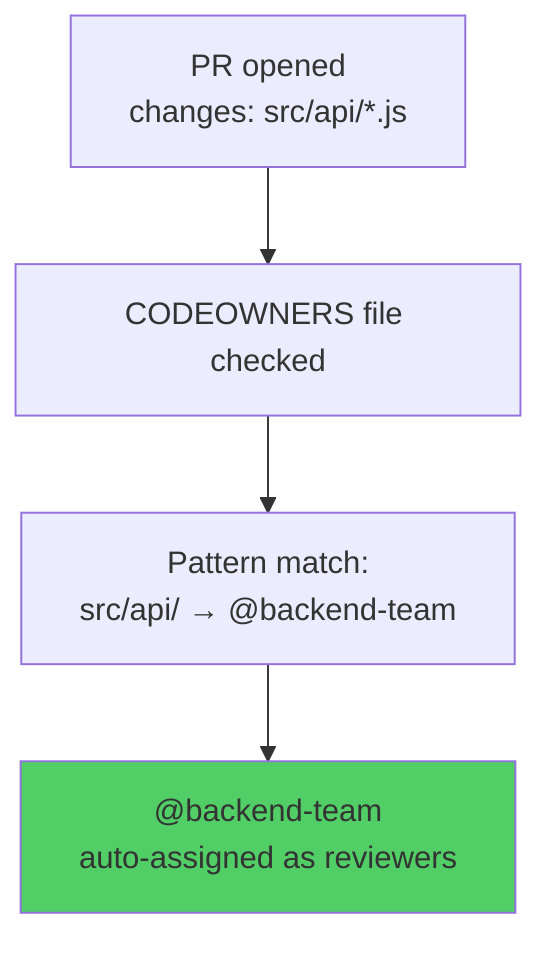
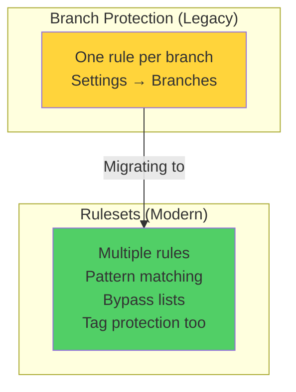

# Module 21: Branch Protection & CODEOWNERS

> **Level**: 🟣 GitHub Deep-Dive | **Time**: 2.5 hours | **Prerequisites**: [Module 20](../20-Pull-Requests-and-Code-Reviews/README.md)

---

## 📋 Learning Objectives

- Configure branch protection rules
- Set up required status checks and reviews
- Use CODEOWNERS for automatic review assignment
- Understand GitHub Rulesets (modern alternative)

---

## 1. Branch Protection — How It Works



### Common Protection Rules

| Rule | What It Does |
|------|-------------|
| Require PR reviews | No direct pushes, must go through PR |
| Required reviewers (N) | Minimum number of approvals |
| Dismiss stale reviews | Re-review needed after new commits |
| Require status checks | CI must pass before merge |
| Require up-to-date | Branch must be current with base |
| Restrict force push | Prevent history rewriting |
| Restrict deletions | Prevent branch deletion |
| Require signed commits | Only GPG-signed commits allowed |

---

## 2. CODEOWNERS



```bash
# .github/CODEOWNERS

# Default owners for everything
* @org/core-team

# Frontend
/src/components/ @org/frontend-team
*.css @org/frontend-team
*.tsx @org/frontend-team

# Backend
/src/api/ @org/backend-team
/src/models/ @org/backend-team @lead-dev

# Documentation
/docs/ @org/docs-team
*.md @org/docs-team

# DevOps
Dockerfile @org/devops-team
.github/ @org/devops-team
```

---

## 3. GitHub Rulesets (Modern Alternative)



Rulesets support:
- **Multiple branch patterns** in one rule
- **Bypass actors** (allow specific people/apps to skip rules)
- **Tag protection** (not just branches)
- **Organization-level** rules (apply across repos)

---

## 🏋️ Exercises

1. Enable branch protection on `main` requiring 1 approval and CI checks
2. Create a CODEOWNERS file with at least 3 ownership patterns
3. Try pushing directly to a protected branch — observe the rejection
4. Set up a Ruleset as an alternative to branch protection

---

## 🔑 Key Takeaways

1. Branch protection prevents direct pushes and enforces quality gates
2. CODEOWNERS auto-assigns reviewers based on file path patterns
3. Required status checks ensure CI passes before merge
4. Rulesets are the modern, more flexible alternative to branch protection
5. Protection rules are essential for any team project

---

**[← Module 20](../20-Pull-Requests-and-Code-Reviews/README.md)** | **[Module 22 →](../22-GitHub-Actions-CI-CD-Fundamentals/README.md)**
