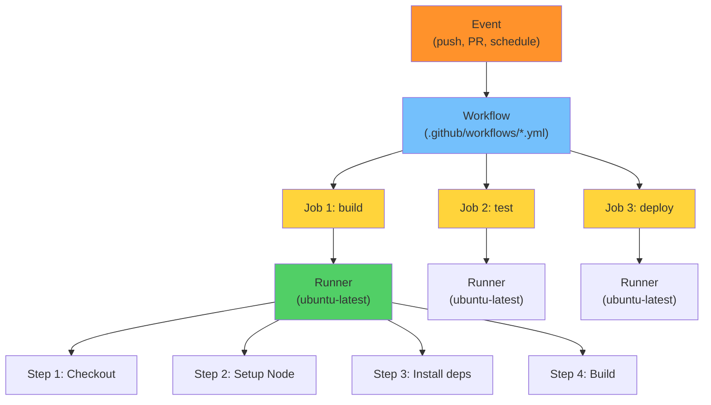
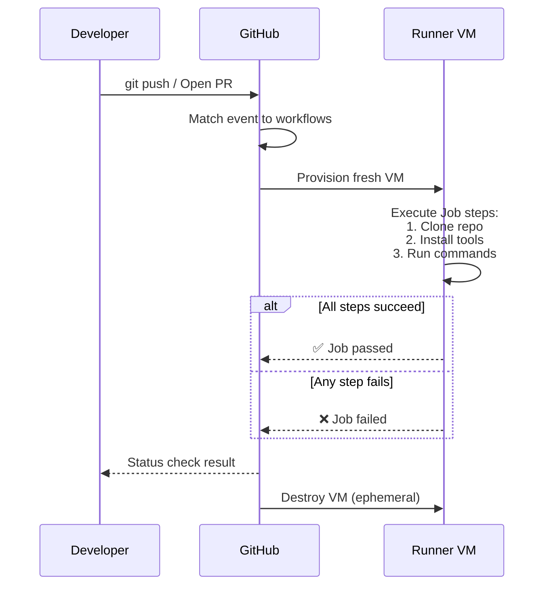
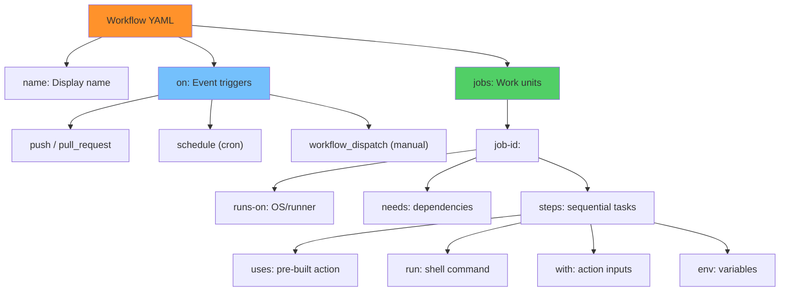
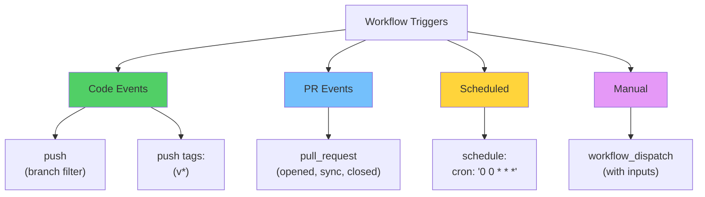
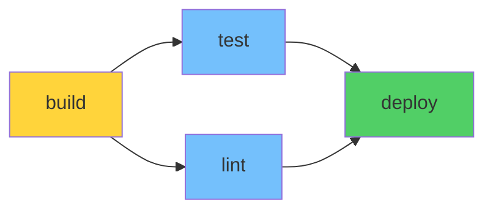
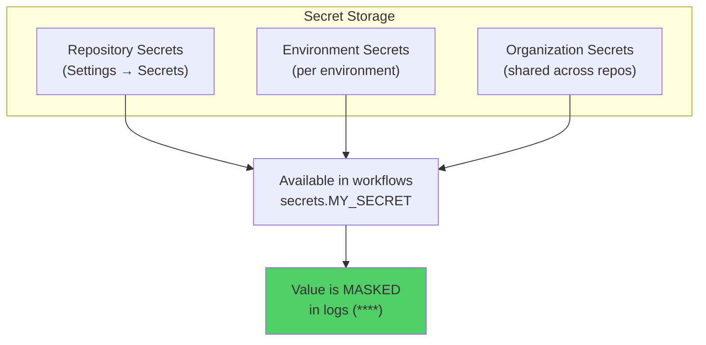

# Module 22: GitHub Actions — CI/CD Fundamentals

> **Level**: 🟣 GitHub Deep-Dive | **Time**: 4 hours | **Prerequisites**: [Module 21](../21-Branch-Protection-and-CODEOWNERS/README.md)

---

## 📋 Learning Objectives

- Understand GitHub Actions architecture
- Write CI/CD workflows in YAML
- Use actions, jobs, steps, and triggers
- Implement automated testing and deployment

---

## 1. GitHub Actions Architecture



### How a Workflow Executes



---

## 2. Workflow YAML Structure

```yaml
# .github/workflows/ci.yml
name: CI Pipeline                    # Workflow name

on:                                  # Triggers
  push:
    branches: [main, develop]
  pull_request:
    branches: [main]

jobs:                                # Jobs (run in parallel by default)
  build:
    runs-on: ubuntu-latest           # Runner
    
    steps:                           # Sequential steps within job
      - name: Checkout code
        uses: actions/checkout@v4    # Use an action
      
      - name: Setup Node.js
        uses: actions/setup-node@v4
        with:
          node-version: '20'
          cache: 'npm'
      
      - name: Install dependencies
        run: npm ci                  # Run shell command
      
      - name: Run lint
        run: npm run lint
      
      - name: Run tests
        run: npm test
      
      - name: Build
        run: npm run build
```

### YAML Components Explained



---

## 3. Event Triggers



```yaml
# Multiple triggers
on:
  push:
    branches: [main]
    paths: ['src/**']           # Only when src/ changes
  pull_request:
    types: [opened, synchronize]
  schedule:
    - cron: '0 2 * * 1'        # Every Monday at 2 AM
  workflow_dispatch:            # Manual trigger button
    inputs:
      environment:
        type: choice
        options: [staging, production]
```

---

## 4. Job Dependencies



```yaml
jobs:
  build:
    runs-on: ubuntu-latest
    steps:
      - run: npm run build

  test:
    needs: build              # Waits for build
    runs-on: ubuntu-latest
    steps:
      - run: npm test

  lint:
    needs: build              # Waits for build
    runs-on: ubuntu-latest
    steps:
      - run: npm run lint

  deploy:
    needs: [test, lint]       # Waits for BOTH
    runs-on: ubuntu-latest
    steps:
      - run: ./deploy.sh
```

---

## 5. Secrets and Environment Variables



```yaml
steps:
  - name: Deploy
    env:
      API_KEY: ${{ secrets.API_KEY }}
      NODE_ENV: production
    run: |
      echo "Deploying with API key..."
      ./deploy.sh
```

---

## 6. Complete CI/CD Example

```yaml
name: Full CI/CD Pipeline

on:
  push:
    branches: [main]
  pull_request:
    branches: [main]

jobs:
  test:
    runs-on: ubuntu-latest
    strategy:
      matrix:
        node-version: [18, 20, 22]
    
    steps:
      - uses: actions/checkout@v4
      
      - name: Use Node.js ${{ matrix.node-version }}
        uses: actions/setup-node@v4
        with:
          node-version: ${{ matrix.node-version }}
          cache: 'npm'
      
      - run: npm ci
      - run: npm test
  
  deploy:
    needs: test
    if: github.ref == 'refs/heads/main'
    runs-on: ubuntu-latest
    environment: production
    
    steps:
      - uses: actions/checkout@v4
      - run: npm ci && npm run build
      - name: Deploy
        env:
          DEPLOY_KEY: ${{ secrets.DEPLOY_KEY }}
        run: ./scripts/deploy.sh
```

---

## 🏋️ Exercises

1. Create a CI workflow that runs lint and tests on every PR
2. Add a matrix strategy to test across Node.js 18, 20, and 22
3. Set up a deploy job that runs only on pushes to `main`
4. Store a secret and use it in a workflow step
5. Add path filters to only run tests when `src/` changes

---

## 🔑 Key Takeaways

1. Workflows are triggered by **events** and run on ephemeral **runners**
2. Jobs run in **parallel** by default; use `needs` for dependencies
3. Steps are **sequential** within a job; `uses` = action, `run` = command
4. **Matrix strategies** test across multiple configurations automatically
5. Secrets are encrypted and **masked** in logs — never hardcode credentials
6. Use `if` conditions and path filters to optimize when workflows run

---

**[← Module 21](../21-Branch-Protection-and-CODEOWNERS/README.md)** | **[Module 23 →](../23-GitHub-Actions-Advanced-Workflows/README.md)**
