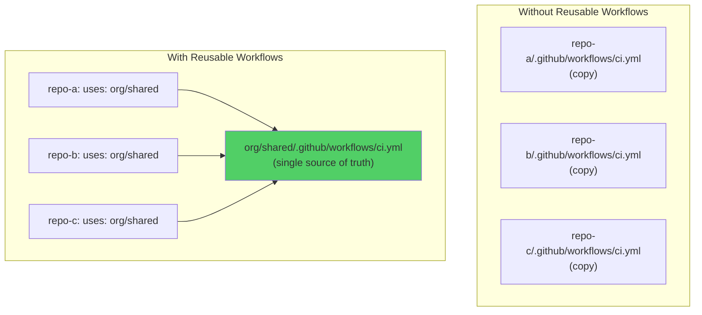
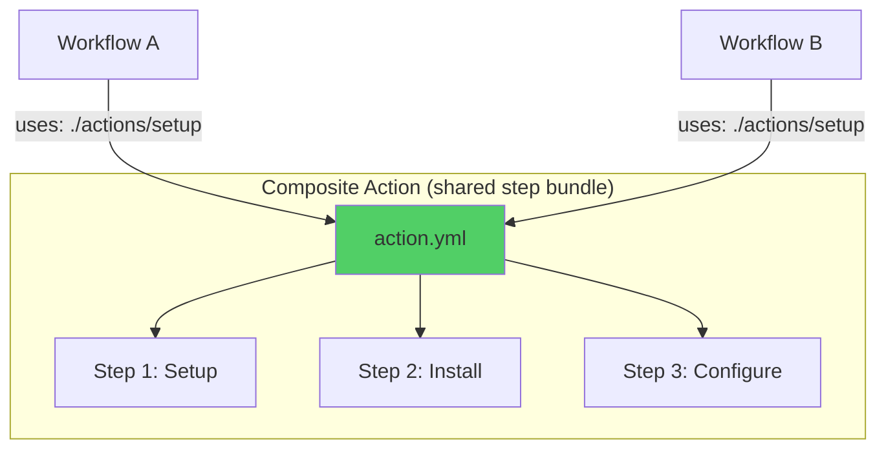
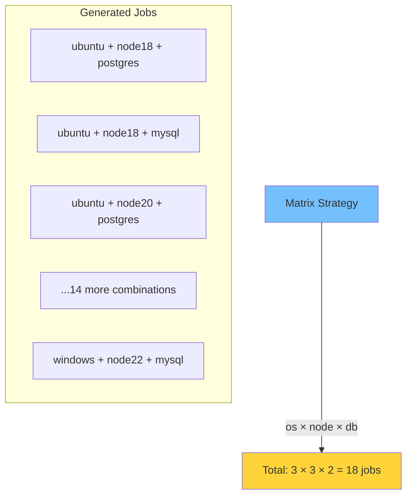
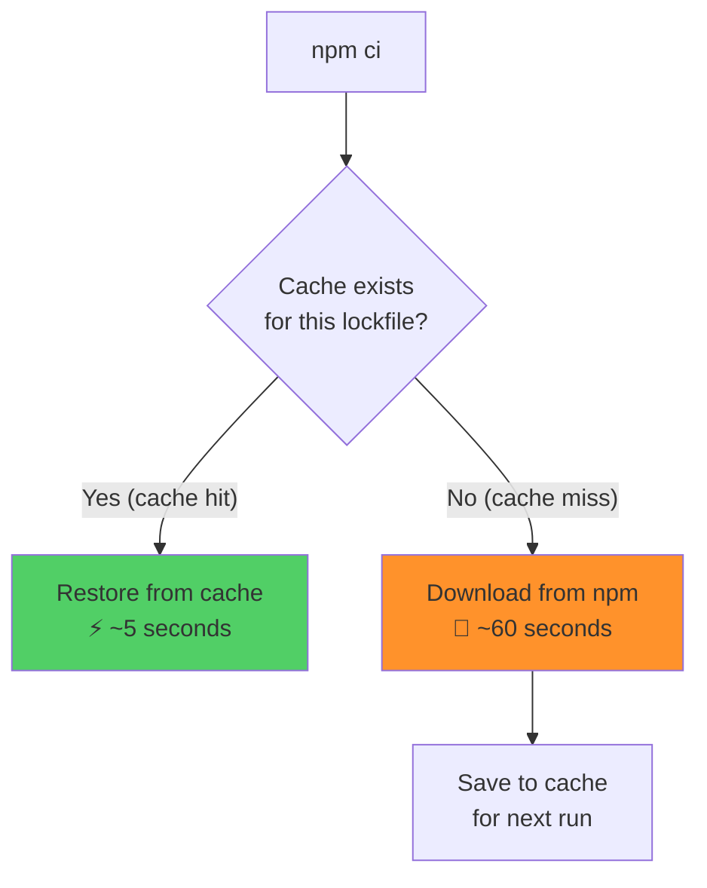
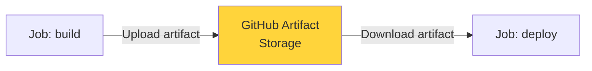
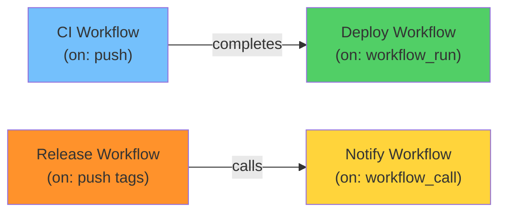

# Module 23: GitHub Actions — Advanced Workflows

> **Level**: 🟣 GitHub Deep-Dive | **Time**: 3.5 hours | **Prerequisites**: [Module 22](../22-GitHub-Actions-CI-CD-Fundamentals/README.md)

---

## 📋 Learning Objectives

- Create reusable workflows and composite actions
- Use matrix strategies for multi-environment testing
- Implement caching and artifacts
- Chain workflows with `workflow_call` and `workflow_run`

---

## 1. Reusable Workflows



```yaml
# Reusable workflow (callee)
# .github/workflows/reusable-test.yml
name: Reusable Test
on:
  workflow_call:               # Makes it callable
    inputs:
      node-version:
        type: string
        default: '20'
    secrets:
      npm-token:
        required: true

jobs:
  test:
    runs-on: ubuntu-latest
    steps:
      - uses: actions/checkout@v4
      - uses: actions/setup-node@v4
        with:
          node-version: ${{ inputs.node-version }}
      - run: npm ci
      - run: npm test
```

```yaml
# Caller workflow
name: CI
on: push
jobs:
  call-test:
    uses: org/shared/.github/workflows/reusable-test.yml@main
    with:
      node-version: '20'
    secrets:
      npm-token: ${{ secrets.NPM_TOKEN }}
```

---

## 2. Composite Actions



```yaml
# .github/actions/setup-project/action.yml
name: 'Setup Project'
description: 'Setup Node.js and install dependencies'
inputs:
  node-version:
    description: 'Node.js version'
    default: '20'
runs:
  using: composite
  steps:
    - uses: actions/setup-node@v4
      with:
        node-version: ${{ inputs.node-version }}
        cache: 'npm'
    - run: npm ci
      shell: bash
```

---

## 3. Matrix Strategies



```yaml
jobs:
  test:
    strategy:
      fail-fast: false          # Don't cancel others on failure
      matrix:
        os: [ubuntu-latest, windows-latest, macos-latest]
        node: [18, 20, 22]
        exclude:                # Remove specific combos
          - os: windows-latest
            node: 18
        include:                # Add specific combos
          - os: ubuntu-latest
            node: 20
            experimental: true
    
    runs-on: ${{ matrix.os }}
    steps:
      - uses: actions/setup-node@v4
        with:
          node-version: ${{ matrix.node }}
```

---

## 4. Caching Dependencies



```yaml
- uses: actions/cache@v4
  with:
    path: ~/.npm
    key: npm-${{ hashFiles('package-lock.json') }}
    restore-keys: npm-
```

---

## 5. Artifacts — Passing Data Between Jobs



```yaml
jobs:
  build:
    runs-on: ubuntu-latest
    steps:
      - run: npm run build
      - uses: actions/upload-artifact@v4
        with:
          name: dist
          path: dist/

  deploy:
    needs: build
    runs-on: ubuntu-latest
    steps:
      - uses: actions/download-artifact@v4
        with:
          name: dist
      - run: ./deploy.sh
```

---

## 6. Workflow Chaining



```yaml
# Triggered when another workflow completes
on:
  workflow_run:
    workflows: ["CI Pipeline"]
    types: [completed]
    branches: [main]

jobs:
  deploy:
    if: ${{ github.event.workflow_run.conclusion == 'success' }}
    runs-on: ubuntu-latest
    steps:
      - run: echo "Deploying after CI passed!"
```

---

## 🏋️ Exercises

1. Create a reusable workflow and call it from another workflow
2. Set up a matrix strategy testing across 3 OS and 3 Node versions
3. Add npm caching and measure the speed improvement
4. Upload build artifacts and download them in a deploy job
5. Chain two workflows using `workflow_run`

---

## 🔑 Key Takeaways

1. **Reusable workflows** eliminate duplication across repositories
2. **Composite actions** bundle multiple steps into one reusable action
3. **Matrix strategies** test across all combinations automatically
4. **Caching** dramatically speeds up repeated installs (npm, pip, etc.)
5. **Artifacts** pass build output between jobs
6. `workflow_call` and `workflow_run` chain workflows together

---

**[← Module 22](../22-GitHub-Actions-CI-CD-Fundamentals/README.md)** | **[Module 24 →](../24-GitHub-Security-Dependabot-and-Secrets/README.md)**
