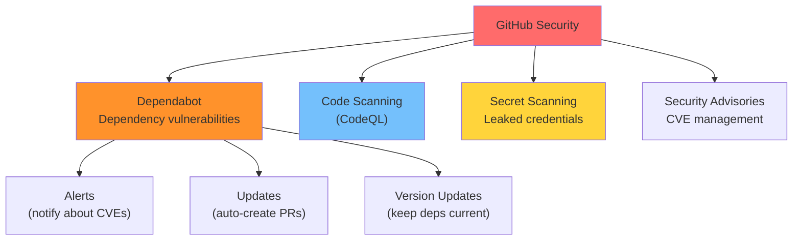
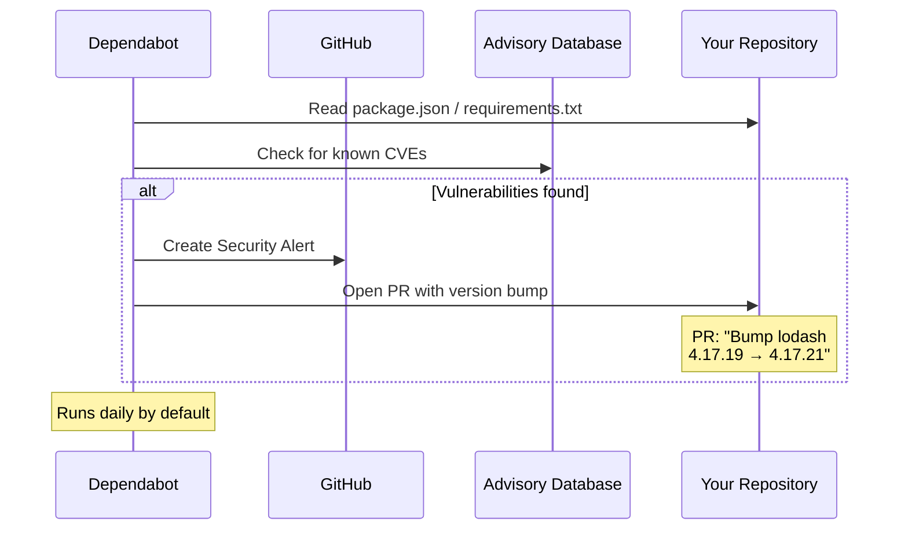
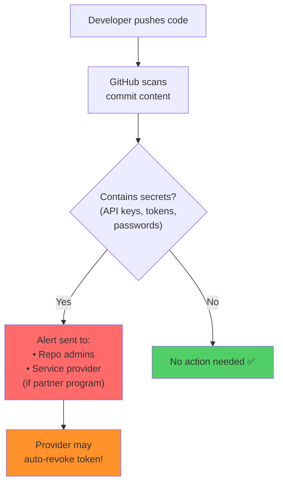
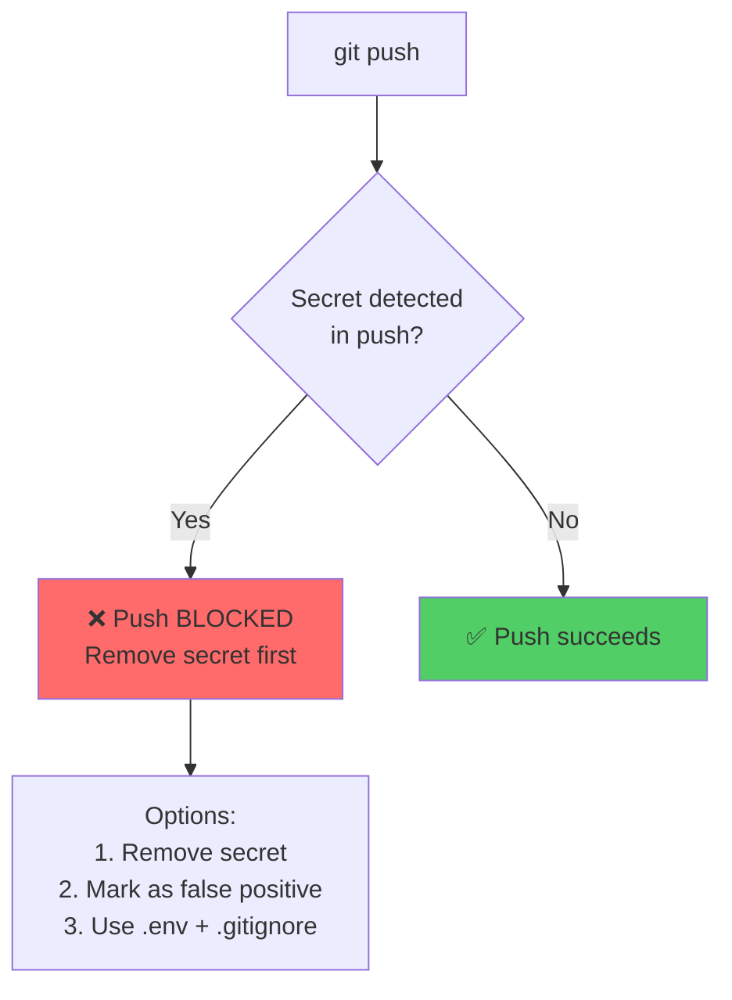
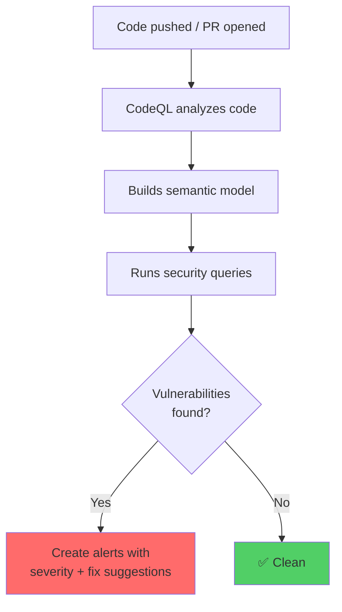
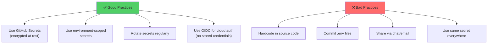

# Module 24: GitHub Security — Dependabot & Secrets

> **Level**: 🟣 GitHub Deep-Dive | **Time**: 3 hours | **Prerequisites**: [Module 23](../23-GitHub-Actions-Advanced-Workflows/README.md)

---

## 📋 Learning Objectives

- Scan for vulnerabilities with Dependabot
- Manage secrets securely
- Use code scanning and secret scanning
- Implement security best practices

---

## 1. GitHub Security Features Overview



---

## 2. Dependabot — How It Works



### Dependabot Configuration

```yaml
# .github/dependabot.yml
version: 2
updates:
  # npm dependencies
  - package-ecosystem: "npm"
    directory: "/"
    schedule:
      interval: "weekly"
    reviewers:
      - "security-team"
    labels:
      - "dependencies"
    open-pull-requests-limit: 10
  
  # GitHub Actions
  - package-ecosystem: "github-actions"
    directory: "/"
    schedule:
      interval: "weekly"
```

---

## 3. Secret Scanning



### Push Protection (Block Before It's Pushed)



---

## 4. Code Scanning with CodeQL



```yaml
# .github/workflows/codeql.yml
name: CodeQL Analysis
on: [push, pull_request]

jobs:
  analyze:
    runs-on: ubuntu-latest
    permissions:
      security-events: write
    
    steps:
      - uses: actions/checkout@v4
      - uses: github/codeql-action/init@v3
        with:
          languages: javascript
      - uses: github/codeql-action/analyze@v3
```

---

## 5. Secrets Management Best Practices



```bash
# .gitignore — ALWAYS include
.env
.env.local
.env.production
*.key
*.pem
```

---

## 🏋️ Exercises

1. Set up `dependabot.yml` for npm and GitHub Actions
2. Enable secret scanning and push protection on a repository
3. Set up CodeQL code scanning with a workflow
4. Practice storing and using secrets in GitHub Actions
5. Review Dependabot alerts and merge a security update PR

---

## 🔑 Key Takeaways

1. **Dependabot** auto-detects vulnerable dependencies and creates update PRs
2. **Secret scanning** finds leaked credentials and alerts you (or auto-revokes)
3. **Push protection** blocks pushes containing secrets *before* they reach GitHub
4. **CodeQL** performs semantic code analysis to find security vulnerabilities
5. Never hardcode secrets — use `.gitignore`, GitHub Secrets, and environment variables
6. Enable all security features — they're free for public repos

---

**[← Module 23](../23-GitHub-Actions-Advanced-Workflows/README.md)** | **[Module 25 →](../25-Branching-Strategies-and-Git-Flow/README.md)**
