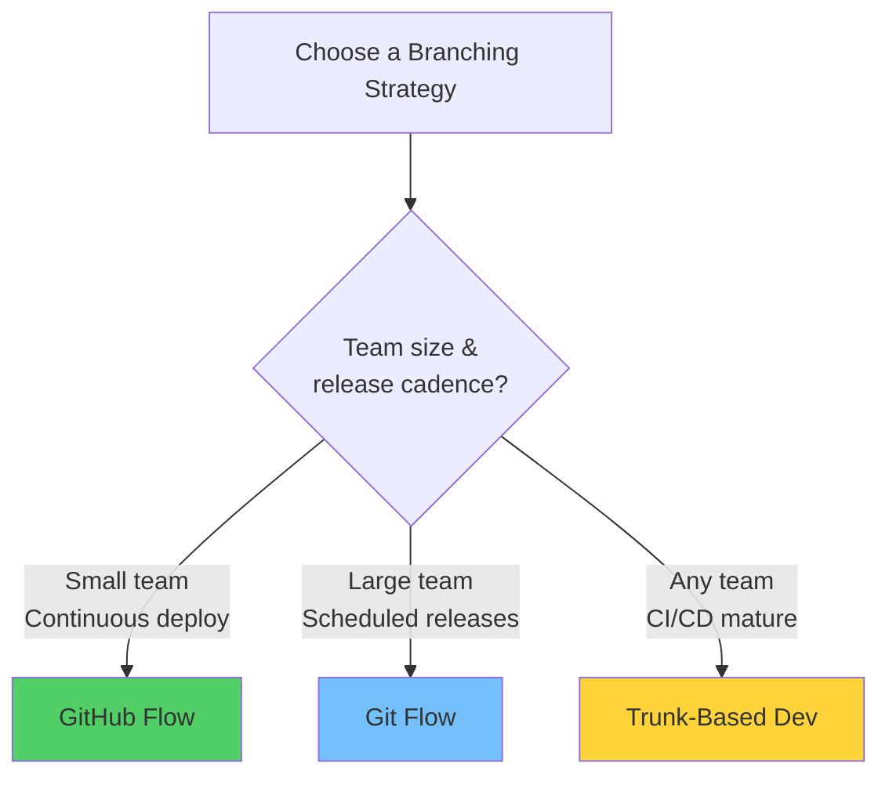
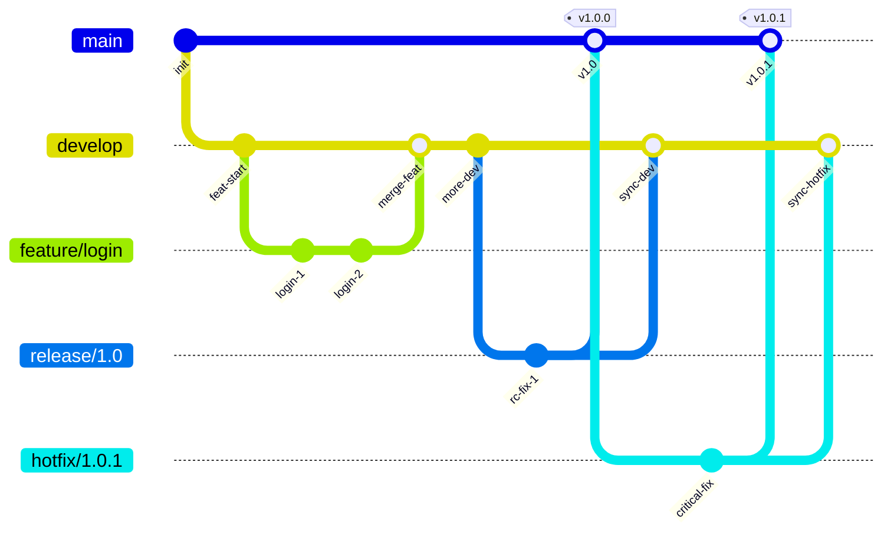
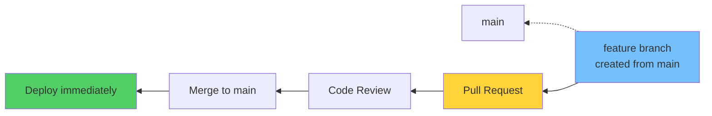
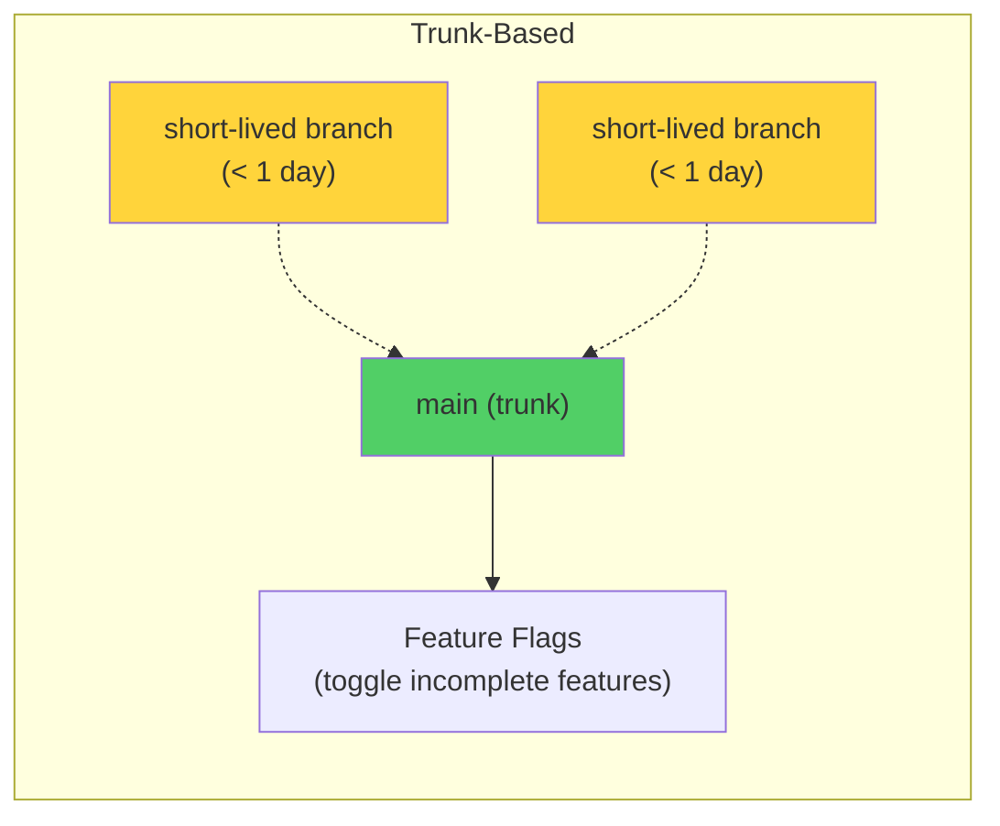

# Module 25: Branching Strategies & Git Flow

> **Level**: ⚫ Professional | **Time**: 3 hours | **Prerequisites**: [Module 24](../24-GitHub-Security-Dependabot-and-Secrets/README.md)

---

## 📋 Learning Objectives

- Compare Git Flow, GitHub Flow, and Trunk-Based Development
- Choose the right branching model for your team
- Implement release management strategies

---

## 1. Branching Models Compared

---

## 2. Git Flow

### Git Flow Branch Roles

| Branch | Purpose | Lifetime |
|--------|---------|----------|
| `main` | Production code | Permanent |
| `develop` | Integration branch | Permanent |
| `feature/*` | New features | Temporary |
| `release/*` | Release prep | Temporary |
| `hotfix/*` | Emergency fixes | Temporary |

---

## 3. GitHub Flow (Simplified)

**Rules:**
1. `main` is always deployable
2. Create feature branches from `main`
3. Open PR when ready for review
4. After review + CI, merge to `main`
5. Deploy immediately after merge

---

## 4. Trunk-Based Development

**Key practices:**
- Branches live less than 1 day
- Merge to `main` multiple times per day
- Use **feature flags** for incomplete features
- Requires strong CI/CD and test coverage

---

## 5. Strategy Comparison

| Factor | Git Flow | GitHub Flow | Trunk-Based |
|--------|----------|-------------|-------------|
| Complexity | High | Low | Medium |
| Branch lifetime | Long | Medium | Very short |
| Release cadence | Scheduled | Continuous | Continuous |
| Best for | Mobile apps, scheduled releases | SaaS, web apps | High-velocity teams |
| CI/CD maturity needed | Low | Medium | High |

---

## 🏋️ Exercises

1. Implement a full Git Flow cycle: feature → develop → release → main
2. Practice GitHub Flow: branch → PR → merge → deploy
3. Create a feature flag system for trunk-based development
4. Decide which strategy your current project should use and justify why

---

## 🔑 Key Takeaways

1. **Git Flow**: Best for scheduled releases with clear versioning
2. **GitHub Flow**: Simple and effective for continuous deployment
3. **Trunk-Based**: Fastest velocity, requires strong CI/CD and feature flags
4. No single strategy fits all — choose based on team size, release cadence, and CI maturity
5. Whatever you choose, document it and enforce it consistently

---

**[← Module 24](../24-GitHub-Security-Dependabot-and-Secrets/README.md)** | **[Module 26 →](../26-Open-Source-Contribution-Guide/README.md)**
