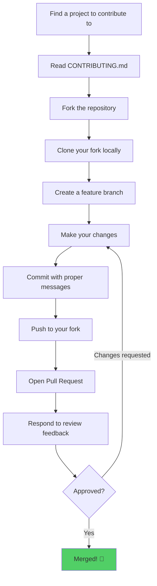
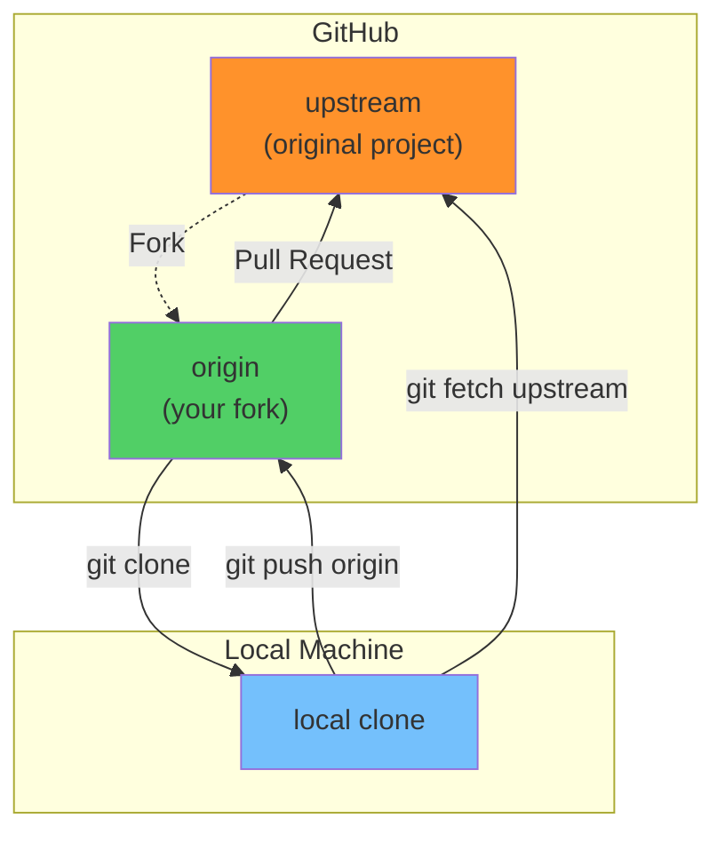
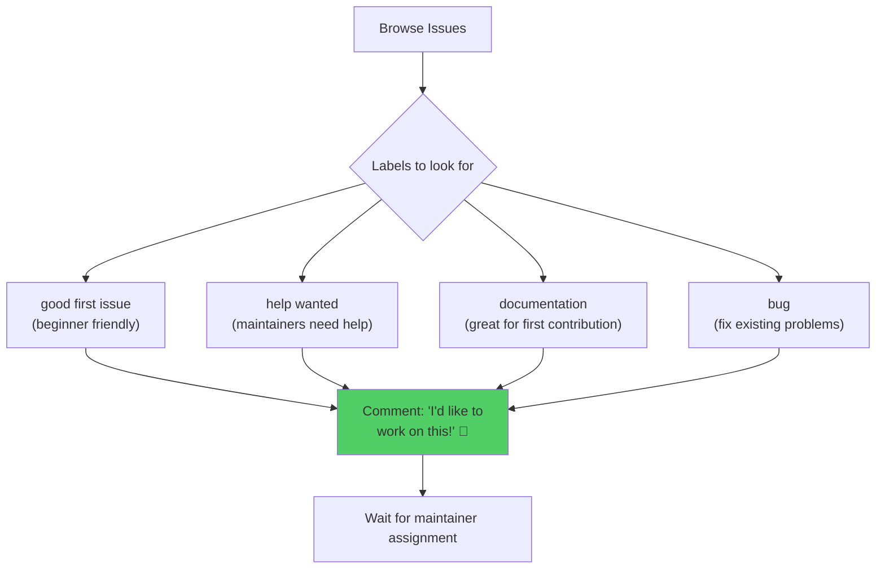
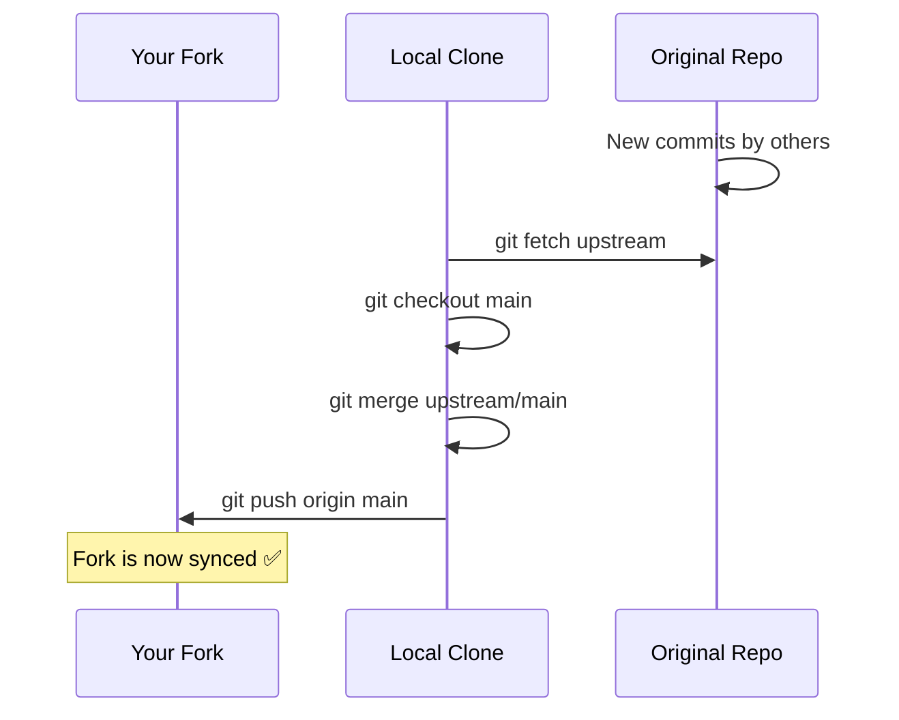

# Module 26: Open-Source Contribution Guide

> **Level**: ⚫ Professional | **Time**: 3 hours | **Prerequisites**: [Module 25](../25-Branching-Strategies-and-Git-Flow/README.md)

---

## 📋 Learning Objectives

- Navigate open-source project structures
- Follow the fork-and-PR contribution workflow
- Write effective contribution documentation
- Understand open-source etiquette

---

## 1. The Contribution Workflow



### Complete Remote Setup



```bash
# 1. Fork on GitHub (web UI)

# 2. Clone your fork
git clone git@github.com:YOUR-USER/project.git
cd project

# 3. Add upstream remote
git remote add upstream git@github.com:ORIGINAL/project.git

# 4. Verify remotes
git remote -v
# origin    git@github.com:YOUR-USER/project.git (fetch)
# origin    git@github.com:YOUR-USER/project.git (push)
# upstream  git@github.com:ORIGINAL/project.git (fetch)
# upstream  git@github.com:ORIGINAL/project.git (push)

# 5. Keep fork synced
git fetch upstream
git checkout main
git merge upstream/main
git push origin main
```

---

## 2. Finding Issues to Work On



---

## 3. Required Project Files

| File | Purpose |
|------|---------|
| `README.md` | Project overview and setup |
| `CONTRIBUTING.md` | How to contribute |
| `CODE_OF_CONDUCT.md` | Community standards |
| `LICENSE` | Legal terms for use |
| `.github/ISSUE_TEMPLATE/` | Standardized issue forms |
| `.github/pull_request_template.md` | PR description template |

---

## 4. Keeping Your Fork in Sync



---

## 🏋️ Exercises

1. Fork a public repo, clone it, and set up upstream remote
2. Find an issue labeled `good first issue` and read the contribution guidelines
3. Create a branch, make a documentation fix, and open a PR
4. Sync your fork with upstream changes
5. Create CONTRIBUTING.md and CODE_OF_CONDUCT.md for your own project

---

## 🔑 Key Takeaways

1. Always **read CONTRIBUTING.md** before starting work
2. Fork → Clone → Branch → Commit → Push → PR is the standard flow
3. Keep your fork synced with `upstream` to avoid merge conflicts
4. Start with `good first issue` labels for your first contributions
5. Be patient and respectful — maintainers are often volunteers

---

**[← Module 25](../25-Branching-Strategies-and-Git-Flow/README.md)** | **[Module 27 →](../27-Monorepos-and-Scaling-Git/README.md)**
