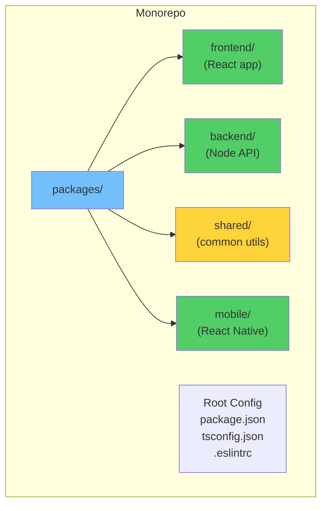
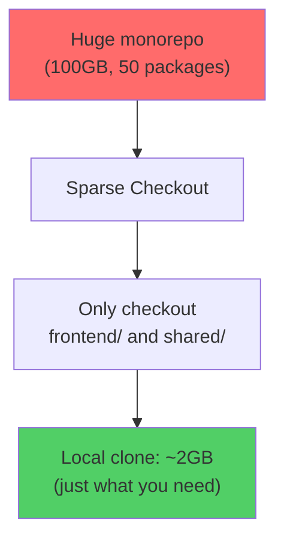
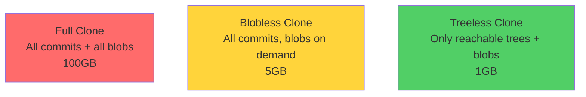
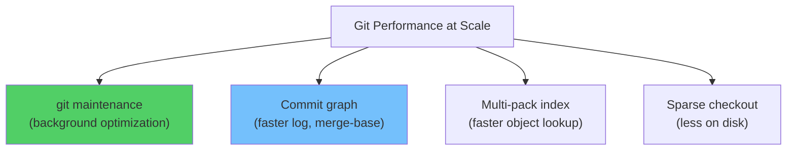

# Module 27: Monorepos & Scaling Git

> **Level**: ⚫ Professional | **Time**: 3 hours | **Prerequisites**: [Module 26](../26-Open-Source-Contribution-Guide/README.md)

---

## 📋 Learning Objectives

- Understand monorepo architecture and trade-offs
- Use sparse checkout and partial clone for large repos
- Optimize Git performance at scale

---

## 1. Monorepo Architecture



### Monorepo vs Polyrepo

| Factor | Monorepo | Polyrepo |
|--------|----------|----------|
| Code sharing | Easy (same repo) | Requires publishing packages |
| Atomic changes | Cross-package in one PR ✅ | Multiple PRs across repos |
| CI complexity | Must detect what changed | Simpler per-repo CI |
| Repo size | Can become very large | Stays small |
| Onboarding | All code visible | Focused per service |

---

## 2. Sparse Checkout — Work on a Subset



```bash
# Clone without checking out files
git clone --no-checkout https://github.com/org/monorepo.git
cd monorepo

# Enable sparse checkout
git sparse-checkout init --cone

# Only checkout these directories
git sparse-checkout set frontend shared

# Add more directories later
git sparse-checkout add backend

# View current sparse-checkout config
git sparse-checkout list
```

---

## 3. Partial Clone — Download Less Data



```bash
# Blobless clone (recommended)
git clone --filter=blob:none URL

# Treeless clone (smallest, but slower operations)
git clone --filter=tree:0 URL

# Shallow clone (specific depth)
git clone --depth=1 URL
```

---

## 4. Performance Optimization



```bash
# Enable background maintenance
git maintenance start

# Force garbage collection
git gc --aggressive

# Update commit-graph for faster log
git commit-graph write --reachable

# Check repo health
git fsck
git count-objects -v
```

---

## 🏋️ Exercises

1. Create a monorepo structure with 3 packages and shared config
2. Use sparse checkout to only clone 1 package from a large repo
3. Compare clone times: full vs blobless vs shallow
4. Enable `git maintenance` and observe background optimization

---

## 🔑 Key Takeaways

1. Monorepos centralize code but require tooling for scale
2. **Sparse checkout** limits which directories are on disk
3. **Partial clone** downloads object data on demand
4. `git maintenance` automates background performance optimization
5. Choose monorepo vs polyrepo based on team size and coupling

---

**[← Module 26](../26-Open-Source-Contribution-Guide/README.md)** | **[Module 28 →](../28-Repository-Best-Practices/README.md)**
