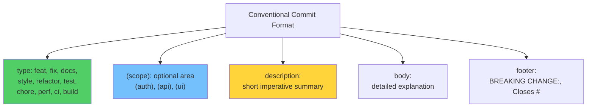
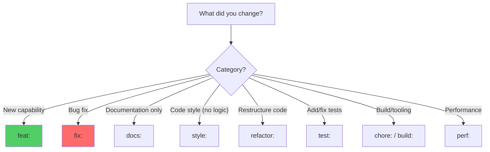
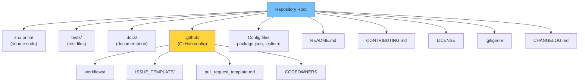
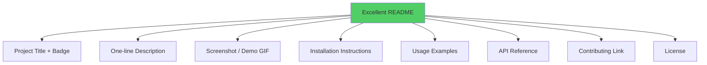
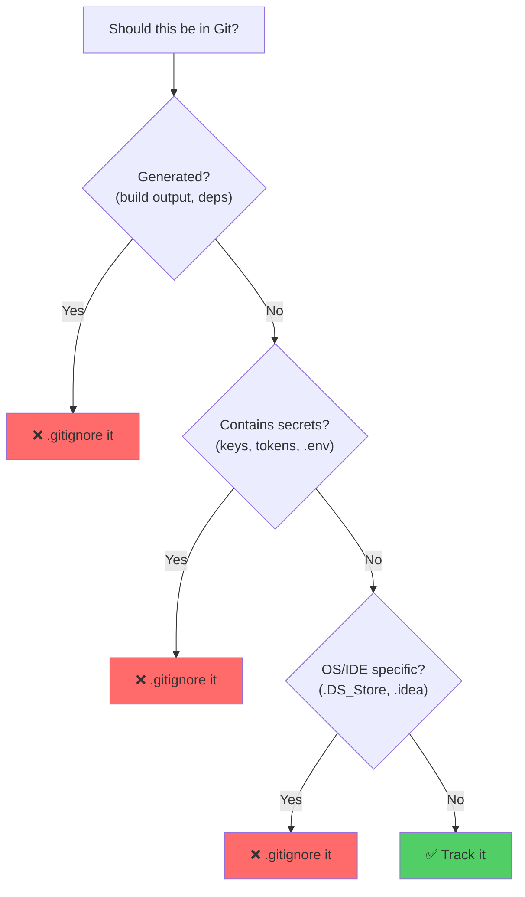

# Module 28: Repository Best Practices

> **Level**: ⚫ Professional | **Time**: 2.5 hours | **Prerequisites**: [Module 27](../27-Monorepos-and-Scaling-Git/README.md)

---

## 📋 Learning Objectives

- Structure repositories for maintainability
- Write effective commit messages
- Implement conventional commits
- Set up community health files

---

## 1. Commit Message Standards

### Conventional Commits



```
feat(auth): add JWT token refresh

Implement automatic token refresh when the access token
expires within 5 minutes. Uses refresh token from httpOnly
cookie.

BREAKING CHANGE: Login response now includes refresh_token field
Closes #142
```

### Commit Type Decision



---

## 2. Repository Structure



---

## 3. README Quality Checklist



---

## 4. .gitignore Best Practices

```bash
# OS files
.DS_Store
Thumbs.db

# IDE
.vscode/settings.json
.idea/

# Dependencies
node_modules/
__pycache__/
venv/

# Build output
dist/
build/
*.pyc

# Environment
.env
.env.local
*.key

# Logs
*.log
npm-debug.log*
```



---

## 🏋️ Exercises

1. Convert your last 10 commit messages to Conventional Commits format
2. Set up a commit-msg hook enforcing Conventional Commits
3. Create a complete repository structure with all community health files
4. Write a comprehensive README with badges, screenshots, and examples
5. Audit your `.gitignore` — are you tracking anything that shouldn't be?

---

## 🔑 Key Takeaways

1. **Conventional Commits** enable automated changelogs and versioning
2. A well-structured repo includes README, CONTRIBUTING, LICENSE, and .github/
3. `.gitignore` should exclude generated files, secrets, and OS/IDE artifacts
4. Great READMEs include install instructions, usage examples, and screenshots
5. Repository standards reduce friction for new contributors

---

**[← Module 27](../27-Monorepos-and-Scaling-Git/README.md)** | **[Module 29 →](../29-Git-in-Production-DevOps-Integration/README.md)**
