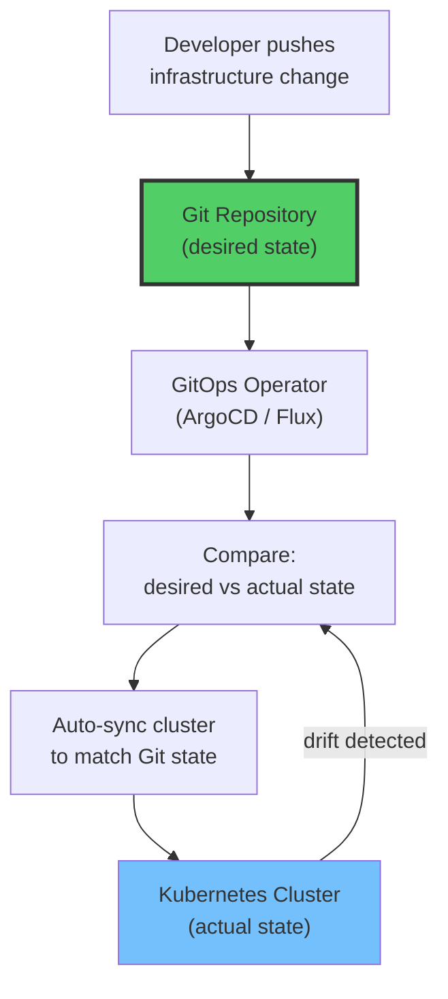
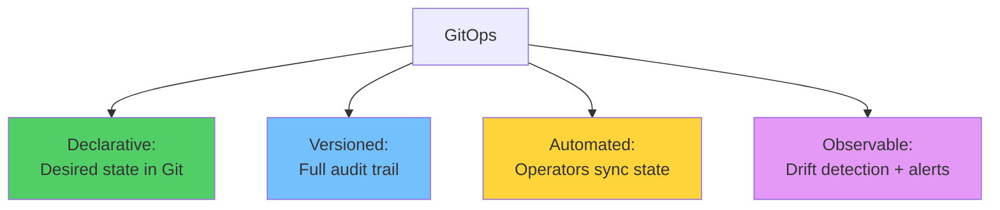
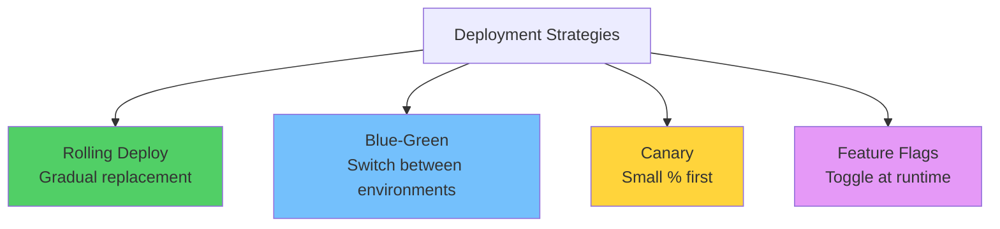
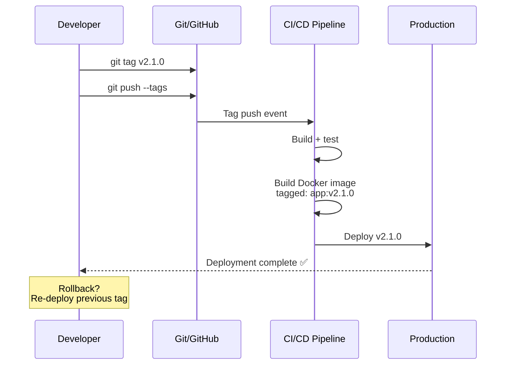
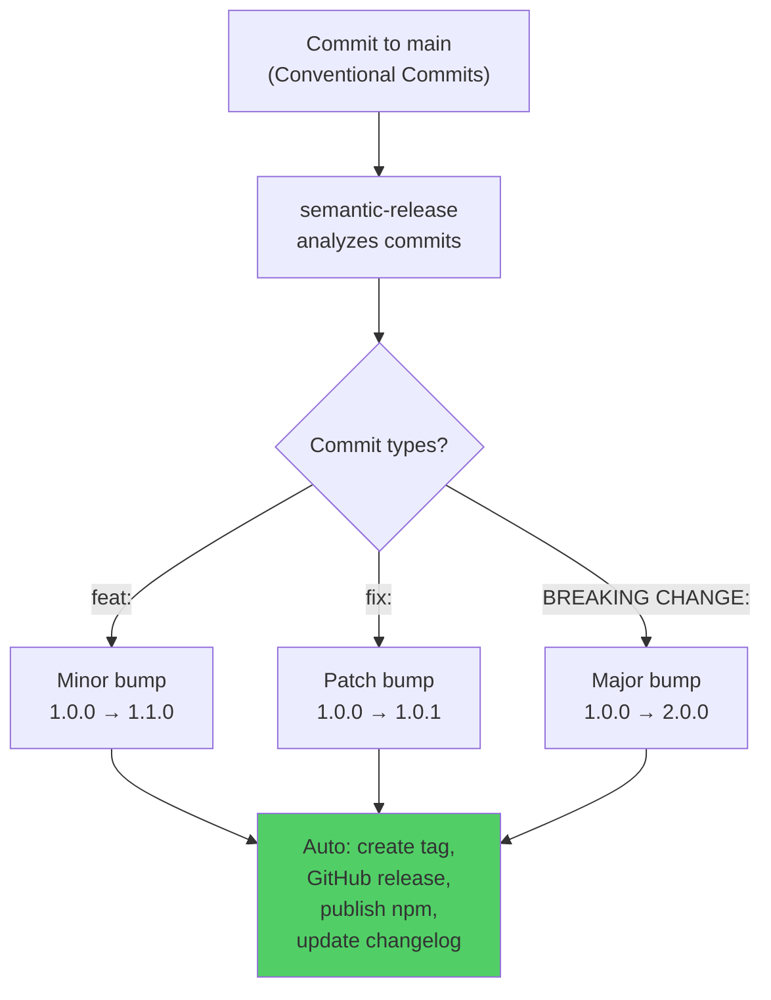
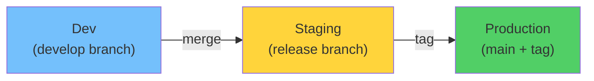

# Module 29: Git in Production — DevOps Integration

> **Level**: ⚫ Professional | **Time**: 4 hours | **Prerequisites**: [Module 28](../28-Repository-Best-Practices/README.md)

---

## 📋 Learning Objectives

- Integrate Git with CI/CD production pipelines
- Implement GitOps for infrastructure management
- Master deployment strategies with Git
- Automate releases

---

## 1. GitOps — Git as Single Source of Truth



### GitOps Principles



---

## 2. Deployment Strategies with Git



### Git Tag-Based Deployments



---

## 3. Automated Release Pipeline

```yaml
# .github/workflows/release.yml
name: Release
on:
  push:
    tags: ['v*']

jobs:
  release:
    runs-on: ubuntu-latest
    steps:
      - uses: actions/checkout@v4
      
      - name: Build
        run: npm ci && npm run build
      
      - name: Create GitHub Release
        uses: softprops/action-gh-release@v2
        with:
          generate_release_notes: true
          files: dist/*
```

### Semantic Release (Fully Automated)



---

## 4. Environment-Based Promotion



---

## 🏋️ Exercises

1. Set up a tag-triggered deployment pipeline with GitHub Actions
2. Configure `semantic-release` with Conventional Commits
3. Implement a blue-green deployment strategy using Git branches
4. Create a GitOps-style repo where merging to `main` auto-deploys

---

## 🔑 Key Takeaways

1. **GitOps** makes Git the single source of truth for infrastructure
2. Tag-based deployments provide clear versioning and easy rollback
3. `semantic-release` automates version bumps based on commit messages
4. Environment promotion (dev → staging → prod) uses branches and tags
5. Every deployment should be traceable to a Git commit/tag

---

**[← Module 28](../28-Repository-Best-Practices/README.md)** | **[Module 30 →](../30-Capstone-Project/README.md)**
