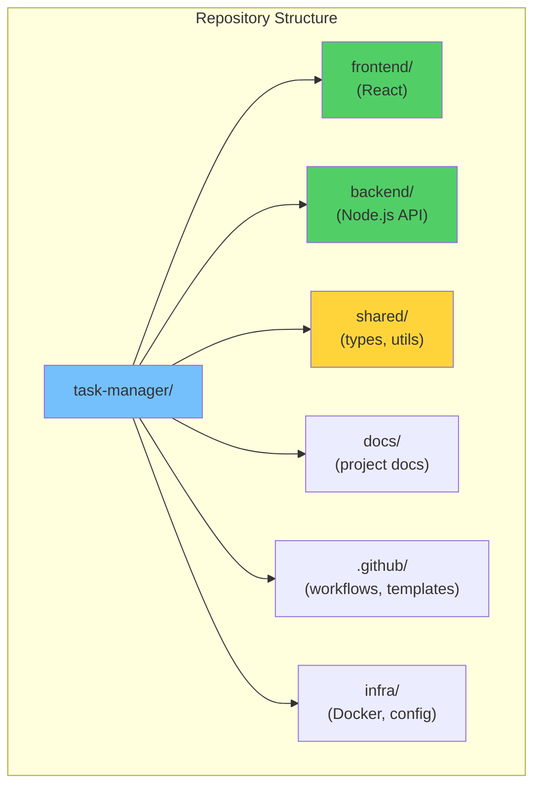
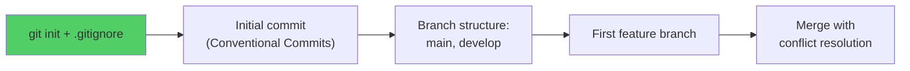
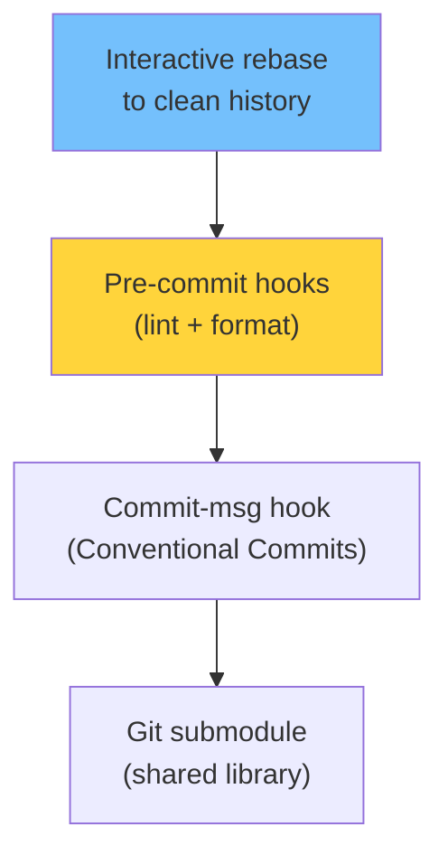
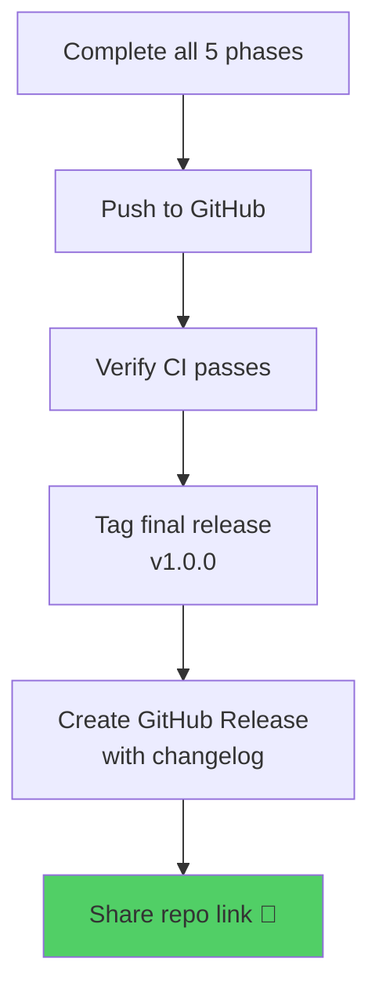

# Module 30: Capstone Project

> **Level**: ⚫ Professional | **Time**: 8-12 hours | **Prerequisites**: Modules 01-29

---

## 📋 Overview

This capstone project brings together **everything you've learned** across all 29 modules. You'll build and manage a complete repository that demonstrates mastery of Git and GitHub.

---

## 🎯 Project: Full-Stack Task Manager

Build a collaborative task manager demonstrating every Git/GitHub skill.

### Architecture

---

## 📝 Requirements (Skills Checklist)

### Phase 1: Repository Setup (Modules 1-6)

- [ ] Initialize repo with proper `.gitignore`
- [ ] Create README, LICENSE, CONTRIBUTING.md
- [ ] Set up branch structure (main + develop)
- [ ] Create feature branch, merge, resolve a conflict

### Phase 2: Collaboration Setup (Modules 7-12)

- [ ] Push to GitHub with SSH
- [ ] Set up fork + upstream workflow
- [ ] Use stash during branch switching
- [ ] Tag first release (v0.1.0) with SemVer
- [ ] Use `git bisect` to find a simulated bug

### Phase 3: Advanced Git (Modules 13-18)

- [ ] Explore `.git/` internals with `cat-file` and `ls-tree`
- [ ] Practice reset (soft/mixed/hard) and recover with reflog
- [ ] Interactive rebase to squash WIP commits
- [ ] Set up Husky + lint-staged hooks
- [ ] Add a submodule for shared library

### Phase 4: GitHub Features (Modules 19-24)

- [ ] Create issue templates (bug + feature)
- [ ] Set up GitHub Project board
- [ ] Create PR template
- [ ] Enable branch protection (require reviews + CI)
- [ ] Set up CI/CD with GitHub Actions
- [ ] Configure Dependabot

### Phase 5: Professional Practices (Modules 25-30)

- [ ] Follow Git Flow or GitHub Flow consistently
- [ ] Write comprehensive documentation
- [ ] Set up automated releases with tags
- [ ] Create a CHANGELOG.md
- [ ] Final audit: commit history, branch hygiene, security

---

## 📊 Grading Rubric

| Category | Points | Criteria |
|----------|--------|----------|
| Repository Structure | 15 | Clean layout, proper files |
| Commit History | 20 | Conventional, atomic, meaningful |
| Branching | 15 | Strategy followed consistently |
| GitHub Features | 20 | Issues, PRs, Projects, Actions |
| Advanced Git | 15 | Hooks, rebase, internals knowledge |
| Documentation | 15 | README, CONTRIBUTING, CHANGELOG |
| **Total** | **100** | |

---

## 🔑 Submission

---

**[← Module 29](../29-Git-in-Production-DevOps-Integration/README.md)** | **[🏠 Home](../README.md)**
