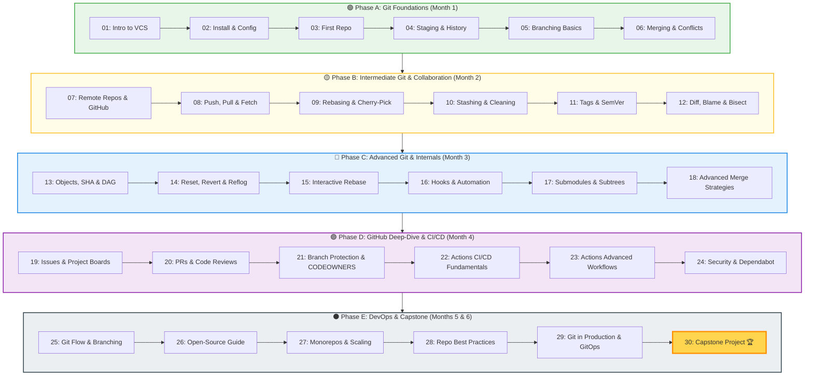

# 🎓 Git & GitHub — Master Coursework
### *From Absolute Beginner to Enterprise DevOps Mastery*

  A university-grade, production-tested curriculum covering version control internals, DAG commit graphs, advanced collaboration workflows, automated CI/CD pipelines, GitOps, secret scanning, and enterprise engineering standards.

[📚 Explore Modules](#-curriculum-index) • [🗺️ 6-Month Roadmap](#️-6-month-learning-roadmap) • [📋 Cheat Sheet](./CHEATSHEET.md) • [📘 Glossary](./GLOSSARY.md) • [🏆 Capstone Project](./30-Capstone-Project/README.md) • [🚀 Getting Started](#-getting-started)

---

## 📋 Course Overview

This repository houses a comprehensive, 30-module curriculum engineered to transition software engineers, DevOps practitioners, and computer science students from basic command-line usage to deep architectural mastery of Git and the GitHub ecosystem.

### Key Highlights

| Feature | Details |
|---|---|
| **Total Modules** | **30 self-contained modules** with theory, CLI commands, and exercises |
| **Progressive Levels** | 🟢 Beginner → 🟡 Intermediate → 🔵 Advanced → 🟣 GitHub CI/CD → ⚫ DevOps Mastery |
| **Paced Duration** | ~6 Months structured learning (or self-paced accelerated track) |
| **Visual Architecture** | Over **200+ Mermaid diagrams** (sequence diagrams, flowcharts, state machines, and DAGs) |
| **Deep Internals** | Content-addressable storage, SHA hashing, object storage formats (`blob`, `tree`, `commit`, `tag`), and plumbing commands |
| **Enterprise Practices** | Branch Protection, CODEOWNERS, GitHub Actions CI/CD matrix builds, Dependabot, GitOps, and Monorepo scaling |
| **Capstone Project** | Full-Stack collaborative repository build with a rigorous **100-point rubric** |

---

## 🗺️ 6-Month Learning Roadmap

---

## 📚 Curriculum Index

### 🟢 Phase A — Git Foundations (Beginner)
*Master the foundational mental models, the 3 areas of Git, local branch operations, and conflict resolution.*

| # | Module | Core Topics | Est. Time | Status |
|---|--------|-------------|-----------|:------:|
| 01 | [Introduction to Version Control](./01-Introduction-to-Version-Control/README.md) | VCS Evolution, Centralized vs Distributed, Snapshot model, 3 Areas of Git | 2.0 hrs |  |
| 02 | [Git Installation & Configuration](./02-Git-Installation-and-Configuration/README.md) | Multi-OS Setup, Config Hierarchy, SSH Authentication, GPG Signing | 1.5 hrs |  |
| 03 | [Your First Repository](./03-Your-First-Repository/README.md) | `git init`, `.git` Anatomy, Object Directory, `git clone` Mechanics | 2.0 hrs |  |
| 04 | [Staging, Committing & History](./04-Staging-Committing-and-History/README.md) | Index Mechanics, Atomic Commits, `git log` Filtering, `.gitignore` Rules | 3.0 hrs |  |
| 05 | [Branching Basics](./05-Branching-Basics/README.md) | Pointer Mechanics, `HEAD` Dereferencing, `switch` vs `checkout`, Detached `HEAD` | 2.5 hrs |  |
| 06 | [Merging & Conflict Resolution](./06-Merging-and-Conflict-Resolution/README.md) | Fast-Forward, 3-Way Merge, Conflict Markers, `git mergetool` Integration | 3.0 hrs |  |

---

### 🟡 Phase B — Intermediate Git & Collaboration
*Learn remote collaboration patterns, linear rebasing, stash internals, and automated debugging with bisect.*

| # | Module | Core Topics | Est. Time | Status |
|---|--------|-------------|-----------|:------:|
| 07 | [Remote Repositories & GitHub Basics](./07-Remote-Repositories-and-GitHub-Basics/README.md) | Remotes, `origin` Architecture, HTTPS vs SSH, GitHub Web UI Tour | 3.0 hrs |  |
| 08 | [Collaboration — Push, Pull, Fetch](./08-Collaboration-Push-Pull-Fetch/README.md) | Upstream Tracking, `git fetch` vs `git pull`, Fast-Forward Pull Strategies | 3.0 hrs |  |
| 09 | [Rebasing & Cherry-Picking](./09-Rebasing-and-Cherry-Picking/README.md) | Linear History, Base Commits, Golden Rule of Rebasing, Cherry-Picking | 3.0 hrs |  |
| 10 | [Stashing & Cleaning](./10-Stashing-and-Cleaning/README.md) | Stash Stack LIFO Mechanics, Untracked Stashes, Git Worktrees, `git clean` | 2.0 hrs |  |
| 11 | [Tags, Releases & Semantic Versioning](./11-Tags-Releases-and-Semantic-Versioning/README.md) | Lightweight vs Annotated Tags, Semantic Versioning (MAJOR.MINOR.PATCH), Releases | 2.5 hrs |  |
| 12 | [Git Diff, Blame & Bisect](./12-Git-Diff-Blame-and-Bisect/README.md) | Revision Comparison, Line History with `blame`, Binary Search Debugging (`bisect`) | 2.5 hrs |  |

---

### 🔵 Phase C — Advanced Git & Internals
*Unpack Git's low-level engine: content-addressable storage, DAG graphs, history rewriting, and hooks.*

| # | Module | Core Topics | Est. Time | Status |
|---|--------|-------------|-----------|:------:|
| 13 | [Git Internals — Objects, SHA, DAG](./13-Git-Internals-Objects-SHA-DAG/README.md) | Blobs, Trees, Commits, Tags, SHA-1 Hashing, Plumbing Commands (`cat-file`) | 4.0 hrs |  |
| 14 | [Reset, Revert & Reflog](./14-Reset-Revert-and-Reflog/README.md) | Soft vs Mixed vs Hard Resets, Safe History Reverts, Disaster Recovery via Reflog | 3.0 hrs |  |
| 15 | [Interactive Rebase & History Rewriting](./15-Interactive-Rebase-and-History-Rewriting/README.md) | Squash, Fixup, Reorder, Drop, Edit Commits, Splitting Commits, Filter-Repo | 3.0 hrs |  |
| 16 | [Git Hooks & Automation](./16-Git-Hooks-and-Automation/README.md) | Client vs Server Hooks, Husky Integration, `lint-staged`, Commitlint Standards | 3.0 hrs |  |
| 17 | [Submodules & Subtrees](./17-Submodules-and-Subtrees/README.md) | Nested Repositories, Submodule Pointers, Updating & Cloning, Git Subtrees | 3.0 hrs |  |
| 18 | [Advanced Merge Strategies](./18-Advanced-Merge-Strategies/README.md) | Recursive/Ort Strategies, Ours vs Theirs, Octopus Merges, `git rerere` | 2.5 hrs |  |

---

### 🟣 Phase D — GitHub Deep-Dive & CI/CD
*Professional GitHub collaboration, branch governance, GitHub Actions automation, and security scanning.*

| # | Module | Core Topics | Est. Time | Status |
|---|--------|-------------|-----------|:------:|
| 19 | [GitHub Issues, Projects & Wikis](./19-GitHub-Issues-Projects-and-Wikis/README.md) | Issue Templates, Milestones, Project Kanban Boards, Team Collaboration | 3.0 hrs |  |
| 20 | [Pull Requests & Code Reviews](./20-Pull-Requests-and-Code-Reviews/README.md) | PR Lifecycle, Review Etiquette, Inline Suggestions, Draft PRs, Merge Types | 3.0 hrs |  |
| 21 | [Branch Protection & CODEOWNERS](./21-Branch-Protection-and-CODEOWNERS/README.md) | Required Reviews, Status Checks, Linear History Enforcement, CODEOWNERS Rules | 2.5 hrs |  |
| 22 | [GitHub Actions — CI/CD Fundamentals](./22-GitHub-Actions-CI-CD-Fundamentals/README.md) | Workflows, Runners, Events, Jobs, Steps, Secrets, Automated Testing Pipeline | 4.0 hrs |  |
| 23 | [GitHub Actions — Advanced Workflows](./23-GitHub-Actions-Advanced-Workflows/README.md) | Matrix Strategies, Dependency Caching, Reusable Workflows, Composite Actions | 4.0 hrs |  |
| 24 | [GitHub Security — Dependabot & Secrets](./24-GitHub-Security-Dependabot-and-Secrets/README.md) | Secret Scanning, Push Protection, Dependabot Vulnerability Alerts, CodeQL | 3.0 hrs |  |

---

## 🧭 How to Use This Coursework

1. Follow modules in order
2. Practice every command
