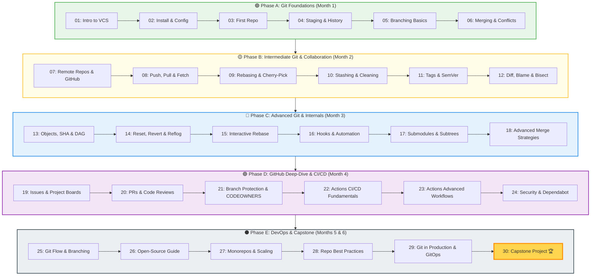

# 🎓 Git & GitHub — Master Coursework
### *From Absolute Beginner to Enterprise DevOps Mastery*

  A university-grade, production-tested curriculum covering version control internals, DAG commit graphs, advanced collaboration workflows, automated CI/CD pipelines, GitOps, secret scanning, and enterprise engineering standards.

[📚 Explore Modules](#-curriculum-index) • [🗺️ 6-Month Roadmap](#️-6-month-learning-roadmap) • [📋 Cheat Sheet](./CHEATSHEET.md) • [📘 Glossary](./GLOSSARY.md) • [🏆 Capstone Project](./30-Capstone-Project/README.md) • [🚀 Getting Started](#-getting-started)

---

## 📋 Course Overview

This repository houses a comprehensive, 30-module curriculum engineered to transition software engineers, DevOps practitioners, and computer science students from basic command-line usage to deep architectural mastery of Git and the GitHub ecosystem.

### Key Highlights

| Feature | Details |
|---|---|
| **Total Modules** | **30 self-contained modules** with theory, CLI commands, and exercises |
| **Progressive Levels** | 🟢 Beginner → 🟡 Intermediate → 🔵 Advanced → 🟣 GitHub CI/CD → ⚫ DevOps Mastery |
| **Paced Duration** | ~6 Months structured learning (or self-paced accelerated track) |
| **Visual Architecture** | Over **200+ Mermaid diagrams** (sequence diagrams, flowcharts, state machines, and DAGs) |
| **Deep Internals** | Content-addressable storage, SHA hashing, object storage formats (`blob`, `tree`, `commit`, `tag`), and plumbing commands |
| **Enterprise Practices** | Branch Protection, CODEOWNERS, GitHub Actions CI/CD matrix builds, Dependabot, GitOps, and Monorepo scaling |
| **Capstone Project** | Full-Stack collaborative repository build with a rigorous **100-point rubric** |

---

## 🗺️ 6-Month Learning Roadmap

---

## 📚 Curriculum Index

### 🟢 Phase A — Git Foundations (Beginner)
*Master the foundational mental models, the 3 areas of Git, local branch operations, and conflict resolution.*

| # | Module | Core Topics | Est. Time | Status |
|---|--------|-------------|-----------|:------:|
| 01 | [Introduction to Version Control](./01-Introduction-to-Version-Control/README.md) | VCS Evolution, Centralized vs Distributed, Snapshot model, 3 Areas of Git | 2.0 hrs |  |
| 02 | [Git Installation & Configuration](./02-Git-Installation-and-Configuration/README.md) | Multi-OS Setup, Config Hierarchy, SSH Authentication, GPG Signing | 1.5 hrs |  |
| 03 | [Your First Repository](./03-Your-First-Repository/README.md) | `git init`, `.git` Anatomy, Object Directory, `git clone` Mechanics | 2.0 hrs |  |
| 04 | [Staging, Committing & History](./04-Staging-Committing-and-History/README.md) | Index Mechanics, Atomic Commits, `git log` Filtering, `.gitignore` Rules | 3.0 hrs |  |
| 05 | [Branching Basics](./05-Branching-Basics/README.md) | Pointer Mechanics, `HEAD` Dereferencing, `switch` vs `checkout`, Detached `HEAD` | 2.5 hrs |  |
| 06 | [Merging & Conflict Resolution](./06-Merging-and-Conflict-Resolution/README.md) | Fast-Forward, 3-Way Merge, Conflict Markers, `git mergetool` Integration | 3.0 hrs |  |

---

---

## 🧭 How to Use This Coursework

1. Follow modules in order
2. Practice every command
